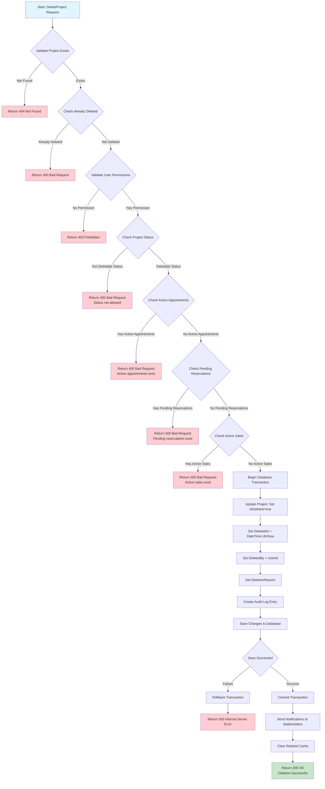
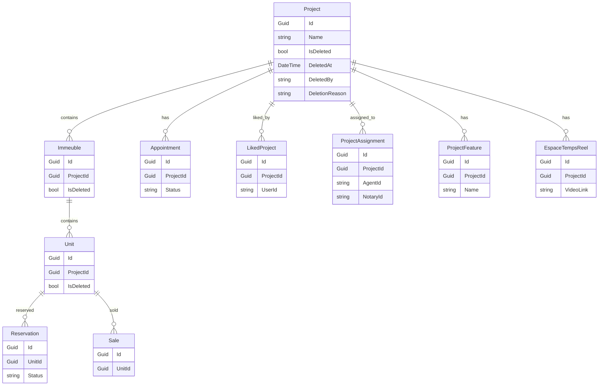
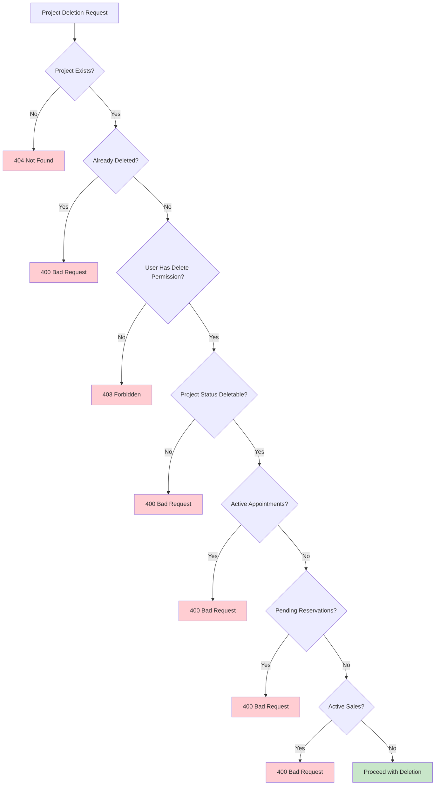

# Project Deletion Flow Diagram

## Mermaid Flowchart



## Entity Relationship Impact Diagram



## Validation Decision Tree



## Transaction Flow Diagram

```mermaid
sequenceDiagram
    participant Client
    participant API
    participant Handler
    participant Repository
    participant Database
    participant AuditService
    participant NotificationService
    
    Client->>API: DELETE /api/projects/{id}
    API->>Handler: DeleteProjectCommand
    Handler->>Repository: GetProjectById(id)
    Repository->>Database: SELECT * FROM Projects WHERE Id = id
    Database-->>Repository: Project Data
    Repository-->>Handler: Project Entity
    
    Handler->>Handler: Validate Business Rules
    
    alt Validation Fails
        Handler-->>API: Validation Error
        API-->>Client: 400 Bad Request
    else Validation Success
        Handler->>Database: BEGIN TRANSACTION
        Handler->>Repository: UpdateProject(project)
        Repository->>Database: UPDATE Projects SET IsDeleted = 1, ...
        Handler->>AuditService: LogDeletion(project, userId)
        AuditService->>Database: INSERT INTO AuditLog ...
        Handler->>Database: COMMIT TRANSACTION
        
        Handler->>NotificationService: SendDeletionNotifications(project)
        NotificationService-->>Handler: Notifications Sent
        
        Handler-->>API: Success Response
        API-->>Client: 200 OK
    end