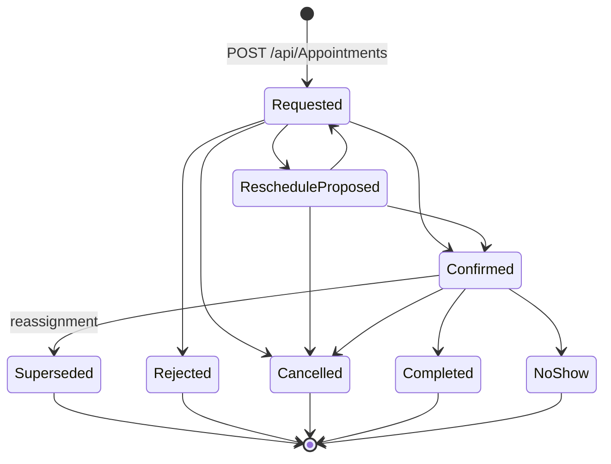
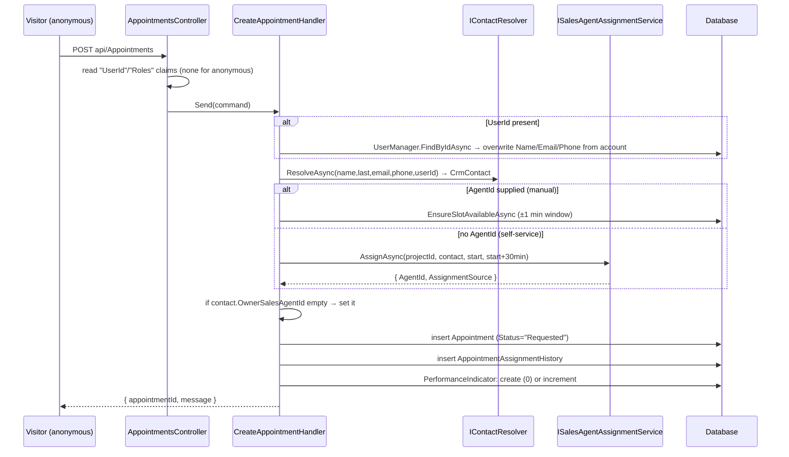

# Appointments (commercial)

`src/ProjectAPI/src/Api/Controllers/AppointmentsController.cs` — class `AppointmentsController`, route prefix **`api/Appointments`**.

> Every row below was traced through executable statements: controller attribute
> → command/query → handler body → repository/DbContext call → entity → response
> DTO. Anything not resolvable from executable code is marked **Unverified**.

## Purpose

The commercial visit appointment: a visitor or buyer requests a viewing, the
system assigns a sales agent, the agent drives it through the shared appointment
state machine, and afterwards records a visit report. This is the stage that
precedes a reservation.

## Authorization

Class-level `[Authorize(AuthenticationSchemes = "Bearer")]`. One action opts out
with `[AllowAnonymous]` (public booking). Handlers layer on
`ProjectScopeService.EnsureProjectAccessAsync` plus, for `SALES_AGENT`, an
ownership check (`appointment.SalesAgentId == ICurrentUser.UserId`) applied in
five separate handlers.

> **Note on endpoint count.** The file contains 11 `[Http…]` attributes, but two
> — `GET user/{userId}` and `GET project/{projectId}` — are inside a `/* … */`
> block (lines 202–230) and are **not routed**. There are **9 live endpoints**.

## Endpoints

| Verb | Route | Auth | Handler | Request | Response |
|---|---|---|---|---|---|
| POST | `/` | **Anonymous** | `CreateAppointmentHandler` | `CreateAppointmentCommand` | `CreateAppointmentResponse` |
| GET | `/` | AdminsAgents | `GetAppointmentsHandler` | `GetAppointmentsQuery` | `PaginatedResponse<AppointmentResponse>` |
| GET | `mine` | *any authenticated* | `GetMyAppointmentsHandler` | — | `List<MyAppointmentSummary>` |
| GET | `{appointmentId:guid}` | AdminsAgents | `GetAppointmentByIdHandler` | route id | `AppointmentResponse` |
| PATCH | `{appointmentId}/status` | AdminsAgents | `UpdateAppointmentStatusHandler` | `UpdateAppointmentStatusCommand` | `UpdateAppointmentStatusResponse` |
| GET | `{appointmentId}/assignment-history` | AdminsAgents | `GetAppointmentAssignmentHistoryHandler` | query + `RestrictToAgentId` | `List<AppointmentAssignmentHistoryDto>` |
| POST | `{appointmentId}/visit-report` | AdminsAgents | `SubmitAppointmentVisitReportHandler` | `SubmitAppointmentVisitReportCommand` | `SubmitAppointmentVisitReportResponse` — 201 |
| GET | `{appointmentId}/visit-report` | AdminsAgents | `GetAppointmentVisitReportHandler` | route id | `AppointmentVisitReportDto` or 404 |
| GET | `{appointmentId}/visit-report/mine` | *any authenticated* | `GetAppointmentVisitReportForBuyerHandler` | route id | `AppointmentVisitReportBuyerDto` or 404 |

### Route-bound fields

`PATCH {id}/status`, `POST {id}/visit-report` and the two report reads all assign
the route segment onto the command before dispatch, so a body-supplied id is
ignored. `SubmitVisitReport` additionally does
`command.AuthorUserId ??= User.FindFirst("UserId")?.Value` — the `??=` means a
client-supplied `AuthorUserId` **wins** (see edge case 6).

## Shared appointment state machine

`AppointmentStateMachine` in `Domain/FinalVisits/Entities/FinalVisitCase.cs` —
shared by commercial, final-visit and handover appointments (confirmed: both
`Handover.cs` and `FinalVisitCase.cs` reference `AppointmentAttemptStatus`).

`BlockingStatuses` (occupy an agent's slot) = `Requested`, `Confirmed`,
`RescheduleProposed`.

**Persistence asymmetry:** `Appointment.Status` is stored as a **string**
(`AppointmentAttemptStatus.Requested.ToString()`), whereas
`FinalVisitAppointment.Status` stores the **enum**. `UpdateAppointmentStatusHandler`
therefore parses with `Enum.TryParse` and, on failure, falls back to `Requested`
rather than rejecting — an explicit accommodation for legacy free-text values.

Guards enforced by `UpdateAppointmentStatusHandler`:

- A same-state update is allowed (`currentStatus != targetStatus &&` precedes the
  `CanTransition` check) — this is what lets the frontend reassign without also
  choosing a new status.
- `RescheduleProposed` requires `ProposedDate`, else 422.
- `Rejected`/`Cancelled` require `Reason`, else 422.
- `NewSalesAgentId` requires `ReassignmentReason`, else 422.

## Data flow — public booking with auto-assignment

`AssignmentSource` values written here: `"MANUAL_REASSIGNMENT"` (agent supplied)
or whatever `ISalesAgentAssignmentService` returns. **Unverified:** the exact
rule set inside `SalesAgentAssignmentService` (round-robin / lowest-workload /
primary-agent) and whether it performs its own slot-conflict check — that service
is documented with `ProjectAgentAssignmentConfig.md`.

## Reassignment of a confirmed appointment

This is the only place in the module that creates a second row:

1. `EnsureEligibleSalesAgentAsync` — the new agent must hold an **active
   `ProjectMembership` with `RoleCode == SALES_AGENT` on this exact project**
   (checks `IsActive`, `ValidFrom <= now`, `ValidUntil == null || > now`), else
   `AGENT_NOT_ELIGIBLE_FOR_PROJECT`.
2. `EnsureSlotAvailableAsync` for the **new** agent (±1 minute).
3. If current status is `Confirmed`: the existing row becomes `Superseded`, and a
   **new** `Appointment` is inserted with `PreviousAppointmentId` pointing back,
   `Status = "Requested"`, copying `TypeBienIds`, `PropertyType`, `UserId`,
   `CrmContactId`, `Name`, `LastName`, `Email`, `PhoneNumber`. The response
   carries the **new** id.
4. If not yet confirmed: the same row is mutated in place.

Either way an `AppointmentAssignmentHistory` row is appended.
`GetAppointmentAssignmentHistoryHandler` walks the `PreviousAppointmentId` chain
backwards (guard: max 50 hops) to reassemble the full story across rows.

## Visit report

`AppointmentVisitReport` is **append-only and versioned**: the handler reads
`MAX(VersionNo)` for the appointment and inserts `+1`. No update or delete path
exists in this module.

Validated in the handler against `VisitInterestLevelCodes.All` and
`AppointmentVisitResultCodes.All` (throws the app `ValidationException` ⇒ 422).

Two projections of the same row:

| Field | Internal (`/visit-report`) | Buyer (`/visit-report/mine`) |
|---|---|---|
| `Id`, `VersionNo`, `PropertiesPresentedUnitIds`, `NextAction`, `FollowUpDate`, `CreatedAt` | ✅ | ✅ |
| `InterestLevel`, `ConfirmedBudget`, `ConfirmedRequirements`, `Objections`, `VisitResult`, `InternalNotes`, `AuthorUserId` | ✅ | ❌ omitted |

The buyer projection is gated by `appointment.UserId == ICurrentUser.UserId` —
an appointment with a null `UserId` (anonymous booking) is always refused, so a
walk-in visitor can never read their own report even after creating an account.

## Frontend coverage

Consumed by `realestateFront/src/api/http/appointmentsApi.ts`.

| Endpoint | Frontend caller | Status |
|---|---|---|
| POST `/` | `appointmentsApi.create` | ⚠️ response-shape mismatch |
| GET `/` | `appointmentsApi.list` | ✅ |
| GET `mine` | `appointmentsApi.getMine` | ✅ |
| GET `{id}` | `appointmentsApi.updateStatus`, `.reassign`, `.byId`-style re-fetches | ✅ |
| PATCH `{id}/status` | `appointmentsApi.updateStatus`, `.reassign` | ✅ |
| GET `{id}/assignment-history` | `appointmentsApi.getAssignmentHistory` | ✅ |
| POST `{id}/visit-report` | `appointmentsApi.submitVisitReport` | ✅ |
| GET `{id}/visit-report` | `appointmentsApi.getVisitReport` | ✅ |
| GET `{id}/visit-report/mine` | `appointmentsApi.getMyVisitReport` | ✅ |

**All 9 live endpoints are wired.** But the adapter also exposes two methods that
call routes which **do not exist**:

- `appointmentsApi.byUser(userId)` → `GET /api/appointments/user/{userId}`
- `appointmentsApi.byProject(projectId)` → `GET /api/appointments/project/{projectId}`

Both target the commented-out controller actions and would return **404**. They
are declared in `AppointmentsApi` (`interfaces.ts:179-180`) and implemented, but
a repository-wide search finds **no caller** for either, so they are dormant
rather than actively broken.

**Response-shape mismatch on create.** `appointmentsApi.create` types the
response as `AppointmentDto` and passes it through `fromWire`, but the backend
returns `CreateAppointmentResponse { AppointmentId, Message }`. The resulting
object has `id === undefined` (the backend field is `appointmentId`),
`date === undefined`, and `status` falling back to the adapter's
`?? "REQUESTED"` default. Same class of defect as `projectsApi.create`.

**Field-name workarounds the adapter documents and the code confirms:**

- `AppointmentResponse` carries both a `date` field never assigned by
  `GetAppointmentsHandler` and the real `appointmentDate`. The adapter reads
  `appointmentDate` and remaps it to `date`. Confirmed: neither
  `GetAppointmentsHandler` nor `GetAppointmentByIdHandler` sets `Date`.
- `create` renames `date → appointmentDate` so the command binds.

**Reassign risk:** `appointmentsApi.reassign` re-sends `current.status` — the raw
wire string — as the target status. If the stored value is a legacy free-text
status, `Enum.TryParse` in the handler fails and the call returns **422
"Statut de rendez-vous inconnu"**. The handler tolerates legacy values when
reading the *current* status but not when parsing the *requested* one.

## Tables touched

| Table | Written by |
|---|---|
| `Appointments` | create, status update, reassignment (insert of replacement row) |
| `AppointmentAssignmentHistories` | create, every reassignment |
| `AppointmentVisitReports` | submit visit report (insert only, versioned) |
| `CrmContacts` | create — resolve/insert, plus first-time `OwnerSalesAgentId` |
| `PerformanceIndicators` | create — insert or increment `AppointmentsScheduled` |
| `ProjectMemberships` | read only — eligibility + scope |

**Unverified:** the EF configuration for `Appointments` (indexes, the
`TypeBienIds` collection mapping, whether a unique slot index exists). The
handler comment refers to "the unique index" as a backstop, but I have not
opened `AppointmentConfiguration.cs`; treat the ±1-minute application check as
the only confirmed protection.

## Relations

### Depends on (outbound)

| Module | Mechanism | Evidence |
|---|---|---|
| **Crm** | `IContactResolver.ResolveAsync` | `CreateAppointmentHandler`; also writes `contact.OwnerSalesAgentId` on first assignment. |
| **ProjectAgentAssignmentConfig** | `ISalesAgentAssignmentService.AssignAsync` | Self-service path in `CreateAppointmentHandler`. |
| **ProjectMembership** | `IProjectMembershipRepository` + `ProjectScopeService` | Reassignment eligibility and perimeter checks. |
| **Projects** | FK `Appointment.ProjectId` | A **direct** project FK — unlike reservations/sales, which resolve through units. |
| **Leads / PerformanceIndicators** | `IPerformanceIndicatorRepository` | `AppointmentsScheduled` counter. |
| **Identity (ProjectAPI store)** | `UserManager<User>` | Fills guest fields from the account; resolves agent names. |

### Depended on by (inbound)

| Module | Mechanism | Evidence |
|---|---|---|
| **Projects** | Cascade delete | `RemoveProjectHandler` deletes appointments by `Appointment.ProjectId`. |
| **Immeuble** | *Not* deleted | `DeleteImmeublesHandler` injects `IAppointmentRepository` but never calls it — building deletion orphans appointments. |
| **FinalVisits / Handovers** | Shared enum + matrix | Both use `AppointmentAttemptStatus` and `AppointmentStateMachine`; they do **not** share the `Appointments` table. |

### Possible / unconfirmed relations

- **Reservations.** `SubmitVisitReport`'s `VisitResult` includes
  `READY_TO_RESERVE`, and the handler comment calls the report "the missing link
  between appointment happened and reservation created". **No code in this module
  creates or references a reservation** — there is no handler call, no FK, and no
  shared table. Any linkage is manual/UI-driven. **Unverified.**
- **Notifications.** `AppointmentReminderJob` is registered in `Program.cs` and
  named for this domain, but I have not traced it; whether it reads
  `Appointments` and writes `Notifications` is **Unverified** until
  `Notifications.md`.

## Known edge cases

1. **The first appointment for a new agent records zero.** In
   `CreateAppointmentHandler`, when no `PerformanceIndicator` exists for the
   agent, one is created with `AppointmentsScheduled = 0` and
   `IncrementAppointmentsScheduled()` is **not** called. The existing-indicator
   branch does increment. An agent's very first appointment is therefore never
   counted.

2. **Slot conflict is checked over ±1 minute, not the slot length.** Both
   `EnsureSlotAvailableAsync` implementations use
   `AppointmentDate ± 1 minute`, while the self-service path computes
   `slotEnd = AppointmentDate.AddMinutes(30)`. Two appointments 5 minutes apart
   for the same agent pass the check.

3. **The self-service path never calls `EnsureSlotAvailableAsync`.** It is
   invoked only when `request.AgentId.HasValue`. Whether
   `SalesAgentAssignmentService` performs an equivalent check is **Unverified**.

4. **Anonymous callers can set `UserId` and `AgentId` directly.** The action is
   `[AllowAnonymous]`; the controller only overwrites `command.AgentId` /
   `command.UserId` when the corresponding claims are present. An anonymous
   caller may therefore post any `UserId` — and `CreateAppointmentHandler` then
   calls `UserManager.FindByIdAsync(request.UserId)` and **copies that account's
   `FirstName`, `LastName`, `Email` and `PhoneNumber`** onto the appointment. The
   created row is readable afterwards only by staff, so this is a write-side
   spoof (an appointment attributed to another person) rather than a direct read
   disclosure.

5. **`Guid.Parse(a.UserId)` can throw.** Both `GetAppointmentsHandler` and
   `GetAppointmentByIdHandler` project `UserId = a.UserId != null ?
   Guid.Parse(a.UserId) : null` in memory. `AppointmentResponse.UserId` is a
   `Guid?` while the column is a string Identity id. A non-GUID id makes the list
   endpoint throw ⇒ 500. Whether any id in this deployment is non-GUID is
   **Unverified**.

6. **Visit-report authorship is forgeable.** The controller uses
   `command.AuthorUserId ??= User.FindFirst("UserId")?.Value`, so a supplied
   value is kept; the handler's fallback (`?? _currentUser.UserId`) only applies
   when it is null. Contrast `ApproveReservationHandler`, which deliberately
   overrides the client value with the token identity.

7. **A visit report can be filed on an appointment that never happened.**
   `SubmitAppointmentVisitReportHandler` checks scope, agent ownership and the
   two code vocabularies — but never the appointment's status. A report can be
   submitted against a `Requested`, `Rejected` or `Cancelled` appointment.

8. **`Guid.Parse(userId)` in the controller.** `CreateAppointment` does
   `command.AgentId = Guid.Parse(userId)` for a caller whose `"Roles"` claim
   contains `"Agent"`. If the claim is present but `userId` is null or non-GUID
   this throws ⇒ 500 before the handler runs.

9. **The controller reads a bespoke `"Roles"` claim, not `ClaimTypes.Role`.**
   `CreateAppointment`, `GetAppointments` and `GetAssignmentHistory` split a
   comma-joined `"Roles"` claim. `TokenProvider.GetStandardUserClaims` builds
   that claim from `user.UserRoles.Select(r => r.Role.Name)` — **stored legacy
   names only, never normalised spec codes** — whereas `AddRolesToClaims` emits
   both forms as separate `ClaimTypes.Role` claims (which is what
   `[Authorize(Roles=)]` and `ICurrentUser` consume). Consequently
   `roles.Contains(RoleCodes.SalesAgent)` in these three actions can only match
   if the stored role name is literally `"SALES_AGENT"`; the `|| roles.Contains("Agent")`
   fallback is what actually fires for legacy accounts. The two claim sources are
   also built from different expressions (`user.UserRoles` vs `user.GetRoleNames()`),
   so if `UserRoles` is not eagerly loaded the `"Roles"` claim is an empty string.
   **Unverified:** whether `UserRoles` is eagerly loaded on the login path.

10. **`GetAppointments` returns no 404 despite declaring one**, and swallows no
    exceptions — behaviour is consistent, but `[ProducesResponseType(404)]` on
    the list action is not reachable.

11. **The buyer report endpoint excludes anonymous bookings permanently.**
    `GetAppointmentVisitReportForBuyerHandler` requires
    `appointment.UserId == _currentUser.UserId`; an appointment created
    anonymously has `UserId = null` (explicitly nulled in
    `CreateAppointmentHandler`), so it can never be claimed by the person later
    even though a `CrmContactId` links them.

12. **Two dead adapter methods** (`byUser`, `byProject`) target commented-out
    routes and would 404 — currently uncalled. See Frontend coverage.

## Related

- Agent selection rules: `ProjectAgentAssignmentConfig.md`
- Agent calendars and availability: `AgentAvailability.md`
- Notary-stage appointments (same state machine, different table):
  `NotaryAppointments.md`
- Final-visit attempts (same state machine, different table): `FinalVisits.md`
- Frontend consumer: `realestateFront/docs/frontend/Appointments.md`
