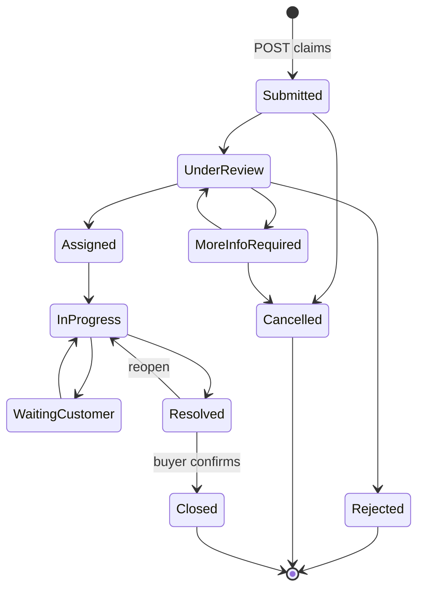

# After-Sale Claims (SAV)

`src/ProjectAPI/src/Api/Controllers/ClaimsController.cs` — class **`AfterSaleClaimsController`**, route prefix **`api/after-sales/claims`**.

The file name and the class name differ; the route is explicit, so `[controller]`
token resolution is not involved.

## Purpose

Warranty claims raised after a unit has been delivered. A buyer (or a guest,
using contact fields instead of an account) opens a claim against a delivered,
warrantied unit. Administrators and technicians qualify, assign, progress and
resolve it. The buyer then confirms the resolution, which closes the claim, or
reopens it with a reason.

## Endpoints

| Verb | Path | Roles | Handler | Response |
|---|---|---|---|---|
| POST | `/api/after-sales/claims` | any authenticated | `CreateAfterSaleClaimHandler` | `{ id }` |
| GET | `/api/after-sales/claims` | `AdminsTechnicians` | `GetClaimsHandler` | `PaginatedResponse<AfterSaleClaimResponse>` |
| GET | `/api/after-sales/claims/mine` | any authenticated | `GetMyClaimsHandler` | paginated list |
| PUT | `/api/after-sales/claims/{claimId:guid}/status` | `AdminsTechnicians` | `UpdateClaimStatusHandler` | 204 No Content |
| POST | `/api/after-sales/claims/{claimId:guid}/respond` | any authenticated | `RespondToClaimResolutionHandler` | 204 No Content |

`RoleGroups.AdminsTechnicians` = `GLOBAL_ADMIN`, `PROJECT_ADMIN`, `TECHNICIAN`.

Both `{claimId}` actions assign the route value onto the command before
dispatch, so a body-supplied `ClaimId` is ignored.

## Creation prerequisites

`CreateAfterSaleClaimHandler` checks, in this order:

1. The unit exists, else `NotFoundException`.
2. `unit.Status == UnitCommercialStatus.Delivered`, else
   `BusinessRuleException.PropertyNotDelivered`.
3. An active warranty exists for the unit —
   `IsActive && EndsAt > UtcNow`, taking the most recent by `StartsAt` — else
   `BusinessRuleException.WarrantyExpired`. The chosen warranty's id is stored on
   the claim.
4. When `BuyerId` is set, a `Reservation` must exist with that `BuyerId` **and**
   that `UnitId`, else a FluentValidation exception. The handler comment records
   that this check reads `Reservation.BuyerId` rather than the `Purchase` table,
   because a buyer who activated their account after approval never receives a
   `Purchase` row.

`PurchaseId` is then resolved opportunistically from `Purchases` (via the
reservation's or sale's `UnitId`) and stored when found; it is not required.

The claim is created with `Status = ClaimStatus.Submitted`. Guest fields
(`GuestName`, `GuestEmail`, `GuestPhone`) are persisted only when `BuyerId` is
null. `Files` are inserted as `ClaimAttachment` rows carrying caller-supplied
URLs.

The controller fills `BuyerId` from `ICurrentUser.UserId` when the body omits it.
Its comment notes this must go through `ICurrentUser` because the JWT carries the
id under a custom `userId` claim that `ClaimTypes.NameIdentifier` does not match.

## Claim state machine

`ClaimStateMachine` in `Domain/Sales/Entities/AfterSaleClaim.cs`:

`EnsureCanTransition` allows a same-state update (`from != to &&` precedes the
check) and otherwise throws `InvalidClaimTransitionException`, which
`ApiExceptionFilter` maps to 409 `INVALID_STATUS_TRANSITION`.

## Status update

`UpdateClaimStatusHandler`:

- Resolves the claim's project through `unit → immeuble → project` and calls
  `EnsureProjectAccessAsync`.
- When the caller is a `TECHNICIAN`, additionally requires
  `claim.AssignedAgentId == ICurrentUser.UserId`, else `ProjectScopeDenied`.
- Runs `ClaimStateMachine.EnsureCanTransition`.
- Requires `AssignedAgentId` when moving to `Assigned`.
- Requires `ResolutionSummary` when moving to `Resolved`.
- Requires a reason when moving `Resolved → InProgress` (a reopen).

Field effects:

| Target status | Writes |
|---|---|
| `Assigned` | `AssignedAgentId` |
| `Resolved` | `ResolutionSummary`, `ResolvedAt = UtcNow`, inserts `Proofs` as `ClaimAttachment` rows |
| `Resolved → InProgress` | `ReopenCount++`, clears `ResolvedAt` and `ResolutionSummary` |
| `Closed` | `ClosedAt = UtcNow` |

`Priority` and `SlaTargetAt` are applied whenever present in the request,
independently of the target status. A `ClaimHistory` row recording
`FromStatus`/`ToStatus` is inserted on every call.

## Buyer response

`RespondToClaimResolutionHandler` requires `claim.BuyerId == ICurrentUser.UserId`
(and refuses when `BuyerId` is empty), so a guest-created claim cannot be
responded to through this endpoint. `Accept = true` targets `Closed`;
`Accept = false` targets `InProgress` and requires a reason, incrementing
`ReopenCount`. A `ClaimHistory` row is written.

## Reads

`GetClaimsHandler` applies caller-supplied filters (`BuyerId`, `AgentId`,
`UnitId`, `Status`, `From`, `To`) and then narrows:

- `TECHNICIAN` → `AssignedAgentId == ICurrentUser.UserId`;
- otherwise, when `ProjectScopeService.GetScopedProjectIdsAsync` returns a set,
  the claim's `UnitId` must resolve into one of those projects.

`GetMyClaimsHandler` takes no caller-supplied buyer id; it filters on
`BuyerId == ICurrentUser.UserId`.

## Background job

`SavSlaDetectionJob` — hosted service on a 15-minute interval. It selects claims
with a non-null `SlaTargetAt`, reads existing `SentReminder` rows of type
`ClaimSlaWarning` and `ClaimSlaBreached`, and notifies `claim.AssignedAgentId`
once per claim per category with `SAV_SLA_WARNING` or `SAV_SLA_BREACHED`.
Deduplication is by the `SentReminder` rows.

## Dependencies

**Services:** `IAfterSaleClaimRepository`, `IClaimAttachmentRepository`,
`IClaimHistoryRepository`, `IPurchaseRepository`, `ApplicationDbContext`,
`ProjectScopeService`, `ICurrentUser`, `INotificationService` (job only).

**Tables written:** `AfterSaleClaims`, `ClaimAttachments`, `ClaimHistories`,
`SentReminders` (job), `Notifications` (job).

**Tables read:** `Units`, `Warranties`, `Reservations`, `Purchases`, `Immeubles`,
`ProjectMemberships`.

## Relations

**Depends on**

| Module | Mechanism |
|---|---|
| Handovers | Reads `Warranties`, created only by `AcknowledgeHandoverHandler`; and requires `unit.Status == Delivered`, written only by the same handler. |
| Immeuble / Units | `unit → immeuble → project` for perimeter resolution. |
| Reservations | Ownership check reads `Reservation.BuyerId` + `UnitId`. |
| Purchases | Optional `PurchaseId` lookup. |
| ProjectMembership | `ProjectScopeService` on the status update and the admin list. |
| Notifications | SLA job only. |

**Depended on by** — none traced. No other module reads `AfterSaleClaims`.

**Not related, though named similarly:** `Snag` (see
`docs/backend/FinalVisits.md`) is a separate entity with its own state machine
and table. No code path links a snag to a claim.

## Known edge cases

- `ClaimAttachment.Url` and the resolution `Proofs` are caller-supplied strings.
  Nothing validates that they point at project storage, and no upload occurs on
  these paths.
- `SlaTargetAt` is set only from the request. No handler derives it from priority
  or category, so a claim has no SLA unless an admin supplies a date, and the SLA
  job skips claims where it is null.
- `Priority` and `SlaTargetAt` can be changed on any status transition, including
  after `Resolved` or `Closed`.
- A guest claim (`BuyerId` null) cannot be responded to: `RespondToResolution`
  requires `claim.BuyerId == ICurrentUser.UserId`, so such a claim can reach
  `Resolved` but only an admin or technician path can move it further, and
  `Resolved → Closed` is otherwise the buyer's transition.
- `GetClaimsHandler` accepts a `BuyerId` filter from the caller. For an admin
  this returns another buyer's claims; the perimeter check still applies, so it
  is bounded by project membership rather than by ownership.
- The controller catches `FluentValidation.ValidationException` in three actions
  and converts it to `ValidationProblem`, producing a 400 rather than the 422 the
  global `ApiExceptionFilter` produces for the application's own
  `ValidationException`. Two exception types with the same name are in play:
  `CreateAfterSaleClaimHandler` throws the FluentValidation one.
- `UpdateClaimStatus` returns 204 with no body, so the caller does not learn the
  resulting status without re-reading.
- No `AbstractValidator` exists for any of the three commands; all rules are
  inline in the handlers.

## Frontend coverage

`realestateFront/src/api/http/claimsApi.ts`; UI in `features/claims/ClaimsPage.tsx`
and `features/buyer/BuyerSavPage.tsx`.

| Endpoint | Frontend caller |
|---|---|
| POST `/` | `claimsApi.create` |
| GET `/` | `claimsApi.list`, and a second call with `PageSize: 1000` |
| GET `mine` | `claimsApi.listMine` |
| PUT `{id}/status` | `claimsApi.updateStatus` |
| POST `{id}/respond` | `claimsApi.respond` |

All five endpoints are called. `claimsApi.create` types the response as
`{ id: string }`, matching `Ok(new { id })`. `updateStatus` and `respond` type it
as `void`, matching the 204 responses.

The adapter issues a second `GET /api/after-sales/claims` with `PageSize: 1000`
(line 69) separately from the paginated `list`.

Backend document for the warranty this module depends on:
`docs/backend/Handovers.md`.
