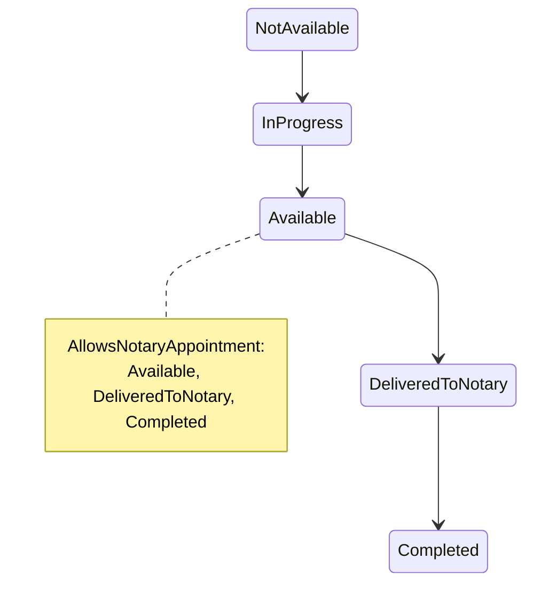

# Construction

`src/ProjectAPI/src/Api/Controllers/ConstructionController.cs` — class `ConstructionController`, route prefix **`api/construction`**.

> Traced through executable statements. Items not resolvable from executable code
> are marked **Unverified**.

## Purpose

Two distinct concerns share this controller:

1. **Construction tracking** — weighted milestones and published progress
   updates, with per-audience visibility, culminating in the `COMPLETED`
   transition that opens final visits.
2. **Land-title status** — the per-unit `UnitTitleState` that is the second
   prerequisite for a notary appointment.

Both are upstream gates: [FinalVisits.md](FinalVisits.md) requires the project to
be complete, and [NotaryAppointments.md](NotaryAppointments.md) requires the
title to be in an allowing state.

## Authorization

Class-level `[Authorize]`. One action is `[AllowAnonymous]`; five are
`RoleGroups.Admins`; one is authenticated-only.

| Action | Role attribute | Handler-level narrowing |
|---|---|---|
| GET `projects/{id}` | **AllowAnonymous** | visibility filter by caller kind (see below) |
| GET `units/{id}/title` | none (authenticated) | `EnsureUnitProjectAccessAsync` + `EnsureBuyerOwnsUnitAsync` |
| PATCH `units/{id}/title` | Admins | `EnsureProjectAccessAsync` (via `unit → immeuble → project`) |
| POST `projects/{id}/milestones` | Admins | `EnsureProjectAccessAsync` |
| PATCH `milestones/{id}/status` | Admins | `EnsureProjectAccessAsync` |
| POST `projects/{id}/updates` | Admins | `EnsureProjectAccessAsync` |
| POST `projects/{id}/complete` | Admins | `EnsureProjectAccessAsync` |

`GET units/{id}/title` is one of the few endpoints applying **both**
`EnsureUnitProjectAccessAsync` (internal roles → project perimeter) and
`EnsureBuyerOwnsUnitAsync` (buyer-only callers → must hold a reservation on that
unit), which is exactly the split `ProjectScopeService` documents for endpoints
reachable by both caller shapes.

## Endpoints

| Verb | Path | Handler | Response |
|---|---|---|---|
| GET | `projects/{projectId:guid}` | `GetProjectConstructionHandler` | milestones + updates, visibility-filtered |
| GET | `units/{unitId:guid}/title` | `GetTitleStatusHandler` | title status + history |
| PATCH | `units/{unitId:guid}/title` | `UpdateTitleStatusHandler` | `UpdateTitleStatusResponse` |
| POST | `projects/{projectId:guid}/milestones` | `AddMilestoneHandler` | milestone id |
| PATCH | `milestones/{milestoneId:guid}/status` | `UpdateMilestoneStatusHandler` | milestone id + status |
| POST | `projects/{projectId:guid}/updates` | `PublishConstructionUpdateHandler` | update id + version |
| POST | `projects/{projectId:guid}/complete` | `CompleteProjectHandler` | `CompleteProjectResponse` |

> **File organisation:** five of seven handlers are declared **inside their
> Command files**; only `GetProjectConstruction` and `GetTitleStatus` have
> separate `*Handler.cs` files. Same pattern as `Payments` and `FinalVisits`.

## Public visibility filter

`GET projects/{projectId}` is anonymous-reachable, so the handler — not the
attribute — decides what each caller sees:

```csharp
var isInternal = _currentUser.IsAuthenticated && RoleCodes.Internal.Any(_currentUser.IsInRole);
var isSignedIn = _currentUser.IsAuthenticated;

if (!isInternal)
    query = isSignedIn
        ? query.Where(m => m.VisibleToPublic || m.VisibleToBuyer)
        : query.Where(m => m.VisibleToPublic);
```

| Caller | Sees |
|---|---|
| internal role | everything |
| any signed-in non-internal | `VisibleToPublic` **or** `VisibleToBuyer` |
| anonymous | `VisibleToPublic` only |

> The middle tier is `isSignedIn`, **not** "is the buyer of this project". Any
> authenticated account — including a `PROSPECT` with no relationship to the
> project — sees buyer-only milestones and updates for **every** project. The
> handler comment describes this tier as "a signed-in buyer"; the code does not
> check ownership. See edge case 1.

## Land-title state machine

`TitleStateMachine` (`Domain/Construction/Entities/UnitTitleState.cs`):



Only the **forward** path is enumerated. `IsBackward(from, to)` is simply
`to < from` (enum ordinal comparison), and a backward move is **permitted** —
but `UpdateTitleStatusHandler` requires a `Reason` for it (422 otherwise). Moving
to the current status throws 409.

There is no `EnsureCanTransition` here: arbitrary forward jumps (e.g.
`NotAvailable → Completed`) are **not** rejected — `IsForward` exists but the
handler never calls it. Only same-state and unreasoned-backward moves are
refused.

`AllowsNotaryAppointment` = `Available`, `DeliveredToNotary` or `Completed`.
This is consumed by both `NotaryEligibilityService` (as a guard) and
`GetNotaryEligibilityHandler` (as a reported field).

## Project completion — the gate

`CompleteProjectHandler`, in order:

1. Load project (404); `EnsureProjectAccessAsync`.
2. `Confirm` must be explicitly `true`, else 422.
3. Already `COMPLETED` ⇒ 409.
4. Compute weighted progress from milestones:
   ```
   totalWeight = Σ WeightPercent
   doneWeight  = Σ WeightPercent WHERE Status == Completed
   progress    = totalWeight > 0 ? round(doneWeight / totalWeight * 100, 2) : 0
   ```
   Note this **normalises by the total**, so milestone weights are effectively
   relative, not absolute percentages.
5. `progress < 100` and no override ⇒ **`PROJECT_PROGRESS_INCOMPLETE`**.
6. Override without `OverrideReason` ⇒ 422.
7. Set `StatusGlobal = COMPLETED` and `OverAllProgress = 100`.
8. Insert a `ConstructionUpdate` (`VersionNo = 1`, `Visibility = Public`,
   `ProgressPercent = 100`) recording the decision — including the override
   reason and actual progress when a derogation was used. The handler comment
   states this stands in for an `audit_logs` table that does not exist yet.
9. One `SaveChangesAsync`.

This is the **only** writer of `ProjectStatusCodes.Completed`:
`UpdateProjectHandler` in [Projects.md](Projects.md) explicitly refuses
`StatusGlobal = COMPLETED` with a 409 pointing here — though
`CreateProjectHandler` does **not** (Projects edge case 6), so the gate is
bypassable at creation time.

## `OverAllProgress` has three uncoordinated writers

| Writer | Value |
|---|---|
| `PublishConstructionUpdateHandler` | `request.ProgressPercent` — **client-supplied**, validated only to 0–100 |
| `CompleteProjectHandler` | hard-coded `100` |
| `UpdateMilestoneStatusHandler` | **does not write it at all** |

So completing every milestone leaves `Project.OverAllProgress` unchanged, while
`CompleteProjectHandler` computes weighted progress from those same milestones
independently. The number displayed to users and the number the completion gate
evaluates come from different sources and can disagree.

## Milestones and updates

**`AddMilestoneHandler`** validates `WeightPercent` in `[0, 100]` and rejects a
duplicate `Code` within the project. There is **no cumulative cap** — total
weights across a project may exceed 100 %, which the normalising formula in
step 4 above tolerates.

**`UpdateMilestoneStatusHandler`** assigns `milestone.Status` directly. There is
**no milestone state machine** — any status may move to any other. Setting
`Completed` defaults `ActualDate` to `UtcNow` when omitted.

**`PublishConstructionUpdateHandler`** validates `ProgressPercent` in `[0, 100]`,
versions via `SupersedesId` (`previous.VersionNo + 1`, default 1), defaults
`Visibility` to `Buyers`, and writes `project.OverAllProgress`.

## Frontend coverage

Consumed by `realestateFront/src/api/http/constructionApi.ts`; UI in
`features/construction/ConstructionPanel.tsx` and the public property page.

| Endpoint | Frontend caller | Status |
|---|---|---|
| GET `projects/{id}` | `constructionApi.getProjectConstruction` | ✅ |
| GET `units/{id}/title` | `constructionApi.getUnitTitle` | ✅ |
| PATCH `units/{id}/title` | `constructionApi.updateTitleStatus` | ✅ |
| POST `projects/{id}/milestones` | `constructionApi.addMilestone` | ✅ |
| PATCH `milestones/{id}/status` | `constructionApi.updateMilestoneStatus` | ✅ |
| POST `projects/{id}/updates` | `constructionApi.publishUpdate` | ✅ |
| POST `projects/{id}/complete` | `constructionApi.completeProject` | ✅ |

**7 of 7 wired — full coverage.**

`constructionApi.ts:11` declares the `TitleStatus` union in PascalCase
(`"NotAvailable"`, …), matching `TitleStatus.ToString()` as returned by the
handlers. This is one of the enum families the `enums.ts` anti-corruption layer
flags as PascalCase-on-the-wire rather than the canonical UPPER_SNAKE codes used
for unit status.

## Tables touched

| Table | Written by |
|---|---|
| `ConstructionMilestones` | add milestone, update milestone status |
| `ConstructionUpdates` | publish update, **and** complete project (audit surrogate) |
| `UnitTitleStates` | update title (insert on first use, else update) |
| `Projects` | publish update (`OverAllProgress`), complete (`StatusGlobal`, `OverAllProgress`) |
| `Units`, `Immeubles` | read only — the `unit → immeuble → project` hop |

**Unverified:** the EF configuration for these tables, and whether a title
history table exists separately from `UnitTitleState` — the GET response is
described as "status and history", but I traced only `UnitTitleState` being
written. Whether history rows are appended elsewhere is not established from the
code read.

## Relations

### Depends on (outbound)

| Module | Mechanism | Evidence |
|---|---|---|
| **Projects** | Shared table, write | Sets `StatusGlobal = COMPLETED` and `OverAllProgress`. |
| **Immeuble / Units** | Join only | `unit.Immeuble.ProjectId` resolves the perimeter for title operations. |
| **ProjectMembership** | `ProjectScopeService` | Six of seven endpoints. |

### Depended on by (inbound)

| Module | Mechanism | Evidence |
|---|---|---|
| **FinalVisits** | `ProjectStatusCodes.AllowsFinalVisit(project.StatusGlobal)` | `RequestFinalVisitHandler` refuses with `PROJECT_NOT_COMPLETED` until this module sets `COMPLETED`. |
| **NotaryAppointments** | `UnitTitleState` + `TitleStateMachine.AllowsNotaryAppointment` | Read by `NotaryEligibilityService` at both creation and confirmation. |
| **FinalVisits** (eligibility read) | same | `GetNotaryEligibilityHandler` reports `TitleStatus` / `TitleAllowsAppointment`. |
| **Projects** | Referenced by exception message | `UpdateProjectHandler` names `POST /api/construction/projects/{id}/complete` as the only legitimate writer of `COMPLETED`. |

### Possible / unconfirmed relations

- **`ImmeubleTracking`** (in [Immeuble.md](Immeuble.md)) is a *separate*
  free-text status log with its own table. It shares no table, handler or code
  path with `ConstructionMilestone`/`ConstructionUpdate`. Two parallel
  progress-tracking mechanisms exist; nothing traced reconciles them.
- **Notifications.** No `INotificationService` call exists in this module, so
  publishing an update or completing a project notifies nobody. **Unverified**
  whether any job does this.

## Known edge cases

1. **Buyer-only construction content is visible to every signed-in account.**
   The middle visibility tier keys on `isSignedIn`, not on any relationship to
   the project. A `PROSPECT` who merely registered sees all `VisibleToBuyer`
   milestones and updates for every project. The handler's own comment describes
   this tier as "a signed-in buyer", which the code does not enforce.

2. **The "global-admin override" is available to any project admin.**
   `CompleteProjectCommand.OverrideIncompleteProgress` is documented as a
   "Global-admin override to bypass the 100% requirement", but the action is
   gated at `RoleGroups.Admins` (= `GLOBAL_ADMIN` **+** `PROJECT_ADMIN`) and the
   handler performs **no role check on the override itself**. A `PROJECT_ADMIN`
   can complete a project at any progress level by supplying a reason string.
   This is the same defect shape as `AllowEarlyCompletion` in
   [FinalVisits.md](FinalVisits.md) edge case 4.

3. **`ActualEndDate` is accepted and never used.** Declared on
   `CompleteProjectCommand` with the comment that completion requires "an actual
   end date", but the handler never reads it — no assignment anywhere. The
   project's real completion date is not recorded.

4. **`ActorUserId` is client-supplied.** Written to
   `ConstructionUpdate.AuthorUserId` on the completion record — the audit
   surrogate for this high-impact transition — with no comparison to
   `ICurrentUser.UserId`. The one field intended to say *who decided* is
   forgeable. Same pattern as FinalVisits edge case 2.

5. **No milestone state machine.** `UpdateMilestoneStatusHandler` assigns
   `milestone.Status = request.Status` unconditionally. A milestone can go from
   `Completed` back to `NotStarted` and directly affect the completion gate's
   computed progress, with no reason recorded.

6. **Forward title jumps are unvalidated.** `TitleStateMachine.IsForward` exists
   but `UpdateTitleStatusHandler` never calls it — only same-state (409) and
   unreasoned-backward (422) are refused. `NotAvailable → Completed` in one step
   is accepted, which directly satisfies `AllowsNotaryAppointment`.

7. **`OverAllProgress` is client-supplied on the publish path** and never
   derived from milestones — see the three-writers table above.

8. **Milestone weights have no cumulative cap**, so `WeightPercent` behaves as a
   relative weight despite its name and its individual 0–100 validation.

9. **The completion audit is a `ConstructionUpdate` with `VersionNo = 1`
   hard-coded**, ignoring any existing update versions for the project. Repeated
   completion attempts cannot occur (step 3 blocks them), but the row does not
   participate in the versioning scheme `PublishConstructionUpdateHandler` uses.

10. **No validators.** None of the five commands has an `AbstractValidator`; all
    rules are inline, surfacing as `BusinessRuleException`.

## Related

- Consumer of `COMPLETED`: [FinalVisits.md](FinalVisits.md)
- Consumer of title status: [NotaryAppointments.md](NotaryAppointments.md)
- The other, separate progress log: [Immeuble.md](Immeuble.md) (`ImmeubleTracking`)
- Project status vocabulary: [Projects.md](Projects.md)
- Frontend consumer: `realestateFront/docs/frontend/Construction.md` *(pending)*
