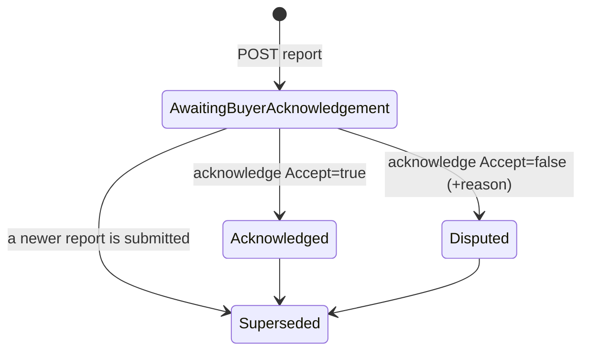
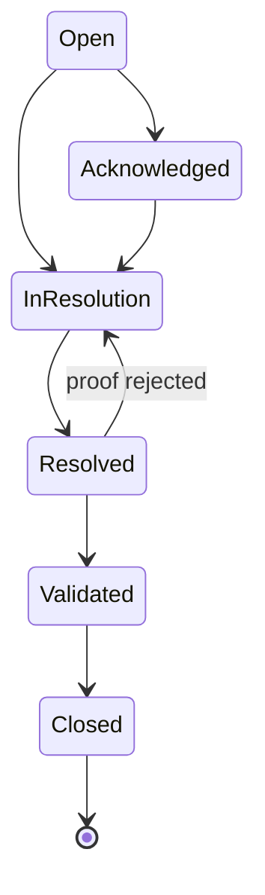

# FinalVisits

`src/ProjectAPI/src/Api/Controllers/FinalVisitsController.cs` — class `FinalVisitsController`, route prefix **`api/final-visits`**.

> Traced through executable statements. Items not resolvable from executable code
> are marked **Unverified**.

## Purpose

The pre-delivery inspection: once a project is complete and a reservation
approved, the buyer walks the unit with the sales agent. The agent records a
report and any defects ("snags"/réserves); the buyer accepts or disputes it.
The outcome, combined with the land-title status, is what gates the notarial
stage.

This module owns the **notary eligibility calculation** that
[NotaryAppointments.md](NotaryAppointments.md) enforces.

## Authorization

Class-level `[Authorize]`. Three actions add `RoleGroups.AdminsAgents`; five
carry no role attribute and are narrowed in the handler.

| Action | Role attribute | Handler-level narrowing |
|---|---|---|
| POST `…/request` | none | `EnsureReservationAccessAsync` + `EnsureBuyerOwnsReservationAsync` |
| POST `…/transition` (appointment) | AdminsAgents | `EnsureReservationAccessAsync` |
| POST `…/report` | AdminsAgents | `EnsureReservationAccessAsync` |
| POST `reports/{id}/acknowledge` | none | both scope checks (when the reservation resolves) |
| POST `snags/{id}/transition` | AdminsAgents | `EnsureReservationAccessAsync` |
| GET `…/case` | AdminsAgents | `EnsureReservationAccessAsync` |
| GET `…/report/mine` | none | **strict buyer-only** — see below |
| GET `…/notary-eligibility` | none | both scope checks |

`GetMyFinalVisitReportHandler` is the strictest check in the module and differs
from every other "mine" endpoint traced so far: it requires
`reservation.BuyerId == ICurrentUser.UserId` with **no internal-role bypass**, so
a `GLOBAL_ADMIN` is refused this projection (they use `GET …/case` instead). An
empty `BuyerId` is also refused, so a walk-in buyer with no account can never
read it.

## Endpoints

| Verb | Path | Handler | Response |
|---|---|---|---|
| POST | `reservations/{reservationId:guid}/request` | `RequestFinalVisitHandler` (idempotent) | `RequestFinalVisitResponse` |
| POST | `appointments/{appointmentId:guid}/transition` | `TransitionVisitAppointmentHandler` | transition response |
| POST | `appointments/{appointmentId:guid}/report` | `SubmitFinalVisitReportHandler` | `SubmitFinalVisitReportResponse` |
| POST | `reports/{reportId:guid}/acknowledge` | `AcknowledgeReportHandler` | `AcknowledgeReportResponse` |
| POST | `snags/{snagId:guid}/transition` | `TransitionSnagHandler` | `TransitionSnagResponse` |
| GET | `reservations/{reservationId:guid}/case` | `GetFinalVisitCaseHandler` | case DTO or 404 |
| GET | `reservations/{reservationId:guid}/report/mine` | `GetMyFinalVisitReportHandler` | `MyFinalVisitReportDto` or 404 |
| GET | `reservations/{reservationId:guid}/notary-eligibility` | `GetNotaryEligibilityHandler` | `NotaryEligibilityResponse` |

Every `{id}` route segment is bound onto the command before dispatch.

> **File organisation:** six of the eight handlers are declared **inside their
> Command/Query files**. Only `GetFinalVisitCase` and `GetMyFinalVisitReport`
> have separate `*Handler.cs` files. Same inconsistency as `Payments`.

> **Controller-specific quirk:** the `Request` action shadows
> `ControllerBase.Request`, so the idempotency key is read via
> `HttpContext.Request.GetIdempotencyKey()` rather than the bare `Request`
> property.

## Domain model

```
Reservation 1─1 FinalVisitCase 1─* FinalVisitAppointment 1─* FinalVisitReport 1─* Snag 1─* SnagHistory
```

- **One `FinalVisitCase` per reservation.** Rescheduling adds an *attempt* to the
  same case, so history is never overwritten.
- `FinalVisitAppointment.AttemptNo` is 1-based within the case; attempts chain
  through `PreviousAppointmentId`.
- Reports are **versioned and append-only**: a new submission sets the previous
  one to `Superseded` and inserts `VersionNo + 1`.
- Snags carry a generated human-readable `Code`:
  `SNG-{first 8 hex of report id, upper}-{sequence:D3}`.

### Three independent state axes

**1. Attempt status** — the shared `AppointmentAttemptStatus` /
`AppointmentStateMachine` (see [Appointments.md](Appointments.md)). Note
`FinalVisitAppointment.Status` stores the **enum**, whereas the commercial
`Appointment.Status` stores a **string**.

**2. Report status** — `ReportStatus`:



**3. Snag status** — `SnagStateMachine`:



`SnagStateMachine.IsActive(status)` = **not** `Validated` and **not** `Closed`.
This is the subtle rule the eligibility calculation depends on: a major snag
merely marked `Resolved` still blocks the notary until it has been *validated*.

**4. Case status** — `FinalVisitCaseStatus` (`Open`, `RevisitRequired`,
`ReadyForNotary`, `Closed`), set by `SubmitFinalVisitReportHandler` from the
declared result:

| `VisitResult` | Case becomes |
|---|---|
| `CompliantNoSnag` | `ReadyForNotary` |
| `CompliantMinorSnags` | `ReadyForNotary` |
| `NonCompliantMajorSnags` | `RevisitRequired` |
| `NonCompliantBlockingSnags` | `RevisitRequired` |

No traced code sets `Closed`. **Unverified** whether any other module does.

## Notary eligibility

`NotaryEligibilityCalculator.Calculate(visitCase, currentReport, snags)` —
domain-layer, pure, priority-ordered:

| # | Condition | Status |
|---|---|---|
| 1 | no case | `NotEligibleFinalVisitPending` |
| 1 | no report | `NotEligibleFinalVisitPending` |
| 1 | report not `Acknowledged` (incl. `Disputed`) | `NotEligibleFinalVisitPending` |
| 2 | any active `Blocking` snag | `BlockedBlockingSnags` |
| 3 | any active `Major` snag | `NotEligibleMajorSnags` |
| 4 | only active `Minor` snags | `EligibleWithMinorSnags` |
| 5 | no active snag | `Eligible` |

`CanRequestAppointment` is true only for `Eligible` and
`EligibleWithMinorSnags`. Every branch appends a human-readable French reason,
returned to the client — the controller's doc states the frontend must display
this and never recompute it, and `finalVisitsApi` does consume it as returned.

**The land title is a separate prerequisite**, not folded into the status.
`GetNotaryEligibilityHandler` reads `UnitTitleState` (defaulting to
`TitleStatus.NotAvailable`), calls
`TitleStateMachine.AllowsNotaryAppointment(...)`, returns `TitleStatus` and
`TitleAllowsAppointment` as distinct fields, and sets
`CanRequestAppointment = eligibility.CanRequestAppointment && titleAllows`.

> **Duplicated composite rule.** The same combination (calculator + title check)
> is implemented **twice**: here as a *query* returning a result, and in
> `NotaryEligibilityService.EnsureEligibleAsync` as a *guard* that throws
> `NOTARY_NOT_ELIGIBLE`. Both read the same tables and apply the same two rules,
> but they are separate code paths that can drift. They agree today.

## Data flow — request → report → acknowledge → eligible

```mermaid
sequenceDiagram
    participant B as Buyer / Agent
    participant A as Agent (UI)
    participant API as FinalVisitsController
    participant DB as Database

    B->>API: POST reservations/{id}/request
    API->>DB: reservation must be Approved or Sold (else 409)
    API->>DB: unit→immeuble→project; ProjectStatusCodes.AllowsFinalVisit (else 409 PROJECT_NOT_COMPLETED)
    API->>DB: case exists? reuse : create (one per reservation)
    API->>DB: any attempt in BlockingStatuses? → 409 FINAL_VISIT_ALREADY_ACTIVE
    API->>DB: insert FinalVisitAppointment (AttemptNo = max+1, Requested)

    A->>API: POST appointments/{id}/transition → Confirmed
    A->>API: POST appointments/{id}/transition → Completed
    Note over API: refuses if StartsAt > now unless AllowEarlyCompletion

    A->>API: POST appointments/{id}/report { ResultCode, Snags[] }
    API->>API: declared result must match max snag severity (else INVALID_REPORT_RESULT)
    API->>DB: previous report → Superseded
    API->>DB: insert report v+1 (AwaitingBuyerAcknowledgement)
    API->>DB: insert Snags (+ SnagHistory Open) with generated codes
    API->>DB: case → ReadyForNotary | RevisitRequired

    B->>API: POST reports/{id}/acknowledge { Accept }
    alt Accept
        API->>DB: report → Acknowledged
    else Dispute (reason required)
        API->>DB: report → Disputed  (blocks the notary stage)
    end

    B->>API: GET reservations/{id}/notary-eligibility
    API-->>B: status + reasons + title status
```

## Enforced business rules

| Rule | Where | Failure |
|---|---|---|
| Reservation must be `Approved` or `Sold` | `RequestFinalVisitHandler` | 409 `INVALID_STATUS_TRANSITION` |
| Project must allow final visits | `RequestFinalVisitHandler` via `ProjectStatusCodes.AllowsFinalVisit` | 409 `PROJECT_NOT_COMPLETED` |
| No second active attempt | `RequestFinalVisitHandler` | 409 `FINAL_VISIT_ALREADY_ACTIVE` |
| Report requires a `Completed` visit | `SubmitFinalVisitReportHandler` | 409 `APPOINTMENT_NOT_COMPLETED` |
| Declared result must match max snag severity | `SubmitFinalVisitReportHandler` | 422 `INVALID_REPORT_RESULT` |
| Cannot complete before `StartsAt` | `TransitionVisitAppointmentHandler` | 422, unless `AllowEarlyCompletion` |
| Reschedule requires a new slot | `TransitionVisitAppointmentHandler` | 422 |
| Reject/cancel requires a reason | `TransitionVisitAppointmentHandler` | 422 |
| Dispute requires a reason | `AcknowledgeReportHandler` | 422 |
| Acknowledge only from `AwaitingBuyerAcknowledgement` | `AcknowledgeReportHandler` | 409 |
| Snag→`Resolved` requires a resolution comment | `TransitionSnagHandler` | 422 |
| Snag transitions follow `SnagStateMachine` | `TransitionSnagHandler` | 409 |

The severity↔result consistency check is the notable one: because eligibility is
computed from snags, a report declaring "compliant" while carrying a blocking
snag would produce a contradictory gate. The handler derives the expected result
from `Snags.Max(s => s.Severity)` and refuses a mismatch.

## Frontend coverage

Consumed by `realestateFront/src/api/http/finalVisitsApi.ts`; UI in
`features/finalVisits/FinalVisitPanel.tsx` and
`features/buyer/BuyerFinalVisitReportCard.tsx`.

| Endpoint | Frontend caller | Status |
|---|---|---|
| POST `…/request` | `finalVisitsApi.request` | ✅ |
| POST `appointments/{id}/transition` | `finalVisitsApi.transitionAppointment` | ✅ |
| POST `appointments/{id}/report` | `finalVisitsApi.submitReport` | ✅ |
| POST `reports/{id}/acknowledge` | `finalVisitsApi.acknowledgeReport` | ✅ |
| POST `snags/{id}/transition` | `finalVisitsApi.transitionSnag` | ✅ |
| GET `…/case` | `finalVisitsApi.getCase` | ✅ wrapped to return `null` on 404 |
| GET `…/report/mine` | `finalVisitsApi.getMyReport` | ✅ wrapped to return `null` on 404 |
| GET `…/notary-eligibility` | `finalVisitsApi.getNotaryEligibility` | ✅ |

**8 of 8 wired — full coverage.** The adapter converts the controller's 404
(`res == null ? NotFound()`) into a `null` return for the two "may not exist yet"
reads, which matches the handlers returning `null` for a reservation with no case
or no report.

**Idempotency declared but inert.** `RequestFinalVisitCommand` implements
`IIdempotentRequest` and the controller reads the header, but the frontend sends
no `Idempotency-Key` (repository-wide, the string appears only as a TypeScript
literal in `client.ts:28`). The `FINAL_VISIT_ALREADY_ACTIVE` check is therefore
the only protection against a double-submitted request, and it is a
read-then-write with no unique index confirmed behind it (**Unverified**).

## Tables touched

| Table | Written by |
|---|---|
| `FinalVisitCases` | request (insert, one per reservation), report (status update) |
| `FinalVisitAppointments` | request (insert attempt), transition (status, slot) |
| `FinalVisitReports` | report (insert versioned; supersede previous), acknowledge (status) |
| `Snags` | report (insert), snag transition (status, resolution, proof) |
| `SnagHistories` | report (initial `Open` row), snag transition |
| `UnitTitleStates` | **read only** — the title prerequisite |
| `Reservations`, `Units`, `Immeubles`, `Projects` | read only — prerequisites and scope |

**Unverified:** EF configuration for these tables (indexes, cascade behaviour,
whether `FinalVisitCase.ReservationId` carries a unique index enforcing
one-case-per-reservation at the database level). The handler enforces it in
application code only, as traced.

## Relations

### Depends on (outbound)

| Module | Mechanism | Evidence |
|---|---|---|
| **Reservations** | Shared table, read + perimeter | Status prerequisite; every scope check resolves through `ReservationId`. |
| **Projects** | Shared table, read | `ProjectStatusCodes.AllowsFinalVisit(project.StatusGlobal)` via `unit → immeuble → project`. |
| **Immeuble** | Join only | The `unit.ProjectId → Immeuble.Id → Immeuble.ProjectId` hop. |
| **Construction** | Shared table, read | `UnitTitleState` + `TitleStateMachine.AllowsNotaryAppointment`. |
| **ProjectMembership** | `ProjectScopeService` | All eight endpoints. |
| **Appointments** | Shared enum/matrix only | `AppointmentAttemptStatus` + `AppointmentStateMachine`; **different table**. |

### Depended on by (inbound)

| Module | Mechanism | Evidence |
|---|---|---|
| **NotaryAppointments** | `NotaryEligibilityService` reads `FinalVisitCase` → `FinalVisitReport` → `Snag` | Gate applied at both appointment creation and confirmation. |

### Possible / unconfirmed relations

- **Handovers.** A delivery presumably follows a cleared final visit, but
  nothing in this module references handovers and no traced code links them.
  **Unverified** until `Handovers.md`.
- **Claims (SAV).** Snags and after-sales claims are distinct entities
  (`Snag` vs `AfterSaleClaim`) with no traced relationship. The snag comment
  states snags belong to the **sales** agent, never the after-sales technician —
  suggesting a deliberate separation. **Unverified.**
- **Notifications.** No `INotificationService` call exists anywhere in this
  module — unlike Reservations and Payments. A buyer is never notified that a
  report awaits their acknowledgement, which is the one action the workflow
  blocks on.

## Known edge cases

1. **No notifications at all.** The workflow's critical wait state — a report in
   `AwaitingBuyerAcknowledgement` blocking the notary stage — produces no
   notification to the buyer. `INotificationService` is injected nowhere in this
   module. A buyer learns of it only by opening the portal.

2. **`AuthorUserId` and `BuyerUserId` are client-supplied and never verified.**
   `SubmitFinalVisitReportCommand.AuthorUserId` is written to the report and to
   every `SnagHistory` row; `AcknowledgeReportCommand.BuyerUserId` is written to
   `report.AcknowledgedBy`. Neither is compared to, or defaulted from,
   `ICurrentUser.UserId` — unlike `ApproveReservationHandler`, which overrides
   the client value with the token identity. Report authorship and buyer
   acknowledgement are therefore both forgeable by an authorised caller.

3. **An agent or admin can acknowledge on the buyer's behalf.**
   `AcknowledgeReportHandler` applies `EnsureBuyerOwnsReservationAsync`, which
   returns early for any internal role. Combined with the client-supplied
   `BuyerUserId`, a scoped agent can mark a report accepted and record any user
   id as the acknowledger. The controller comment frames this as recording "on a
   walk-in's behalf"; the code places no limit on it.

4. **`AllowEarlyCompletion` is a request flag, not a role check.** The guard
   against completing a visit before `StartsAt` is bypassed by a boolean in the
   request body. The comment says "unless a project admin explicitly authorises
   it", but **no role check exists** — any `AdminsAgents` caller can set it.

5. **Scope checks are skipped when the reservation cannot be resolved.** Both
   `AcknowledgeReportHandler` and `TransitionSnagHandler` wrap their scope calls
   in `if (reservationId != Guid.Empty)`. If the report→appointment→case join
   returns nothing, the handler proceeds **unscoped** rather than failing closed.
   Contrast `ProjectScopeService.EnsureReservationAccessAsync`, which explicitly
   treats an unresolvable ownership chain as a denial.

6. **Report supersession is per appointment, not per case.**
   `SubmitFinalVisitReportHandler` supersedes the previous non-superseded report
   for the **same `AppointmentId`**. A second attempt (new appointment) produces
   a new report chain, so two non-superseded reports can coexist across attempts.
   The eligibility query then picks the highest `VersionNo` across all
   appointments in the case — and `VersionNo` restarts at 1 per appointment, so
   with multiple attempts the "current" report is selected by a version number
   that is not globally ordered. **This is a real ordering hazard;** whether it
   misfires depends on attempt/version combinations not exercised here.
   **Unverified at runtime.**

7. **`GetMyFinalVisitReport` does not filter `Superseded`.** It orders by
   `VersionNo` descending without excluding superseded rows, whereas the
   eligibility query filters `Status != Superseded`. Given item 6, the two reads
   can disagree about which report is current.

8. **No `Closed` transition for a case.** `FinalVisitCaseStatus.Closed` exists
   and no traced code sets it.

9. **`TransitionSnagHandler` has no ownership narrowing.** Any `AdminsAgents`
   caller scoped to the project may transition any snag, including validating
   their own resolution — there is no separation between the agent who marked a
   snag `Resolved` and the one who marks it `Validated`, even though that
   validation is what unblocks the notary.

10. **No validators.** None of the five commands has an `AbstractValidator`;
    every rule is inline, surfacing as `BusinessRuleException` (409/422).

## Related

- Downstream gate consumer: [NotaryAppointments.md](NotaryAppointments.md)
- Shared appointment matrix: [Appointments.md](Appointments.md)
- Reservation prerequisite: [Reservations.md](Reservations.md)
- Title status source: `Construction.md` *(pending)*
- Frontend consumer: `realestateFront/docs/frontend/FinalVisits.md` *(pending)*
