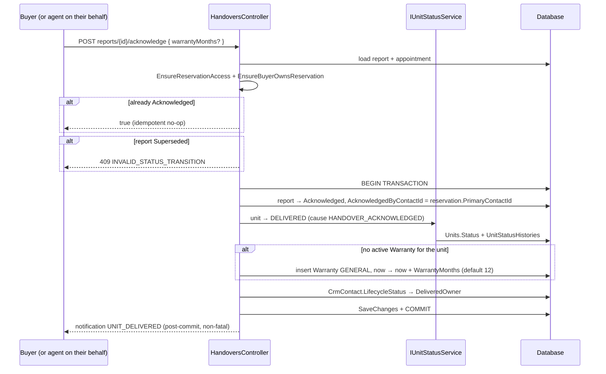

# Handovers

`src/ProjectAPI/src/Api/Controllers/HandoversController.cs` — class `HandoversController`, route prefix **`api/Handovers`** (explicit, not `[controller]`).

> Traced through executable statements. Items not resolvable from executable code
> are marked **Unverified**.

## Purpose

*Remise des clés* — the final step of the sale. Keys are handed over, a
procès-verbal is recorded, and the **buyer's acknowledgement** is what actually
delivers the property: it moves the unit to `DELIVERED`, opens the warranty, and
thereby makes after-sales claims possible.

This is the only module that writes `UnitCommercialStatus.Delivered`, and the
only one that creates a `Warranty`.

## Authorization

Class-level `[Authorize]`. Three writes are `RoleGroups.AdminsAgents`; the
acknowledgement and the two reads are authenticated-only and narrowed in the
handler.

| Action | Role attribute | Handler-level narrowing |
|---|---|---|
| POST `/` | AdminsAgents | `EnsureReservationAccessAsync` |
| POST `{id}/confirm` | AdminsAgents | `EnsureReservationAccessAsync` |
| POST `{id}/report` | AdminsAgents | `EnsureReservationAccessAsync` |
| POST `reports/{id}/acknowledge` | `[Authorize]` | `EnsureReservationAccessAsync` + `EnsureBuyerOwnsReservationAsync` |
| GET `…/mine` | `[Authorize]` | internal → perimeter; otherwise `BuyerId == caller` |
| GET `…/warranties/mine` | `[Authorize]` | same two-branch check |

Both reads use an explicit branch rather than the usual pair of calls:

```csharp
if (isInternal) await _projectScope.EnsureReservationAccessAsync(...);
else if (string.IsNullOrEmpty(reservation.BuyerId) || reservation.BuyerId != _currentUser.UserId)
    throw 403;
```

This is stricter than `EnsureBuyerOwnsReservationAsync` alone, and the handler
comment records why: previously any agent or admin could view the buyer-facing
projection without a perimeter check.

## Endpoints

| Verb | Path | Handler | Response |
|---|---|---|---|
| POST | `/` | `ScheduleHandoverHandler` | `{ id }` |
| POST | `{id:guid}/confirm` | `ConfirmHandoverHandler` | `bool` |
| POST | `{id:guid}/report` | `SubmitHandoverReportHandler` | `{ id }` |
| POST | `reports/{reportId:guid}/acknowledge` | `AcknowledgeHandoverHandler` (idempotent) | `bool` |
| GET | `reservations/{reservationId:guid}/mine` | `GetMyHandoverStatusHandler` | status DTO or 404 |
| GET | `reservations/{reservationId:guid}/warranties/mine` | `GetMyWarrantiesHandler` | warranty list |

All four command handlers live in a single **`HandoverCommands.cs`** (397 lines)
— commands, inputs and handlers together. The two queries have conventional
folders. This is the most condensed file organisation in the solution.

The acknowledge action takes a **nullable** body (`AcknowledgeHandoverCommand?`)
and rebuilds the command server-side, defaulting `WarrantyMonths` to 12 and
falling back to the `Idempotency-Key` header.

## Prerequisites — what gates a handover

`ScheduleHandoverHandler`:

1. `EnsureReservationAccessAsync`.
2. **`reservation.Status` must be `Sold`** (the spec's CONVERTED), else
   `INVALID_STATUS_TRANSITION`. Since `Sold` is written only by
   `UpdateNotaryAppointmentHandler` on `PURCHASE_COMPLETED`
   ([NotaryAppointments.md](NotaryAppointments.md)), a handover is impossible
   without a completed notarial act.
3. Unit already `Delivered` ⇒ `INVALID_STATUS_TRANSITION`.
4. **No active handover** — any existing `HandoverAppointment` for the
   reservation whose status is in `AppointmentStateMachine.BlockingStatuses`
   ⇒ 409 `HANDOVER_ALREADY_ACTIVE`.
5. Insert `HandoverAppointment` with `Status = Requested`,
   `SalesAgentId = reservation.AgentId`, `CreatedBy = ICurrentUser.UserId`.

Note step 5: `CreatedBy` is taken from the **token**, not from the request — one
of the few handlers in the solution that does this correctly without being asked.

## Report and acknowledgement

**`SubmitHandoverReportHandler`** — the procès-verbal. It supersedes any current
report (`Status = Superseded`) and inserts a new one at
`AwaitingBuyerAcknowledgement`, refusing when a report is already `Acknowledged`.
If the appointment is still `Confirmed`, it is advanced to `Completed` in the
same call. The report carries `HandoverItem` rows from `HandoverItemInput`.

**`AcknowledgeHandoverHandler`** — the act that delivers the property:



Properties verified in code:

- **Idempotent on an already-acknowledged report** — returns `true` without
  re-running, in addition to the `IIdempotentRequest` pipeline.
- **The unit transition is the real guard.** `IUnitStatusService` validates
  against `UnitStateMachine`, where `Delivered` is reachable only from `Sold`.
  A unit that never reached the notary cannot be delivered by this path even if
  the report exists.
- **Warranty is created only when no active one covers the unit**
  (`w.UnitId == … && w.IsActive`). `WarrantyMonths <= 0` falls back to 12.
  The handler comment names a filtered unique index as the real guarantee;
  **Unverified** — I did not open the `Warranty` EF configuration.
- **Lifecycle advances on the contact, not the account** —
  `ContactLifecycleStatus.DeliveredOwner`, so a buyer with no login is still
  recorded as an owner.
- Unit transition, warranty and contact update are in **one transaction**; the
  notification is post-commit and non-fatal.

## Frontend coverage

Consumed by `realestateFront/src/api/http/handoversApi.ts`; UI in
`features/reservations/HandoverPanel.tsx` and
`features/buyer/BuyerHandoverCard.tsx`.

| Endpoint | Frontend caller | Status |
|---|---|---|
| POST `/` | `handoversApi.schedule` | ⚠️ declared return type wrong (latent) |
| POST `{id}/confirm` | `handoversApi.confirm` | ✅ |
| POST `{id}/report` | `handoversApi.submitReport` | ⚠️ declared return type wrong (latent) |
| POST `reports/{id}/acknowledge` | `handoversApi.acknowledge` | ✅ |
| GET `…/mine` | `handoversApi.getMyStatus` | ✅ 404 → `null` |
| GET `…/warranties/mine` | `handoversApi.getMyWarranties` | ✅ |

**6 of 6 wired — full coverage.**

**Latent type mismatch.** `schedule` and `submitReport` both declare
`projectFetch<string>`, but the controller returns an **object**
(`Ok(new { id = … })`). At runtime the value is `{ id: "…" }` while TypeScript
believes it is a `string`. This is currently harmless: `HandoverPanel.tsx` awaits
both calls (lines 64 and 110) and **discards the return value**. It would break
the moment a caller used the result as an id.

`confirm` sends `{ appointmentId }` in the body, which the controller ignores —
it builds the command from the route segment only.

## Tables touched

| Table | Written by |
|---|---|
| `HandoverAppointments` | schedule (insert), confirm (status), report (status → Completed) |
| `HandoverReports` | report (insert; supersede previous), acknowledge (status) |
| `HandoverItems` | report (insert from `HandoverItemInput`) |
| `Units` + `UnitStatusHistories` | acknowledge — via `IUnitStatusService`, cause `HANDOVER_ACKNOWLEDGED` |
| `Warranties` | acknowledge — insert when none active |
| `CrmContacts` | acknowledge — `LifecycleStatus → DeliveredOwner` |
| `Notifications` | acknowledge — `UNIT_DELIVERED`, post-commit |
| `Reservations` | read only |

**Unverified:** EF configuration for `HandoverAppointments`, `HandoverReports`,
`HandoverItems` and `Warranties`, including the filtered unique index the
acknowledge handler relies on for warranty uniqueness.

## Relations

### Depends on (outbound)

| Module | Mechanism | Evidence |
|---|---|---|
| **NotaryAppointments** | Precondition via shared table | `reservation.Status == Sold` is required, and only that module sets it. |
| **Reservations** | Shared table, read + perimeter | Every handler scopes through `ReservationId`. |
| **Units** | `IUnitStatusService.TransitionAsync` | `SOLD → DELIVERED`, cause `HANDOVER_ACKNOWLEDGED`. |
| **Crm** | Shared table, write | `ContactLifecycleStatus.DeliveredOwner`. |
| **Notifications** | `INotificationService.NotifyAsync` | `UNIT_DELIVERED`. |
| **Appointments** | Shared enum/matrix only | `AppointmentAttemptStatus` + `BlockingStatuses`; **different table** (`HandoverAppointments`). |
| **ProjectMembership** | `ProjectScopeService` | All six endpoints. |

### Depended on by (inbound)

| Module | Mechanism | Evidence |
|---|---|---|
| **Claims (SAV)** | `Warranty` rows created here | The handler's own log line and notification both state SAV opens on delivery. **The consuming side is Unverified** until `Claims.md`. |

### Possible / unconfirmed relations

- **FinalVisits.** A cleared final visit is intuitively a prerequisite for
  delivery, but **nothing in this module references it** — no `FinalVisitCase`
  read, no snag check. The only gate is `reservation.Status == Sold`. Since the
  notary stage already required an acknowledged final-visit report, the
  constraint is transitive rather than direct.
- **Deliveries.** A separate `DeliveriesController` exists with its own
  `PropertyDelivery` entity. `UpdateNotaryAppointmentHandler`'s comment notes
  that `ScheduleDeliveryHandler` requires an existing `Sale` whereas
  `ScheduleHandoverHandler` does not — implying two parallel delivery
  mechanisms. **Unverified** until `Deliveries.md`.
- **Payments.** Nothing here checks that the schedule is fully paid before
  delivery. **Unverified** whether that rule exists elsewhere.

## Known edge cases

1. **An agent can acknowledge on the buyer's behalf, unrestricted.**
   `EnsureBuyerOwnsReservationAsync` returns early for any internal role, so any
   `SALES_AGENT` or admin scoped to the project can trigger the delivery — the
   single most consequential state change after the notarial conversion. The
   controller comment frames this as recording for "a buyer with no account
   (§1.1)", but the code places no condition on it: it applies equally to buyers
   who *do* have an account and could acknowledge themselves.

2. **`AcknowledgedByContactId` records the reservation's contact, not the actor.**
   It is set to `reservation.PrimaryContactId` regardless of who called. Combined
   with item 1, an agent-triggered delivery is indistinguishable from a
   buyer-triggered one in the report row. The actor survives only in
   `UnitStatusHistories.ActorUserId` (which *is* set from the token).

3. **`WarrantyMonths` is caller-supplied with no bounds.** Any value > 0 is
   accepted — `1200` months is as valid as `12`. Only `<= 0` falls back to the
   default. Warranty length is set by whoever clicks acknowledge.

4. **The warranty guard is per unit, not per reservation.**
   `AnyAsync(w => w.UnitId == … && w.IsActive)` means a unit whose earlier
   warranty is still active gets **no new warranty** on a subsequent delivery
   (after a cancellation and resale), while the new `Warranty` would carry the
   old `ReservationId`. Mirrors the `Sale`-dedupe-by-unit issue in
   [NotaryAppointments.md](NotaryAppointments.md) edge case 2.

5. **No handover state machine beyond the shared appointment matrix.**
   `ConfirmHandoverHandler` checks the current status before assigning
   `Confirmed`, and `SubmitHandoverReportHandler` advances `Confirmed → Completed`
   — but there is no `AppointmentStateMachine.CanTransition` call in this module,
   unlike `TransitionVisitAppointmentHandler`. The checks are hand-written
   comparisons.

6. **No reschedule or cancel path.** The module offers schedule, confirm, report
   and acknowledge only. A handover that must be moved has no endpoint; the
   `HANDOVER_ALREADY_ACTIVE` guard then blocks scheduling a replacement while the
   original sits in a blocking status. **Unverified** whether any other module
   can release it.

7. **`{id}/confirm` accepts a body it ignores**, and the frontend sends one.

8. **Both write endpoints return `{ id }` while the client types `string`** —
   latent, see Frontend coverage.

9. **No validators.** None of the four commands has an `AbstractValidator`.

## Related

- The precondition that makes a handover possible:
  [NotaryAppointments.md](NotaryAppointments.md)
- Unit status writer and history: [Reservations.md](Reservations.md),
  [Immeuble.md](Immeuble.md)
- Upstream inspection: [FinalVisits.md](FinalVisits.md)
- Warranty consumer: `Claims.md` *(pending)*
- Parallel delivery mechanism: `Deliveries.md` *(pending)*
- Frontend consumer: `realestateFront/docs/frontend/Reservations.md` (HandoverPanel)
  and `.../Buyer.md` (BuyerHandoverCard) *(pending)*
