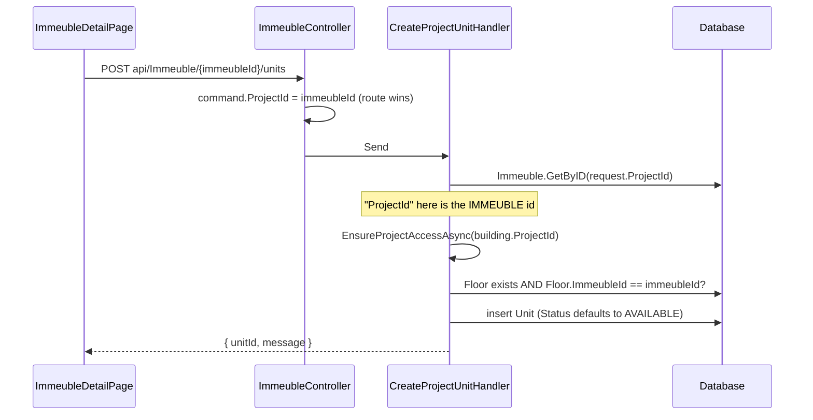

# Immeuble (Buildings, Floors, Units)

`src/ProjectAPI/src/Api/Controllers/ImmeubleController.cs` — class `ImmeubleController`, route prefix **`api/Immeuble`** (singular).

> Traced from source. Comments are recorded only where the statements confirm
> them; divergences are under [Known edge cases](#known-edge-cases).

## Purpose

The stock layer: buildings, their floors, and the units inside them — levels 2–4
of `Project → Immeuble → Floor → Unit`. Also carries building features, building
construction tracking, and every unit read/write path except commercial status
(which only `IUnitStatusService` may change).

## Authorization

Class-level `[Authorize]`. **Ten of 17 actions are `[AllowAnonymous]`** for the
public catalogue; all writes are `RoleGroups.Admins`. Every write handler resolves
the owning project and calls `ProjectScopeService.EnsureProjectAccessAsync`.

**No anonymous read applies any scope check** — by design for catalogue data, but
see edge case 1 for what that actually exposes.

## Endpoints

| Verb | Route | Auth | Handler | Response |
|---|---|---|---|---|
| POST | `/` | Admins | `CreateImmeubleHandler` | `CreateImmeubleResponse` |
| GET | `/` | **Anonymous** | `GetAllImmeublesHandler` | `PaginatedResponse<ImmeubleResponse>` |
| GET | `{id}` | **Anonymous** | `GetImmeubleByIdHandler` | `ImmeubleResponse` |
| PUT | `{id}` | Admins | `UpdateImmeubleHandler` | `ImmeubleResponse` |
| DELETE | `{id}` | Admins | `DeleteImmeublesHandler` | `DeleteImmeubleResponse` |
| POST | `{immeubleId}/units` | Admins | `CreateProjectUnitHandler` | `CreateProjectUnitResponse` |
| POST | `{immeubleId}/floors` | Admins | `CreateFloorHandler` | `CreateFloorResponse` |
| GET | `{immeubleId}/floors` | **Anonymous** | `GetFloorsByImmeubleHandler` | `List<FloorSummary>` |
| GET | `{immeubleId}/floor-stats` | **Anonymous** | `GetImmeubleFloorStatsHandler` | `List<FloorStatsDto>` |
| GET | `floors/{floorId}/units` | **Anonymous** | `GetUnitsByFloorHandler` | `List<UnitDrillDownDto>` |
| GET | `by-immeuble` | **Anonymous** | `GetUnitsByProjectIdHandler` | `PaginatedResponse<UnitResponse>` |
| GET | `all` | **Anonymous** | `GetAllUnitsHandler` | `PaginatedResponse<UnitResponse>` |
| PUT | `update/{id}` | Admins | `UpdateUnitHandler` | **plain text** |
| POST | `features` | Admins | `AddImmeubleFeatureHandler` | `{ message }` |
| GET | `features` | **Anonymous** | `GetImmeubleFeaturesHandler` | `List<ImmeubleFeatureResponse>` or **404** |
| POST | `{immeubleId}/tracking` | Admins | `AddImmeubleTrackingHandler` | `{ Message }` |
| GET | `{immeubleId}/tracking` | **Anonymous** | `GetImmeubleTrackingHandler` | `List<ImmeubleTrackingResponse>` or **404** |

## Frontend coverage

Consumed by `immeublesApi.ts`, `floorsApi.ts`, `trackingApi.ts`.

| Endpoint | Frontend caller | Status |
|---|---|---|
| POST `/` | `immeublesApi.create` | ✅ reads `res.projectId` as the new **immeuble** id |
| GET `/` | `immeublesApi.list` | ✅ |
| GET `{id}` | `immeublesApi.getById` | ✅ |
| PUT `{id}` | `immeublesApi.update` | ✅ |
| DELETE `{id}` | — | ❌ **deliberately unused** (`interfaces.ts:123` — "Pas de remove()") |
| POST `{immeubleId}/units` | `immeublesApi.createUnit` | ✅ |
| POST `{immeubleId}/floors` | `floorsApi.create` | ⚠️ fabricates `sequenceNo: 0` |
| GET `{immeubleId}/floors` | `floorsApi.list` | ✅ |
| GET `{immeubleId}/floor-stats` | `immeublesApi.getFloorStats` | ✅ |
| GET `floors/{floorId}/units` | `immeublesApi.getUnitsByFloor` | ✅ |
| GET `by-immeuble` | `immeublesApi.listUnits` | ✅ paginates client-side to `MAX_PAGE_SIZE` |
| GET `all` | `immeublesApi.listAllUnits` | ✅ |
| PUT `update/{id}` | `immeublesApi.updateUnit` | ✅ via `projectFetchText` (plain-text body) |
| POST `features` | — | ❌ **never called** |
| GET `features` | `immeublesApi.listFeatures` | ⚠️ **always returns empty** |
| POST `{immeubleId}/tracking` | `trackingApi` | ✅ |
| GET `{immeubleId}/tracking` | `trackingApi` | ✅ via `projectFetchOr404Empty` |

**15 of 17 endpoints wired.** Two gaps:

- `GET features` is called as `"/api/Immeuble/features"` with **no `ImmeubleId`
  query parameter** (`immeublesApi.ts:140`). The query binds `ImmeubleId =
  Guid.Empty`, the handler finds no rows, and the controller returns 404 — which
  `projectFetchOr404Empty` swallows into `[]`. **Building features never appear in
  the UI**, and nothing writes them either (`POST features` is uncalled). The
  feature set is effectively dead end-to-end.
- `floorsApi.create` returns `{ id, name, sequenceNo: 0 }` built locally. The
  backend computes `SequenceNo = request.SequenceNo ?? existing.Count`, so the
  real ordering value is discarded until the list is re-fetched. The frontend also
  never sends `sequenceNo`, so floors are always appended.

## Data flow — unit creation

`CreateProjectUnitHandler` never sets `Status`, `LatestPrice`, or any
`SaleableValue`/price field — a new unit is `AVAILABLE` (enum default `0`) with no
price until `PUT update/{id}` sets one.

## The `Unit.ProjectId` naming trap

`Unit.ProjectId` is the FK to **Immeuble**, not to Project. Confirmed in code by:

- `CreateProjectUnitHandler` — `_projectRepository` is an `IImmeubleRepository`
  and is queried with `request.ProjectId`.
- `UpdateUnitHandler` — resolves `Immeuble.Where(i => i.Id == unit.ProjectId)` to
  get `realProjectId` before the scope check.
- `GetProjectByIdHandler` — `units.Where(u => immeubleIds.Contains(u.ProjectId))`.
- `DeleteImmeublesHandler` — `allUnits.Where(u => u.ProjectId == request.Id)`
  where `request.Id` is an immeuble id.

`Immeuble.ProjectId`, by contrast, is a real project FK. `CreateImmeubleResponse`
compounds the confusion: its `ProjectId` property carries the **new immeuble's
id**, and the frontend reads it as such.

## Stock figures are computed live

Neither `GetImmeubleByIdHandler` nor `GetAllImmeublesHandler` trusts the stored
counters. Both count `Unit.Status` in memory:

| Bucket | Statuses counted |
|---|---|
| `NumberOfAvailableUnites` | `AVAILABLE` |
| `NumberOfReservedUnites` | `HOLD_PENDING_APPROVAL`, `RESERVED`, `CONTRACTED` |
| `NumberOfSoldUnites` | `SOLD`, `DELIVERED` |
| `SellsPercentage` | `round(sold * 100 / total)` |

`GetImmeubleFloorStatsHandler` and `GetProjectByIdHandler` use the **same three
buckets**, so building, floor and project levels agree.

The stored columns (`Immeuble.NumberOfUnits`, `NumberOfAvailableUnites`,
`NumberOfSoldUnites`, `SellsPercentage`) *are* written — but only once, by
`CreateImmeubleHandler`, straight from client input. No other handler updates
them, so they are stale from the first sale onward and are never read back.

## Relations

### Depends on (outbound)

| Module | Mechanism | Evidence |
|---|---|---|
| **Projects** | FK + scope resolution | `Immeuble.ProjectId → Projects.Id`; every write handler calls `EnsureProjectAccessAsync(immeuble.ProjectId)`. `CreateImmeubleHandler` validates the project exists via `IProjectRepository`. |
| **ProjectMembership** | `ProjectScopeService` | All 7 write handlers. Anonymous reads bypass it. |
| **Units** (domain) | Shared tables | `Units`, `Floors` written here; `Unit.Status` **not** written — deliberately absent from `UpdateUnitCommand`. |
| **Reservations** | Read + cascade delete | `GetUnitsByFloorHandler` reads `Reservations` for buyer/agent enrichment; `DeleteImmeublesHandler` deletes them. |
| **Sales** | Cascade delete | `DeleteImmeublesHandler` deletes sales for the building's units. |
| **Identity (ProjectAPI store)** | `_db.Users` | `GetUnitsByFloorHandler` resolves agent names. |

### Depended on by (inbound)

| Module | Mechanism | Evidence |
|---|---|---|
| **Reservations** | Join + scope chain | `reservation → unit → immeuble → project` in `ProjectScopeService`, `CreateReservationHandler`, `GetReservationsHandler`. |
| **Projects** | Read + cascade delete | Drill-down stats read `Immeubles`/`Floors`/`Units`; `RemoveProjectHandler` deletes them. |
| **Units status writer** | `IUnitStatusService` writes `Units.Status` | Owned by `Reservations`/`NotaryAppointments`/`Handovers`, not by this controller. |

### Possible / unconfirmed relations

- **Construction** — `ImmeubleTracking` here is a **separate** free-text status
  log from the `ConstructionMilestone`/`ConstructionUpdate` entities used by
  `ConstructionController`. They share no table and no handler in the code traced
  so far. Confirm when `Construction.md` is written.
- **Appointments** — `DeleteImmeublesHandler` injects `IAppointmentRepository`
  but never uses it (edge case 4). Whether appointments should cascade here is
  unresolved.

## Known edge cases

1. **`GET floors/{floorId}/units` publishes buyer and agent names anonymously,
   and its own justification is wrong.** The handler's XML comment says the
   enrichment "is only ever populated for units already in a non-selectable state
   (RESERVED and beyond)", and `UnitDrillDownDto.BuyerName` repeats "Populated only
   when the unit is RESERVED/CONTRACTED/SOLD/DELIVERED".

   The code applies **no unit-status filter at all**. It selects reservations
   where `r.Status != Rejected && r.Status != Cancelled` — which still includes
   `Draft` (5), `Pending`/SUBMITTED (0), `ChangesRequested` (6) and **`Expired`
   (7)** — then attaches `reservation.Name + LastName` and the agent's full name
   to the unit. So an `[AllowAnonymous]` endpoint discloses the buyer's name for
   units that are still `AVAILABLE` (draft reservation), merely on hold pending
   approval, or whose reservation has already expired. The stated precondition
   that makes the anonymous exposure defensible is not implemented.

2. **`UpdateImmeubleHandler` cannot clear or zero a field.** Updates are applied
   through a `Dictionary<Func<bool>, Action>` guarded by truthiness:
   `request.MinPrice > 0`, `request.Latitude != 0`, `!string.IsNullOrWhiteSpace(...)`.
   A building cannot be moved to latitude 0, priced at 0, or have its description
   cleared. `UpdateUnitHandler` uses the same dictionary pattern but guards on
   `.HasValue`/`!= null`, so it *can* — the two are inconsistent.

3. **`UpdateImmeubleHandler` can 500 on null images.** Its response does
   `immeuble.Images.Split(',')` with no null guard, while `GetImmeubleByIdHandler`
   and `GetAllImmeublesHandler` both null-check the same field.

4. **`DeleteImmeublesHandler` never deletes appointments.** It injects
   `IAppointmentRepository`, assigns it, and never calls it — the numbered comment
   sequence jumps from "1." to "3.". Appointments referencing the deleted units
   survive as orphans. `RemoveProjectHandler` *does* delete appointments (by
   `Appointment.ProjectId`), so deleting a building leaves rows that deleting the
   whole project would have removed.

5. **Both delete paths are untransacted** and, per
   [`BaseRepository` semantics](Projects.md#repository-semantics), each `Delete`
   commits individually. A failure part-way through leaves sales deleted but units
   intact, etc.

6. **`GetAllImmeubles` swallows every exception into a 400 with `ex.Message`.**
   The controller wraps `_mediator.Send` in `try/catch` and returns
   `BadRequest(ex.Message)`, bypassing `ApiExceptionFilter` — so a scope denial,
   a not-found, and a null-reference all surface identically as a 400 carrying an
   internal message. No other read action on this controller does this.

7. **`CreateImmeubleHandler` throws a bare `Exception`** for a missing project ⇒
   **500**, where every sibling handler throws `NotFoundException` ⇒ 404.

8. **`CreateImmeubleHandler` writes the legacy status spelling.** It hardcodes
   `Status = "ComingSoon"` without passing it through
   `ProjectStatusCodes.Normalize`, unlike `UpdateImmeubleHandler` (which
   normalises) and `CreateProjectHandler` (which normalises). Read handlers
   normalise on the way out, so the stored value is legacy while the API surface
   is canonical.

9. **`Immeuble.Status` and `Project.StatusGlobal` share a normaliser but not a
   meaning.** `GetImmeubleByIdHandler` runs the building's status through
   `ProjectStatusCodes.Normalize`, and the frontend then runs it through the
   *project* status mapper. `Immeuble.Status` is a free-text column seeded with
   `"ComingSoon"`; whether it is genuinely the same vocabulary as a project's
   lifecycle is not established anywhere in code.

10. **`GET features` and `GET tracking` return 404 for "no rows".** Both
    controller actions convert an empty list into `NotFound(...)`.
    `ProjectsController.GetProjectFeatures` was changed to return `Ok([])` for
    exactly this reason (its comment says the 404 "made every fetch throw
    client-side"); the same fix was not applied here, so the frontend still needs
    `projectFetchOr404Empty` for both.

11. **`PUT update/{id}` returns a plain-text body**, so the frontend must use
    `projectFetchText`. It also returns **400** (`IsSuccess = false`) for a unit
    that does not exist, rather than 404.

12. **`GetAllImmeublesHandler` loads every matching building with all its units
    into memory** (`Find(..., p => p.PlanInterieurs, p => p.Units)`) before
    paginating with `Skip`/`Take`. Unlike `GetAllProjectsHandler` it paginates
    only once, so the page counts are correct — but the whole filtered set is
    materialised on every catalogue request.

13. **Unit prices are anonymous.** `LatestPrice`, `PriceSaleableValue` and
    `SaleableValue` are returned by `GET all`, `GET by-immeuble` and
    `GET floors/{floorId}/units`, all `[AllowAnonymous]`. That is presumably
    intended for the public catalogue, but it means the full per-unit price list
    of every project is readable without authentication.

## Related

- Parent project and the drill-down that aggregates these stats: `Projects.md`
- Who may change `Unit.Status`, and the history table: `Reservations.md`
- Construction milestones (distinct from `ImmeubleTracking`): `Construction.md`
- Frontend consumers: `realestateFront/docs/frontend/Immeubles.md`,
  `.../PublicProperty.md`
