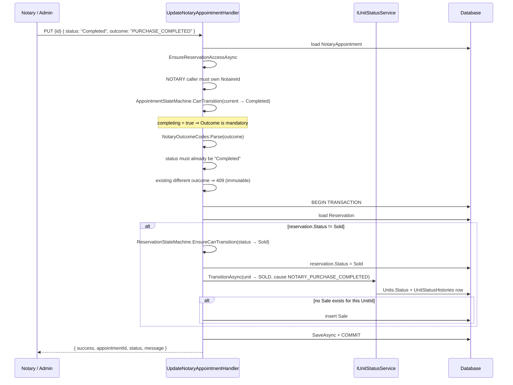

# NotaryAppointments

`src/ProjectAPI/src/Api/Controllers/NotaryAppointmentsController.cs` — class `NotaryAppointmentsController`, route prefix **`api/NotaryAppointments`**.

> Traced through executable statements only. Items not resolvable from code are
> marked **Unverified**.

## Purpose

The notarial stage: once a reservation is approved and the final visit has
cleared, a notary appointment is requested, confirmed, and its **outcome**
recorded. This controller owns the single most consequential write in the
solution — `PURCHASE_COMPLETED` converts the reservation, sells the unit and
creates the `Sale` row, atomically.

## Authorization

Class-level `[Authorize]` — no anonymous access.

| Action | Roles |
|---|---|
| POST `/` | `NotaryAppointmentRequesters` = admins + `SALES_AGENT` + `BUYER` (deliberately **excludes** `NOTARY`) |
| GET `{id}` | *any authenticated* — narrowed in the handler |
| GET `/` | *any authenticated* — narrowed in the handler |
| GET `NotaireAvailability` | `AdminsAgentsNotary` |
| PUT `{id}` | `AdminsNotary` — agents and buyers cannot record an outcome |
| GET `{id}/assignment-history` | `AdminsNotary` |

Handler-level narrowing, all verified in code:

- `EnsureReservationAccessAsync` (project perimeter) on create, get-by-id and update.
- `EnsureBuyerOwnsReservationAsync` on create and get-by-id — a buyer-only caller
  must own the reservation.
- A `NOTARY` caller must be the appointment's own `NotaireId` (get-by-id, update).
- `GetNotaryAppointmentsHandler` filters: buyer-only → `BuyerId == UserId`;
  `NOTARY` → `NotaireId == UserId`; internal → reservations whose project is in
  the caller's scope.

## Endpoints

| Verb | Route | Handler | Request | Response |
|---|---|---|---|---|
| POST | `/` | `CreateNotaryAppointmentHandler` | `CreateNotaryAppointmentCommand` (idempotent) | `CreateNotaryAppointmentResponse` — 201 |
| GET | `{id}` | `GetNotaryAppointmentByIdHandler` | route id | `GetNotaryAppointmentByIdResponse` |
| GET | `/` | `GetNotaryAppointmentsHandler` | `GetNotaryAppointmentsQuery` | `PaginatedResponse<…>` |
| GET | `NotaireAvailability` | `GetNotaryCalendarHandler` | `notaryId`, `from`, `to` | calendar result |
| PUT | `{id}` | `UpdateNotaryAppointmentHandler` | `UpdateNotaryAppointmentCommand` | `UpdateNotaryAppointmentResponse` |
| GET | `{id}/assignment-history` | `GetNotaryAppointmentAssignmentHistoryHandler` | id + `RestrictToNotaryId` | `List<…>` |

`PUT {id}` binds the route id onto the command and does
`command.ActorUserId ??= User.FindFirst("UserId")?.Value`.

`GET NotaireAvailability` computes defaults in the **controller**: `from`
defaults to tomorrow (`DateTime.Today.AddDays(1)`, server-local), `to` to
`from + 7 days`; supplying `from` without `to` forces a 7-day window; `to <= from`
returns 400.

## The conversion — PURCHASE_COMPLETED

This is the only code path in the solution that moves a reservation to
`CONVERTED`. Verified in `UpdateNotaryAppointmentHandler` lines 300–357.

Properties of this path, all verified:

- **Outcome is mandatory to complete.** `completing == true` with an empty
  `Outcome` throws 422.
- **Outcome is immutable.** A second, different outcome throws 409; the same
  outcome again is accepted.
- **Outcome requires a completed meeting.** Recording one while status ≠
  `Completed` throws 409.
- **Conversion is idempotent.** Guarded by `if (reservation.Status != Sold)`.
- **Only `PURCHASE_COMPLETED` converts.** Every other `NotaryOutcomeCodes` value
  records the outcome and leaves reservation and unit untouched.
- **The `Sale` row is created here**, and only here in this module — deduped by
  `UnitId`, not by reservation.

## Eligibility gate

`NotaryEligibilityService.EnsureEligibleAsync` is invoked at **creation** and
again at **confirmation** (`Requested → Confirmed`). It reads, in order:

1. `FinalVisitCase` for the reservation, including its `Appointments`.
2. The newest non-`Superseded` `FinalVisitReport` across those appointments.
3. `Snag` rows for that report.
4. `NotaryEligibilityCalculator.Calculate(visitCase, currentReport, snags)`.
5. `UnitTitleState` for the unit (defaulting to `TitleStatus.NotAvailable` when
   absent) and `TitleStateMachine.AllowsNotaryAppointment(...)`.

Failing either check throws `NOTARY_NOT_ELIGIBLE` with the accumulated reasons.
**Unverified:** the internals of `NotaryEligibilityCalculator` and
`TitleStateMachine` — documented with `FinalVisits.md` and `Construction.md`.

## Slot and notary checks

`EnsureEligibleNotaryAsync` (present in **both** create and update): the chosen
notary must hold an active `ProjectMembership` with `RoleCode == NOTARY` on the
project reached by `unit.ProjectId → Immeuble.Id → Immeuble.ProjectId`, checking
`IsActive`, `ValidFrom <= now`, `ValidUntil == null || > now`.

`EnsureSlotAvailableAsync` / `EnsureSlotStillAvailableAsync` reject:

- another `NotaryAppointment` for the same notary within **±1 minute** whose
  status is in `AppointmentStateMachine.BlockingStatuses`, and
- any `NotaryBlock` where `Start <= appointmentDate < End`.

The block check is notable: the commercial appointment path has **no equivalent
`AgentBlock` check** in `UpdateAppointmentStatusHandler`.

## Frontend coverage

Consumed by `realestateFront/src/api/http/notaryApi.ts`.

| Endpoint | Frontend caller | Status |
|---|---|---|
| POST `/` | `notaryApi.createAppointment` | ⚠️ response-shape mismatch |
| GET `{id}` | `notaryApi.getAppointmentById` | ✅ |
| GET `/` | `notaryApi.listAppointments` | ✅ |
| GET `NotaireAvailability` | `notaryApi.availability` | ✅ sends `notaryId`, `from`, `to` |
| PUT `{id}` | `notaryApi.updateAppointment` | ⚠️ response-shape mismatch |
| GET `{id}/assignment-history` | — | ❌ **never called** |

**5 of 6 wired.** The notary assignment-history endpoint has no caller, although
the *commercial* equivalent does (`appointmentsApi.getAssignmentHistory`) — so the
UI can show reassignment history for sales appointments but not for notarial ones.

**Response-shape mismatches.** Both `createAppointment` and `updateAppointment`
type the response as `NotaryAppointmentDto`, but the handlers return
`CreateNotaryAppointmentResponse { Id, Message }` and
`UpdateNotaryAppointmentResponse { Success, AppointmentId, Status, Message }`
respectively. Neither carries the full appointment shape, so fields the adapter
maps afterwards are `undefined`. In particular the update response names the id
`appointmentId`, and on a **reassignment of a confirmed appointment** it is a
*different* id (the new row) — a caller reading `dto.id` gets `undefined` and
never learns the replacement id.

`notaryApi` also targets `api/notaries/{notaryId}/…` for blocks and weekly
availability; those belong to `NotaryBlocks.md`, not this controller.

## Tables touched

| Table | Written by |
|---|---|
| `NotaryAppointments` | create, update, reassignment (insert of replacement) |
| `NotaryAppointmentAssignmentHistories` | create (when a notary is named), every reassignment |
| `Reservations` | update — `Status = Sold` on `PURCHASE_COMPLETED` only |
| `Units` + `UnitStatusHistories` | update — via `IUnitStatusService`, cause `NOTARY_PURCHASE_COMPLETED` |
| `Sales` | update — insert on `PURCHASE_COMPLETED` when no `Sale` exists for the unit |
| `Purchases` | create — shell with `PaidAmount = 0`, then reconciled by `PurchaseTotalsService` |
| `PerformanceIndicators` | create — `IncrementLeadsGenerated()` for the reservation's agent |
| `IdempotencyKeyRecords` | create (`CreateNotaryAppointmentCommand` is `IIdempotentRequest`) |
| `FinalVisitCases`, `FinalVisitReports`, `Snags`, `UnitTitleStates` | read only, via `NotaryEligibilityService` |
| `NotaryBlocks`, `ProjectMemberships` | read only |

## Relations

### Depends on (outbound)

| Module | Mechanism | Evidence |
|---|---|---|
| **Reservations** | Shared table, write | Sets `reservation.Status = Sold` through `ReservationStateMachine`; perimeter via `EnsureReservationAccessAsync`. |
| **Units** | `IUnitStatusService.TransitionAsync` | `UnitCommercialStatus.Sold`, cause `NOTARY_PURCHASE_COMPLETED`. |
| **Sales** | Shared table, insert | Creates the `Sale` row — the only writer traced so far. |
| **FinalVisits** | `NotaryEligibilityService` | Reads `FinalVisitCase`, `FinalVisitReport`, `Snag`. |
| **Construction** | `NotaryEligibilityService` | Reads `UnitTitleState` + `TitleStateMachine.AllowsNotaryAppointment`. |
| **Payments** | `PurchaseTotalsService.RefreshForReservationAsync` | Called inside create's transaction. |
| **Purchases** | Shared table | Purchase shell keyed on `ReservationId` + `NotaryAppointmentId`. |
| **ProjectMembership** | `ProjectScopeService` + direct `ProjectMemberships` query | Perimeter and notary eligibility. |
| **NotaryBlocks** | Shared table, read | Slot conflict check. |
| **Appointments (commercial)** | Shared enum/matrix only | `AppointmentAttemptStatus` + `AppointmentStateMachine`; **different table**. |

### Depended on by (inbound)

| Module | Mechanism | Evidence |
|---|---|---|
| **Reservations** | This module performs the `Approved → Sold` transition the reservation state machine permits but never executes itself. |
| **Handovers** | *Possible* — `UnitStatusCause.HandoverAcknowledged` moves `SOLD → DELIVERED`, which can only follow this module's `SOLD`. **Unverified** until `Handovers.md`. |
| **AdminDashboard / Sales reporting** | The `Sale` rows created here. **Unverified** until those docs. |

## Known edge cases

1. **`GET {id}` returns 500 for a missing appointment.**
   `GetNotaryAppointmentByIdHandler` throws a bare `Exception`, which
   `ApiExceptionFilter` maps to 500 `INTERNAL_ERROR`. The controller's
   `if (response == null) return NotFound(...)` branch is therefore
   **unreachable**, despite `[ProducesResponseType(404)]`.

2. **The `Sale` dedupe key is the unit, not the reservation.**
   `if (!await _db.Set<Sale>().AnyAsync(s => s.UnitId == reservation.UnitId))`.
   If a unit is sold, later administratively cancelled back to `AVAILABLE`, and
   sold again to a different buyer, **no second `Sale` row is created** — sales
   reporting would keep the first buyer's record. The created `Sale` also stores
   no `ReservationId`, so the two cannot be correlated afterwards.

3. **Reassignment of a confirmed appointment commits outside the transaction.**
   That branch calls `_notaryAppointmentRepository.SaveAsync()` and returns at
   line 261 — before `BeginTransactionAsync` at line 303. Any status/outcome/fee
   changes made earlier in the same request are committed by that save with no
   transaction around them. The conversion path is properly transacted.

4. **±1-minute conflict window.** Same as commercial appointments: two notarial
   appointments 5 minutes apart for the same notary pass. No appointment duration
   is modelled on `NotaryAppointment` at all.

5. **A notary may not request an appointment for themselves**, by design —
   `NotaryAppointmentRequesters` excludes `NOTARY`. But `PUT {id}` is
   `AdminsNotary`, so an admin can both request and complete one; there is no
   separation-of-duties check equivalent to reservations'
   `SELF_APPROVAL_FORBIDDEN`.

6. **`GET NotaireAvailability` uses server-local dates.** `DateTime.Today` in the
   controller, while everything else in the module uses `DateTime.UtcNow`. The
   default window is therefore relative to the server's timezone.

7. **`NotaireAvailability` takes `notaryId` as a plain query parameter** with no
   check that the caller is that notary. The `AdminsAgentsNotary` gate means any
   sales agent on any project can read any notary's full calendar.

8. **Idempotency is declared but inert.** `CreateNotaryAppointmentCommand`
   implements `IIdempotentRequest` and the controller reads the
   `Idempotency-Key` header, but the frontend never sends that header
   (repository-wide, the string appears only as a TypeScript literal in
   `client.ts:28`).

9. **Fees are writable at any status.** `TaxFees` and `TahfidFees` are applied
   whenever present, including after the outcome is recorded and the sale
   converted. There is no immutability guard on them.

10. **`PUT {id}` returns 400 with a bare string** when `Success == false` —
    which happens only for "No fields provided for update." All genuine failures
    throw and are formatted by `ApiExceptionFilter`, so this is the one
    non-`problem+json` response on the action.

11. **Purchase shell is skipped for account-less buyers.** `Purchase.UserId` is
    non-nullable, so a walk-in buyer with no account gets a notary appointment
    but no `Purchase` row; `PurchaseTotalsService.RefreshForReservationAsync` is
    still called. **Unverified:** how that service behaves with no purchase row.

## Related

- Upstream eligibility: `FinalVisits.md`, `Construction.md` (title state)
- Downstream of the conversion: `Sales.md`, `Handovers.md`
- Reservation lifecycle this completes: `Reservations.md`
- Notary calendars and blocks: `NotaryBlocks.md`
- Frontend consumer: `realestateFront/docs/frontend/Notary.md`
