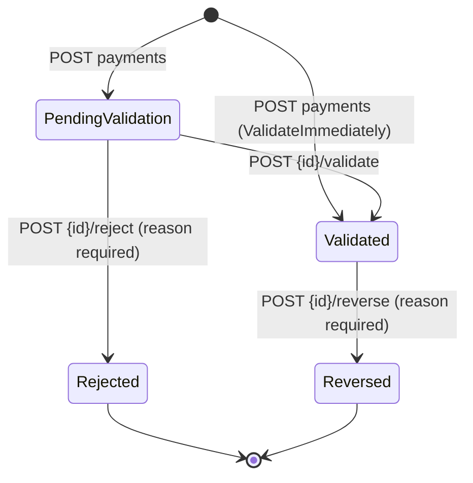

# Payments

`src/ProjectAPI/src/Api/Controllers/PaymentsController.cs` — class `PaymentsController`, route prefix **`api/payments`**.

> Traced through executable statements. Anything not resolvable from code is
> marked **Unverified**.

## Purpose

Payment schedules and the financial ledger for a reservation. GPIA does not
collect money — these endpoints record what the administration declares it has
received. The design principle visible throughout the code is that **financial
figures are derived, never stored as independent values**: installment status and
buyer totals are computed on every read by `PaymentCalculator`, so a stale cache
cannot contradict the ledger.

This is the most internally consistent module traced so far.

## Authorization

Class-level `[Authorize]`. Every write is `RoleGroups.Admins`. The two reads
carry no role attribute and are narrowed in the handler.

| Action | Roles | Handler-level narrowing |
|---|---|---|
| GET `method-codes` | any authenticated | none — returns a constant list |
| GET `reservations/{id}/schedule` | any authenticated | `EnsureReservationAccessAsync` **and** `EnsureBuyerOwnsReservationAsync` |
| all writes | `Admins` | `EnsureReservationAccessAsync` |

The schedule read applies both checks, so an internal caller is bound to their
project perimeter and a buyer-only caller to their own reservation.

## Endpoints

| Verb | Route | Roles | Handler | Response |
|---|---|---|---|---|
| GET | `method-codes` | any auth | *(none — inline)* | `PaymentMethodCodes.All` |
| GET | `reservations/{reservationId:guid}/schedule` | any auth | `GetPaymentScheduleHandler` | `PaymentScheduleResponse` |
| POST | `reservations/{reservationId:guid}/schedule` | Admins | `CreatePaymentScheduleHandler` | `CreatePaymentScheduleResponse` |
| POST | `reservations/{reservationId:guid}/payments` | Admins | `RecordPaymentHandler` (idempotent) | `RecordPaymentResponse` |
| POST | `{paymentId:guid}/reverse` | Admins | `ReversePaymentHandler` | `ReversePaymentResponse` |
| POST | `{paymentId:guid}/validate` | Admins | `ValidatePaymentHandler` | `ValidatePaymentResponse` |
| POST | `{paymentId:guid}/reject` | Admins | `RejectPaymentHandler` | `RejectPaymentResponse` |

`GET method-codes` is the only action in the solution that returns without
dispatching through MediatR.

> **File organisation note:** `ValidatePaymentHandler`, `RejectPaymentHandler`,
> `ReversePaymentHandler` and `GetPaymentScheduleHandler` are declared **inside
> their Command/Query files**, not in separate `*Handler.cs` files. Only
> `RecordPayment` and `CreatePaymentSchedule` follow the one-file-per-class
> convention used elsewhere.

## Schedule lifecycle

`PaymentSchedule` is versioned per reservation (`VersionNo = MAX + 1`) and has
states `Draft`, `Active`, plus a superseded path.

`CreatePaymentScheduleHandler`:

1. `EnsureReservationAccessAsync`; reservation must exist (404).
2. At least one installment, else 422.
3. `SequenceNo` values must be unique, else 422.
4. **Draft rule** — percentages may sum to *at most* 100 %
   (`> 100 + PercentageTolerance` ⇒ 422).
5. If `ActivateImmediately`: `PaymentCalculator.CanActivate` must pass —
   percentages sum to **exactly** 100 % (±0.01) **and** amounts sum to
   `ContractAmount` (±0.01); then `SupersedeCurrentActiveAsync` retires the
   previous active schedule and this one becomes `Active` with `ActivatedAt`.
6. One `SaveChangesAsync` — schedule, installments and the superseded row commit
   together.

So a draft may be incomplete; activation is the gate that forces it to balance.

## Payment entry lifecycle



Guards verified in code:

- **Record** — `Amount <= 0` ⇒ 422 (reversal is a separate command);
  `MethodCode` must satisfy `PaymentMethodCodes.IsValid` when supplied.
- **Validate** — only from `PendingValidation`, else 409.
- **Reject** — only from `PendingValidation`, else 409; `Reason` required.
- **Reverse** — `Reason` required; already `Reversed` ⇒ 409
  `PAYMENT_ALREADY_REVERSED`; not `Validated` ⇒ 409; **a reversal cannot itself
  be reversed** (`ReversalOfPaymentId is not null` ⇒ 422).

Entries are **immutable**. A reversal inserts a *new* `Payment` with
`Amount = -original.Amount`, `Status = Validated`,
`ReversalOfPaymentId = original.Id`, and `ExternalReference = null` (explicitly,
to avoid colliding with the original's unique reference). The original flips to
`Reversed`; its amount is never edited.

## Derived figures — `PaymentCalculator`

| Function | Rule |
|---|---|
| `CountsTowardTotals` | `Validated` **or** `Reversed` |
| `TotalValidated` | sum of `Amount` over counted entries — the reversal's negative amount cancels the original |
| `PaidAmount(installment)` | sums allocations of counted payments, then **subtracts** allocations belonging to reversed payment ids |
| `StatusOf(installment)` | `Cancelled` → `Paid` (≥ amount − 0.01) → `Overdue`/`PartiallyPaid` (partial) → `Upcoming` (not due) → `Due` (due today) → `Overdue` |
| `TotalCalled(schedule)` | sum of non-cancelled installment amounts |
| `CanActivate(schedule)` | percentages = 100 ±0.01 **and** amounts = `ContractAmount` ±0.01 |

Including `Reversed` in `CountsTowardTotals` is deliberate and correct: a
reversed payment really was received, and its cancellation is carried by the
separate negative entry. Counting only `Validated` would cancel it twice.

Tolerances are `AmountTolerance = 0.01m` and `PercentageTolerance = 0.01m`.

## Allocation

`RecordPaymentCommand.Allocations` is an optional explicit split across
installments. When omitted, `BuildAllocationsAsync` applies the amount
**oldest-installment-first**, and any surplus becomes an explicit
`PaymentAllocation` with `InstallmentId == null` — an unallocated credit, never
silently absorbed. The response reports `AllocatedAmount` and
`UnallocatedAmount` separately.

`GetPaymentScheduleHandler` computes `UnallocatedCredit` by taking allocations
with a null `InstallmentId` whose payment counts toward totals, minus those
belonging to reversed payments — so a reversed payment's credit is withdrawn too.

## Transaction boundaries

`RecordPayment`, `Validate` and `Reverse` each open
`BeginTransactionAsync`, then:

```
SaveChangesAsync                                  // ledger entry first
PurchaseTotalsService.RefreshForReservationAsync  // reads the DB
SaveChangesAsync                                  // cached totals
CommitAsync
```

The ledger write must be saved before the refresh because the refresh queries the
database and would otherwise not see it. `RejectPayment` has **no transaction** —
it only flips a status and touches no totals, which is consistent since a
rejected entry never counted.

## Background job

`InstallmentOverdueJob` — hosted service, 1-hour interval after a 1-minute
startup delay. It does **not** rewrite any status (there is none stored). It
loads active schedules, resolves their reservations, reads existing
`SentReminder` rows with `EntityType == "OverdueInstallment"`, recomputes each
non-cancelled installment's status via `PaymentCalculator`, and sends one
notification the **first** time an installment crosses into `Overdue` —
deduplicated by the `SentReminder` record. One `SaveChangesAsync` per pass.

## Frontend coverage

Consumed by `realestateFront/src/api/http/paymentsApi.ts`.

| Endpoint | Frontend caller | Status |
|---|---|---|
| GET `method-codes` | `paymentsApi.methodCodes` | ✅ |
| GET `reservations/{id}/schedule` | `paymentsApi.getSchedule` | ✅ |
| POST `reservations/{id}/schedule` | `paymentsApi.createSchedule` | ✅ |
| POST `reservations/{id}/payments` | `paymentsApi.recordPayment` | ✅ |
| POST `{id}/reverse` | `paymentsApi.reversePayment` | ✅ |
| POST `{id}/validate` | `paymentsApi.validatePayment` | ✅ |
| POST `{id}/reject` | `paymentsApi.rejectPayment` | ✅ |

**7 of 7 wired** — full coverage, and the declared TypeScript response types
match the handler response shapes (unlike `projectsApi`, `appointmentsApi` and
`notaryApi`). UI components: `features/payments/PaymentSchedulePanel.tsx`,
`ScheduleBuilder.tsx`, `features/buyer/BuyerPaymentSummary.tsx`.

**Idempotency is declared but inert.** `RecordPaymentCommand` implements
`IIdempotentRequest` and the controller reads the `Idempotency-Key` header, but
the frontend never sends one — repository-wide the string appears only as a
TypeScript literal in `client.ts:28`. The command's own doc notes that
`ExternalReference` uniqueness was the prior guard and that it is optional, so
duplicate-entry protection is currently **absent in practice**.

## Tables touched

| Table | Written by |
|---|---|
| `PaymentSchedules` | create schedule (insert, version + supersede) |
| `PaymentInstallments` | create schedule (insert with the schedule) |
| `Payments` | record (insert), validate/reject (status), reverse (insert negative + flip original) |
| `PaymentAllocations` | record (insert, including null-installment credits) |
| `Purchases` | all three total-affecting paths, via `PurchaseTotalsService` |
| `Notifications` | record, validate, overdue job |
| `SentReminders` | overdue job — dedupe key `EntityType == "OverdueInstallment"` |
| `Reservations` | read only |

**Unverified:** the EF configuration for `PaymentSchedules` — the
`ReservationConfiguration` comment names `IX_PaymentSchedules_ActivePerReservation`
as a filtered unique index of the same kind, but I have not opened that
configuration file.

## Relations

### Depends on (outbound)

| Module | Mechanism | Evidence |
|---|---|---|
| **Reservations** | Shared table (read) + perimeter | Every handler calls `EnsureReservationAccessAsync(reservationId)`; the schedule hangs off `ReservationId`. |
| **Purchases** | `PurchaseTotalsService.RefreshForReservationAsync` | Called inside the transaction of record/validate/reverse. |
| **Notifications** | `INotificationService.NotifyAsync` | `PAYMENT_RECORDED`, `PAYMENT_VALIDATED`, and the overdue job. Post-commit, non-fatal. |
| **ProjectMembership** | `ProjectScopeService` | Perimeter for every endpoint. |

### Depended on by (inbound)

| Module | Mechanism | Evidence |
|---|---|---|
| **NotaryAppointments** | `PurchaseTotalsService` | `CreateNotaryAppointmentHandler` creates a `Purchase` shell at `PaidAmount = 0` and immediately calls `RefreshForReservationAsync` to reconcile it from this ledger. |
| **Buyer portal** | GET schedule | `BuyerPaymentSummary.tsx` reads the same endpoint the admin panel uses. |

### Possible / unconfirmed relations

- **Handovers / Deliveries.** Whether handover is gated on payment completion is
  **Unverified** — nothing in this module references them.
- **AdminDashboard.** Whether financial KPIs read `Payments` directly or go
  through `Purchases` is **Unverified**.

## Known edge cases

1. **Duplicate payments are not actually prevented.** Idempotency is wired
   end-to-end on the server but the client never sends the header, and
   `ExternalReference` is optional. Two identical `POST payments` calls create two
   ledger entries and double the buyer's recorded total.

2. **`RecordPaymentCommand.CreatedBy` is client-supplied.** The handler writes it
   to `Payment.CreatedBy` and, when `ValidateImmediately` is set, also to
   `ValidatedBy` — with no comparison to `ICurrentUser.UserId`. Financial
   attribution is therefore forgeable by any admin caller. Contrast
   `ValidatePaymentHandler`, which writes `request.ActorUserId` (also
   client-supplied) — neither uses the token identity, unlike
   `ApproveReservationHandler`.

3. **`ValidateImmediately` bypasses the two-step control.** The whole
   declare-then-confirm design is optional on a per-request boolean, with no
   separate role or check.

4. **A draft schedule may be created on any reservation status.** Nothing checks
   that the reservation is `APPROVED` — a schedule can be attached to a
   `DRAFT`, `REJECTED`, `EXPIRED` or `CANCELLED` file.

5. **`RejectPayment` mutates `Comment` by concatenation**
   (`"{existing} | Rejeté : {reason}"`), so the rejection reason is not a
   separate field and repeated edits accumulate in one text column.

6. **`GET method-codes` is authenticated but not role-gated**, returning a static
   constant. Harmless, but it is the one endpoint with no scope check of any kind.

7. **The schedule read returns the full payment history to a buyer**, including
   `Comment` — which `RejectPayment` uses to store the internal rejection reason.
   A rejected payment's reason is therefore visible to the buyer.
   **Unverified:** whether `PaymentScheduleResponse.PaymentDto.Comment` is
   filtered anywhere in the UI; the handler does not filter it.

8. **`PaymentDate` defaults to `UtcNow` when `default`**, so a client omitting it
   silently records today rather than failing validation.

9. **No validators.** None of the five commands has an `AbstractValidator`; every
   rule is enforced inline in the handlers, which is why they surface as
   `BusinessRuleException` (422/409) rather than `ValidationException`.

## Related

- Reservation the schedule hangs off: [Reservations.md](Reservations.md)
- Purchase shell reconciled from this ledger:
  [NotaryAppointments.md](NotaryAppointments.md)
- Workflow: [PaymentSchedule.md](../workflows/PaymentSchedule.md) *(pending)*
- Frontend consumer: `realestateFront/docs/frontend/Payments.md` *(pending)*
