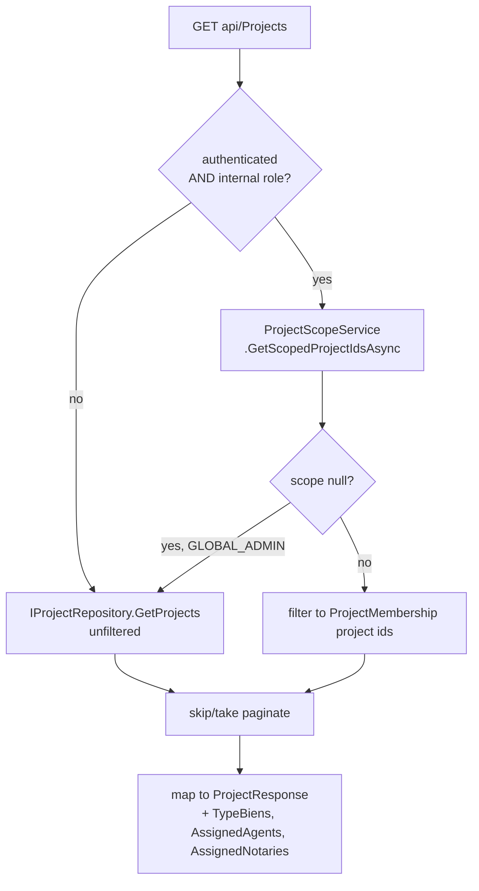
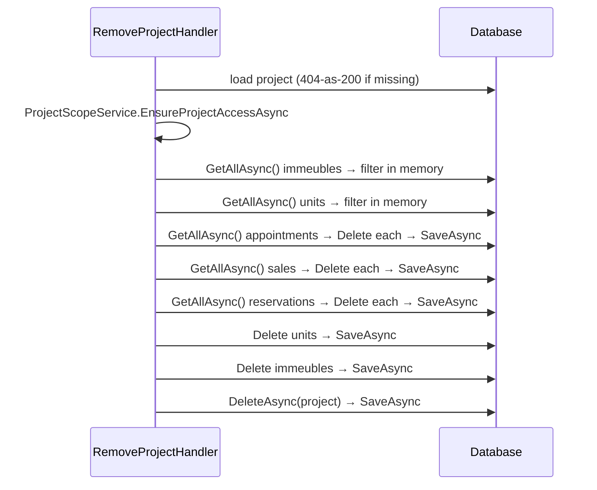

# Projects

`src/ProjectAPI/src/Api/Controllers/ProjectController.cs` — class **`ProjectsController`**, route prefix **`api/Projects`**.

> ⚠️ The file is named `ProjectController.cs` but declares `ProjectsController`, so
> `[Route("api/[controller]")]` resolves to `api/Projects` (plural). Searching the
> codebase for `api/Project` finds nothing.

> Traced from source. Where a comment claims behaviour the statements do not
> implement, it is recorded under [Known edge cases](#known-edge-cases).

## Purpose

The catalogue root. Holds project CRUD, the public project listing, the
admin drill-down, project features, quartiers (districts), neighbourhood
amenities, project videos, favourites ("likes"), TypeBien associations and —
unrelated to any of that — a user's purchase history.

This is the largest controller in the solution and the least cohesive: its 23
actions dispatch into **six** different application folders
(`Projects`, `Quartiers`, `EspacesTempsReel`, `TypeBiens`, `Purchases`,
`Projects/LikedProjects`).

## Authorization

Class-level `[Authorize]`. Eleven actions opt out with `[AllowAnonymous]` for the
public catalogue. Writes are `RoleGroups.Admins`. **Five actions carry no role
attribute at all** and therefore admit any authenticated user — see edge cases.

## Endpoints

| Verb | Route | Auth | Handler | Response |
|---|---|---|---|---|
| POST | `/` | Admins | `CreateProjectHandler` | `CreateProjectResponse` |
| GET | `/` | **Anonymous** | `GetAllProjectsHandler` | `PaginatedResponse<ProjectResponse>` |
| GET | `{id}` | AdminsAgents | `GetProjectByIdHandler` | `ProjectDrillDownResponse` |
| PUT | `{id}` | Admins | `UpdateProjectHandler` | `ProjectResponse` |
| POST | `Like` | *any authenticated* | `AddLikedProjectHandler` | `LikedProjectResponse` |
| DELETE | `DisLikeProject` | *any authenticated* | `RemoveLikedProjectHandler` | 204 / 400 |
| GET | `LikedProjects` | *any authenticated* | `GetLikedProjectsHandler` | `PaginatedResponse<LikedProjectResponse>` |
| PUT | `LikedProject` | *any authenticated* | `UpdateLikedProjectHandler` | `LikedProjectResponse` |
| POST | `features` | Admins | `AddProjectFeatureHandler` | `{ message }` |
| DELETE | `RemoveFeatures` | Admins | `RemoveProjectFeatureHandler` | 204 |
| GET | `quartier-amenities` | **Anonymous** | `GetQuartierAmenitiesHandler` | `List<QuartierAmenityResponse>` |
| GET | `features` | **Anonymous** | `GetProjectFeaturesHandler` | `List<ProjectFeatureResponse>` |
| POST | `quartiers` | Admins | `CreateQuartierHandler` | `CreateQuartierResponse` — 201 |
| GET | `quartiers` | **Anonymous** | `GetQuartiersHandler` | `PaginatedResponse<QuartierListItem>` |
| GET | `quartiers/{id}` | **Anonymous** | `GetQuartierByIdHandler` | `GetQuartierByIdResponse` |
| POST | `{projectId}/videos` | Admins | `CreateEspaceTempsReelHandler` | `CreateEspaceTempsReelResponse` — 201 |
| GET | `videos/{id}` | **Anonymous** | `GetEspaceTempsReelByIdHandler` | `GetEspaceTempsReelByIdResponse` |
| GET | `{projectId}/videos` | **Anonymous** | `GetVideosByProjectIdHandler` | `List<VideoListItem>` |
| GET | `user/{userId}` | *any authenticated* | `GetUserPurchasesHandler` | `PurchaseSummaryResponse` |
| DELETE | `{projectId}` | Admins | `RemoveProjectHandler` | `RemoveProjectResponse` |
| POST | `{projectId}/type-biens` | Admins | `AssociateTypeBienToProjectHandler` | `AssociateTypeBienToProjectResponse` |
| GET | `{projectId}/type-biens` | **Anonymous** | `GetTypeBiensByProjectHandler` | `List<TypeBienListItem>` |
| GET | `type-biens` | **Anonymous** | `GetTypeBiensByProjectHandler` (ProjectId = null) | `List<TypeBienListItem>` |

## Frontend coverage

Consumed by `realestateFront/src/api/http/` — `projectsApi.ts`, `favoritesApi.ts`,
`trackingApi.ts`, `typeBiensApi.ts`.

| Endpoint | Frontend caller | Status |
|---|---|---|
| GET `/` | `projectsApi.list`, `projectsApi.getById` | ✅ |
| POST `/` | `projectsApi.create` | ⚠️ shape mismatch |
| GET `{id}` | `projectsApi.getDrillDown` | ✅ |
| PUT `{id}` | `projectsApi.update` | ⚠️ partial response |
| GET `features` | `projectsApi.listFeatures` | ✅ |
| GET `quartier-amenities` | `projectsApi.listQuartierAmenities` | ✅ |
| GET `quartiers` | `projectsApi.listQuartiers` | ⚠️ shape mismatch |
| GET `type-biens` | `projectsApi.listTypeBiens`, `typeBiensApi` | ✅ (called twice, two adapters) |
| GET `{projectId}/videos` | `videosApi.listByProject` | ✅ |
| POST `{projectId}/videos` | `videosApi` (trackingApi.ts:46) | ✅ |
| POST `Like` | `favoritesApi.add` | ✅ |
| DELETE `DisLikeProject` | `favoritesApi.remove` | ✅ |
| GET `LikedProjects` | `favoritesApi.list` | ✅ |
| PUT `LikedProject` | — | ❌ **never called** |
| POST `features` | — | ❌ **never called** |
| DELETE `RemoveFeatures` | — | ❌ **never called** |
| POST `quartiers` | — | ❌ **never called** |
| GET `quartiers/{id}` | — | ❌ **never called** |
| GET `videos/{id}` | — | ❌ **never called** |
| GET `user/{userId}` | — | ❌ **never called** |
| DELETE `{projectId}` | — | ❌ **deliberately unused** |
| POST `{projectId}/type-biens` | — | ❌ **never called** |
| GET `{projectId}/type-biens` | — | ❌ **never called** |

**10 of 23 endpoints have no frontend caller.** One of those is deliberate:
`ProjectsApi` in `src/api/interfaces.ts:103` documents the omission of a
`remove()` — "les données métier ne sont jamais supprimées (§9, §6.3) — fin de vie
d'un projet = statut ARCHIVED, pas un DELETE". The project features write path
(`POST features` / `DELETE RemoveFeatures`) is read-only from the UI: the frontend
lists features but offers no way to edit them.

**Shape mismatches (frontend expects fields the backend never sends):**

- `projectsApi.create` types the response as `ProjectDto` and runs it through
  `fromWire`, but the backend returns `CreateProjectResponse { Id, Message }`.
  Every other field on the returned `Project` is `undefined`, and
  `statusGlobal` is derived from `undefined`.
- `projectsApi.update` likewise expects a full `ProjectDto`; `UpdateProjectHandler`
  returns a `ProjectResponse` populated with only `Id, Name, Location, Address,
  Description, Images, Module3DLink` — no `statusGlobal`, `type` or
  `overAllProgress`, even though the request may have changed them.
- `projectsApi.listQuartiers` declares a local `QuartierListItem` with
  `description` and `images` and casts the result `as Quartier[]`.
  `GetQuartiersHandler` projects **only `Id` and `Name`**. Those two fields are
  always `undefined` at runtime.

**Dead backend capability:** the frontend never sends an `Idempotency-Key` header
(the string appears in the codebase only as a TypeScript literal in
`client.ts:28`). `IdempotencyBehaviour` therefore short-circuits on every request
from this client.

## Data flow — GET `/` (public list + admin list, same route)



This single route serves both the anonymous public catalogue and the admin
console list. An anonymous or BUYER caller sees everything; an internal caller
below `GLOBAL_ADMIN` is filtered to their `ProjectMembership` perimeter.

**Pagination bug:** the scope filter is applied *after* `GetProjects` has already
paginated internally, then `Skip`/`Take` is applied a second time to the filtered
list. `totalItems` is computed from the post-filter count of an already-paged
result, so page counts are wrong for any scoped internal caller.

## Data flow — DELETE `{projectId}`

The highest-blast-radius operation in the codebase: a hard cascade delete.



There is **no transaction**. Each `Delete` commits on its own (see
[Repository semantics](#repository-semantics)), so a failure part-way leaves the
project partially destroyed with no rollback. It also calls `GetAllAsync()` on
five tables and filters in memory.

## Repository semantics

`BaseRepository<T>` (`Infrastructure/Repositories/BaseRepository.cs`) **commits
inside every write**:

```csharp
public virtual async Task<T> InsertAsync(T e) { await _dbSet.AddAsync(e); await SaveAsync(); return …; }
public virtual async Task Update(T e)        { _dbSet.Update(e);           await SaveAsync(); }
public virtual void       Delete(T e)        { _dbSet.Remove(e);           _dbContext.SaveChanges(); }
```

Consequences that apply to every handler in this file:

- A handler without `BeginTransactionAsync` has **no atomicity** — each repository
  call is its own commit.
- The trailing `await _repo.SaveAsync()` seen after most write loops is a no-op;
  the write already committed.
- `Delete(T)` calls the **synchronous** `SaveChanges()` inside async handlers.
- Reads must precede writes in a handler, or EF throws "A second operation was
  started on this context instance". Both `AddLikedProjectHandler` and
  `RemoveLikedProjectHandler` carry comments saying they were restructured for
  exactly this reason.

## Tables touched

`Projects`, `Quartiers`, `QuartierAmenities`, `ProjectFeatures`,
`EspaceTempsReels`, `ProjectTypeBiens`, `TypeBiens`, `LikedProjects`, `Leads`,
`PerformanceIndicators`, `Purchases`, plus — via the cascade delete —
`Immeubles`, `Units`, `Reservations`, `Sales`, `Appointments`.

> **Naming trap:** `Unit.ProjectId` holds the **Immeuble** id, not the project id.
> `GetProjectByIdHandler` joins `units.Where(u => immeubleIds.Contains(u.ProjectId))`,
> and `CreateReservationHandler` documents the same. The real project is reached
> via `unit.ProjectId → Immeuble.Id → Immeuble.ProjectId`.

## Known edge cases

1. **The four favourites endpoints are an IDOR cluster.** `POST Like`,
   `DELETE DisLikeProject`, `GET LikedProjects` and `PUT LikedProject` carry no
   role attribute and take the target `UserId` from the request body or query
   string. No handler compares it to `ICurrentUser.UserId`. Any authenticated
   user can therefore like/unlike on behalf of another user, and
   `GET LikedProjects?UserId=<someone-else>` returns that user's favourites
   **including their `UserName`, `FirstName` and `LastName`** (joined in by
   `GetLikedProjectsHandler`). `PUT LikedProject` takes only a like `Id` and a new
   `ProjectId` — no ownership check at all — so any authenticated caller can
   repoint any other user's favourite.

   Contrast `GetUserPurchasesHandler` on the same controller, which *does* check
   `isInternal || currentUser.UserId == request.UserId` and throws
   `BuyerScopeDenied`. The favourites handlers were not given the same treatment.

2. **`UpdateLikedProjectHandler` still has the un-awaited-update bug.**
   It runs `_ = _repository.Update(likedProject); await _repository.SaveAsync();`.
   `UpdateProjectHandler` in the same folder carries a comment describing this
   exact pattern as the cause of a 500 ("fired Update() un-awaited AND then called
   SaveAsync() again, racing two operations on the same DbContext") and fixes it
   there. The fix was not applied here.

3. **Liking is not idempotent.** `AddLikedProjectHandler` never checks for an
   existing `LikedProject`. Liking twice inserts two rows, increments
   `Project.NumberLikes` twice, and creates a duplicate `Lead` per immeuble plus a
   duplicate `PerformanceIndicator.LeadsGenerated` increment. `RemoveLikedProject`
   removes only `.FirstOrDefault()`, so the counters cannot be walked back.

4. **`GetAllProjectsHandler` can throw on null `ImagesInterieur`.** It calls
   `tb.ImagesInterieur!.Split(',')` — the `!` suppresses the compiler warning but
   not the runtime `NullReferenceException`, surfacing as a 500 on the public
   catalogue. `GetTypeBiensByProjectHandler` does the same mapping and *does*
   null-check (`string.IsNullOrWhiteSpace(...) ? new List<string>() : …`).

5. **`GET {id}` and the list route return different status vocabularies.**
   The drill-down returns `project.StatusGlobal` raw, while the list route also
   returns it raw but the frontend passes both through `projectStatusString.fromLegacy`.
   `ImmeubleDrillDownDto.Status` is an untyped `string?` fed from `Immeuble.Status`,
   which is a different enumeration from `ProjectStatusCodes` — the frontend
   nonetheless runs it through the *project* status mapper (`projectsApi.ts:88`).

6. **`COMPLETED` is gated on PUT but reachable elsewhere.** `UpdateProjectHandler`
   refuses `StatusGlobal = COMPLETED` with a 409, directing callers to
   `POST /api/construction/projects/{id}/complete`. `CreateProjectHandler` applies
   no such guard — `ProjectStatusCodes.Normalize(request.StatusGlobal)` is written
   straight through, so a project can be **created** directly in `COMPLETED`,
   bypassing the 100 %-progress gate the PUT protects.

7. **`RemoveProject` swallows every failure as a 200.** Its `catch (Exception)`
   returns `Success = false` with `ex.ToString()` — the **full stack trace** — in
   `Details`. The controller maps that to a 400, so the global filter's
   "never leak stack traces" rule (`ApiExceptionFilter.HandleGlobalException`)
   is bypassed on this path. A missing project is likewise reported as 400, not 404.

8. **`GET {id}` leaks existence across the perimeter.** The project is loaded (404
   if absent) *before* `EnsureProjectAccessAsync` runs, so an out-of-perimeter
   caller gets 403 for a project that exists and 404 for one that does not —
   distinguishable. `GetReservationByIdHandler` deliberately avoids this.

9. **`CreateQuartier` and `GetQuartiers` disagree on the shape.** Create accepts
   `Name`, `Description`, `Images`; the list projects only `Id` and `Name`. There
   is no list endpoint that returns a quartier's description or images —
   `GET quartiers/{id}` does, but nothing calls it.

10. **Inline quartier creation is duplicated and unguarded.** Both
    `CreateProjectHandler` and `UpdateProjectHandler` create a `Quartier` inline
    when `QuartierName` is supplied without `QuartierId`. Neither checks for an
    existing quartier of the same name, so repeated project edits accumulate
    duplicate quartiers.

11. **`InsertedAt` and `LikedAt` use server local time.** `DateTime.Now` in
    `CreateEspaceTempsReelHandler`, `AddLikedProjectHandler` and the `Lead` rows it
    creates, against `DateTime.UtcNow` everywhere else.

12. **`GetAllProjects` has dead claim-reading code.** Lines 52–53 of the controller
    are a commented-out block that would have populated `query.UserId` from the
    token. As shipped, `UserId` is whatever the caller puts in the query string —
    it drives the `IsLiked` flag, so any caller can ask "is this liked by user X".

13. **`AddProjectFeatureHandler` has no null guard.** `request.Features` is a
    non-nullable `List<ProjectFeatureRequest>` with no validator; a body omitting
    `features` yields `null` and a `NullReferenceException` ⇒ 500.

## Relations

Traced from constructor injections and the delete cascade's actual repository
calls.

### Depends on (outbound)

| Module | Mechanism | Evidence |
|---|---|---|
| **ProjectMembership** | Direct service call — `ProjectScopeService` | `GetAllProjects` (internal callers only), `GetProjectById`, `UpdateProject`, `RemoveProject`, `AddProjectFeature`, `RemoveProjectFeature`, `CreateEspaceTempsReel`, `AssociateTypeBienToProject`. |
| **Immeubles** | Shared table, read + cascade delete | `GetProjectByIdHandler` reads `Immeubles` and `Floors` for drill-down stats; `RemoveProjectHandler` deletes them. |
| **Units** | Shared table, read + cascade delete | Drill-down counts `Unit.Status` live (no denormalised counter); delete removes them. |
| **Sales** | Shared table, read + cascade delete | Drill-down computes 90-day velocity from `Sales.SaleDate`; delete removes sales for the project's units. |
| **Reservations** | Cascade delete only | `RemoveProjectHandler` deletes reservations by `UnitId`. |
| **Appointments** | Cascade delete only | Deletes appointments by `Appointment.ProjectId` — note this is a *direct* project FK, unlike reservations/sales which resolve through units. |
| **TypeBiens** | Shared tables | `ProjectTypeBiens` join rows; `GetTypeBiensByProjectHandler` is shared with `TypeBiens.md`. |
| **Leads + PerformanceIndicators** | Shared tables, write | `AddLikedProjectHandler` inserts one `Lead` per immeuble and increments `PerformanceIndicator.LeadsGenerated`; `RemoveLikedProjectHandler` reverses both. |
| **Purchases** | Shared table, read | `GetUserPurchasesHandler` reads `Purchases` and resolves each through `Reservations`/`Sales` to `Unit → Immeuble → Project`. |
| **Identity (ProjectAPI store)** | `_context.Users` | `GetLikedProjectsHandler` joins user names onto favourites. |

### Depended on by (inbound)

| Module | Mechanism | Evidence |
|---|---|---|
| **Everything project-scoped** | `Projects.Id` is the perimeter key | `ProjectScopeService` resolves every scoped request to a project id; `ProjectMemberships.ProjectId` FKs here. |
| **Construction** | Shared column | `UpdateProjectHandler` refuses `StatusGlobal = COMPLETED` and names `POST /api/construction/projects/{id}/complete` as the only writer. *Confirm when `Construction.md` is traced.* |
| **Immeubles** | FK | `Immeuble.ProjectId → Projects.Id`. |
| **AdminDashboard** | Shared tables | Reporting reads projects/units. *Unconfirmed until traced.* |

### Possible / unconfirmed relations

- **`Appointment.ProjectId`** is deleted directly by this module, implying
  appointments carry a project FK independent of the unit chain. Confirm the
  column's semantics in `Appointments.md`.
- **Construction `complete` command** — referenced only by the exception message
  in `UpdateProjectHandler`; the handler itself has not been traced.

## Related

- Stock and unit structure beneath a project: `Immeuble.md`
- The `COMPLETED` gate: `Construction.md`
- Perimeter membership rows: `ProjectMembership.md`
- TypeBien CRUD proper: `TypeBiens.md`
- Frontend consumers: `realestateFront/docs/frontend/Projects.md`,
  `.../PublicListings.md`, `.../Buyer.md` (favourites)
