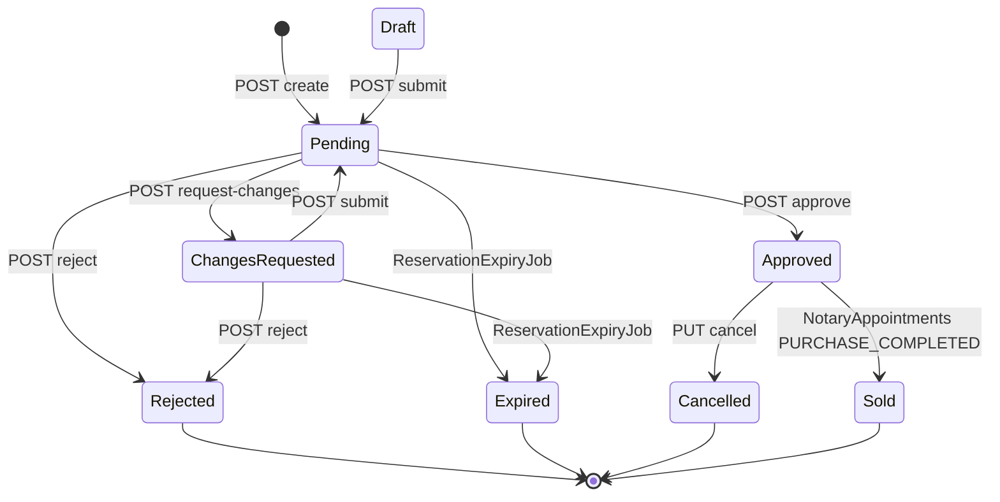
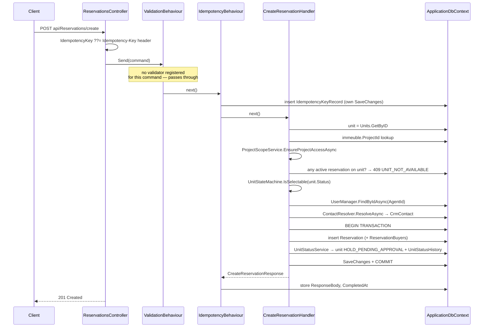

# Reservations

`src/ProjectAPI/src/Api/Controllers/ReservationsController.cs` — class `ReservationsController`, route prefix **`api/Reservations`**.

> Traced from source, not from comments. Where a code comment or XML doc claims
> behaviour the statements do not implement, the divergence is recorded under
> [Known edge cases](#known-edge-cases) rather than repeated as fact.

## Purpose

Owns the reservation lifecycle: an agent submits a reservation against a unit, an
administrator approves / rejects / sends it back for correction, and the unit's
commercial status is moved in lockstep. Conversion to a sale is **not** here — it
happens once, in `PUT /api/NotaryAppointments/{id}` when the outcome is
`PURCHASE_COMPLETED`. A `PUT {id}/sold` endpoint was deliberately removed
(comment at `ReservationsController.cs:171`).

## Authorization

Class-level `[Authorize]` — no anonymous access. Per-action roles stack on top
(both must pass). `RoleGroups` constants resolve to spec role codes:

- `Admins` = `GLOBAL_ADMIN, PROJECT_ADMIN`
- `AdminsAgents` = `GLOBAL_ADMIN, PROJECT_ADMIN, SALES_AGENT`

Every handler additionally calls `ProjectScopeService.EnsureReservationAccessAsync`,
which resolves `reservation → unit → immeuble → project` and checks the caller
holds an active `ProjectMembership` on that project. `GLOBAL_ADMIN` bypasses it.
The one exception is `AssignNotaire`, covered below.

## Endpoints

| Verb | Route | Roles | Handler | Request | Response |
|---|---|---|---|---|---|
| POST | `create` | AdminsAgents | `CreateReservationHandler` | `CreateReservationCommand` (body) | `CreateReservationResponse` — 201 |
| GET | `{id}` | AdminsAgents | `GetReservationByIdHandler` | route id | `GetReservationByIdResponse` |
| GET | `mine` | *any authenticated* | `GetMyReservationsHandler` | — | `List<MyReservationSummary>` |
| GET | `list` | AdminsAgents | `GetReservationsHandler` | `GetReservationsQuery` (query) | `PaginatedResponse<GetReservationsResponse>` |
| POST | `{id:guid}/documents` | AdminsAgents | `UploadReservationDocumentHandler` | multipart `UploadReservationDocumentCommand` | `UploadReservationDocumentResponse` |
| DELETE | `documents/{documentId:guid}` | AdminsAgents | `DeleteReservationDocumentHandler` | route id | `string` (plain text) |
| POST | `{id:guid}/approve` | Admins | `ApproveReservationHandler` | `ApproveReservationCommand` | `bool` |
| POST | `{id:guid}/reject` | Admins | `RejectReservationHandler` | `RejectReservationCommand` | `bool` |
| POST | `{id:guid}/request-changes` | Admins | `RequestChangesHandler` | `RequestChangesCommand` | `bool` |
| POST | `{id:guid}/submit` | AdminsAgents | `ResubmitReservationHandler` | `ResubmitReservationCommand` | `bool` |
| PUT | `{id:guid}/assign-notaire` | AdminsAgents | `AssignNotaireToReservationHandler` | `AssignNotaireToReservationCommand` | `AssignNotaireToReservationResponse` |
| PUT | `{id:guid}/cancel` | Admins | `CancelReservationHandler` | `CancelReservationCommand` | `CancelReservationResponse` |

The controller binds the route `id` onto the command's `ReservationId` before
dispatch on every `{id}` action, so a body-supplied `ReservationId` is ignored.

## Frontend coverage

Consumed by `realestateFront/src/api/http/reservationsApi.ts`. **All 12 endpoints
are called** — the only fully-covered controller of the three documented so far.

| Endpoint | Frontend caller | Notes |
|---|---|---|
| POST `create` | `reservationsApi.create` | ⚠️ fabricates the returned object |
| GET `{id}` | `reservationsApi.getById` | ✅ |
| GET `mine` | `reservationsApi.getMine` | ⚠️ field mislabel |
| GET `list` | `reservationsApi.list` | ⚠️ client-side status filter |
| POST `{id}/documents` | `reservationsApi.uploadDocument` | ✅ FormData field names match the command |
| DELETE `documents/{id}` | `reservationsApi.deleteDocument` | ✅ uses `projectFetchText` for the plain-text body |
| POST `{id}/approve` | `reservationsApi.approve` | always sends `documents: []` |
| POST `{id}/reject` | `reservationsApi.reject` | sends `adminUserId` from localStorage |
| POST `{id}/request-changes` | `reservationsApi.requestChanges` | sends `adminUserId` from localStorage |
| POST `{id}/submit` | `reservationsApi.submit` | ✅ |
| PUT `{id}/assign-notaire` | `reservationsApi.assignNotaire` | ✅ |
| PUT `{id}/cancel` | `reservationsApi.cancel` | sends `{}` — matches the command |

Integration issues visible only across the two sides:

- **Idempotency is never exercised.** Both `create` and `approve` implement
  `IIdempotentRequest`, and the controller fills the key from an `Idempotency-Key`
  header — but the frontend never sends that header (the string appears in the
  codebase only as a TypeScript literal in `client.ts:28`). `IdempotencyBehaviour`
  short-circuits on every call, so retry-safety is implemented but inactive.
- **The reject attribution is client-controlled end to end.** The frontend reads
  `adminUserId` from `localStorage["gpia_user"].id` and
  `RejectReservationHandler` persists it verbatim into `ValidatedBy`
  (edge case 4). Approve is unaffected — the backend overrides it with the token.
- **`list` filters status client-side** (`reservationsApi.ts:36`) after the server
  has already paginated. Filtering a 10-row page down to 3 still reports the
  server's unfiltered `totalItems`, so paging through a status filter skips rows.
- **`getMine` maps `finalPrice` onto `reservationAmount`**
  (`reservationsApi.ts:61`) and hard-codes `isUnderConstruction: false`,
  `documents: []`, `createdAt = reservationDate`. The buyer portal therefore shows
  the total agreed price where the admin table shows the deposit.
- **`create` returns `{...data, id}`** — the request echoed back with the new id,
  not server state. `status`, `expiresAt`, `catalogPrice` and `finalPrice`
  computed by the handler are absent until something re-fetches.
- **The approve document path is unused.** The frontend always sends
  `documents: []` and uploads through `POST {id}/documents` instead, which means
  edge case 10 (arbitrary client-supplied URLs) is not reachable from this UI.

## State machine

`ReservationStateMachine` (`Domain/Reservations/Entities/ReservationStateMachine.cs`)
is the only transition authority. Enum values are persisted as **int** and must
not be renumbered:

| Code | Int | Spec name |
|---|---|---|
| `Pending` | 0 | SUBMITTED |
| `Approved` | 1 | APPROVED |
| `Rejected` | 2 | REJECTED |
| `Cancelled` | 3 | CANCELLED |
| `Sold` | 4 | CONVERTED |
| `Draft` | 5 | DRAFT |
| `Expired` | 7 | EXPIRED |
| `ChangesRequested` | 6 | CHANGES_REQUESTED |

No handler in this controller produces `Draft`. `POST create` always writes
`Pending`, so the `Draft → Pending` edge is only reachable for rows created
elsewhere (e.g. the dev seeder).

### Unit coupling

`UnitBlockingStatuses` = `Pending, ChangesRequested, Approved, Sold`
(ints 0, 6, 1, 4). This set is mirrored by the filtered unique index
`IX_Reservations_ActivePerUnit` with filter `[Status] IN (0, 1, 4, 6)` —
**verified identical**. `Draft` (5) is excluded, so a draft does not block a unit.

Unit transitions go through `IUnitStatusService`, which validates against
`UnitStateMachine`, appends a `UnitStatusHistory` row, and deliberately does
**not** call `SaveChanges` — the calling handler owns the transaction. Verified
in `UnitStatusService.Apply`.

| Reservation action | Unit transition | Cause code |
|---|---|---|
| create | `AVAILABLE → HOLD_PENDING_APPROVAL` | `RESERVATION_SUBMITTED` |
| submit (resubmit) | `→ HOLD_PENDING_APPROVAL`, idempotent | `RESERVATION_SUBMITTED` |
| approve | `HOLD_PENDING_APPROVAL → RESERVED` | `RESERVATION_APPROVED` |
| reject | `→ AVAILABLE` | `RESERVATION_REJECTED` |
| cancel | `RESERVED → AVAILABLE` | `RESERVATION_CANCELLED` |
| request-changes | *none* — unit stays held | — |
| expiry job | `→ AVAILABLE` | `RESERVATION_EXPIRED` |

Note the persistence asymmetry: `Reservation.Status` is an **int** column
(`HasConversion<int>`), while `Unit.Status` is an **UPPER_SNAKE string** column
with a `CK_Units_Status` check constraint generated from `UnitStatusCodes.All`.
Both shapes appear in this controller's payloads.

## Data flow — POST create

Pricing is frozen at submit: `CatalogPrice = unit.LatestPrice ?? request.TotalPropertyPrice`,
`FinalPrice = CatalogPrice - Discount`. `ExpiresAt = UtcNow + 72h` (hardcoded
`DefaultHoldDuration`, no per-project override exists).

## Data flow — POST approve

`ApproveReservationHandler` is the widest handler in the module. Order of operations:

1. `EnsureReservationAccessAsync` (project perimeter).
2. Load reservation **with documents**.
3. **Self-approval guard** — if `ICurrentUser.UserId == reservation.AgentId`, throw
   `SELF_APPROVAL_FORBIDDEN` (403). Uses the token identity, not the body's `AdminUserId`.
4. `EnsureCanTransition(status, Approved)`.
5. If `PrimaryContactId` is set and the contact is `Prospect`, promote to `Buyer`.
6. Set `Status/ValidatedAt/ValidatedBy/AdminNote`. `ValidatedBy` = **caller id** from the token.
7. **Transaction**: unit → `RESERVED`; create legacy `Purchase` row *only if* the
   reservation has a `BuyerId` account and no purchase exists; save reservation;
   insert `ReservationDocument` rows; save purchase; commit.
8. **After commit, all non-fatal (caught and logged, never rethrown):**
   - `GrantBuyerRoleAsync` — adds the `BUYER` role, idempotent, only when an account exists.
   - `IssueInvitationAsync` — when there is no account but a contact exists, issues an
     `AccountInvitation` token. **No email is sent** — the handler's own comment states
     no email provider is wired into ProjectAPI; only the token is persisted.
   - `INotificationService.NotifyAsync` to the buyer (if account) and to the agent.

A buyer with no account is fully supported: approval proceeds on the reservation's
own identity fields, and only the `Purchase` row and `BUYER` role are skipped.

## Dependencies

**Services** — `IReservationRepository`, `IUnitRepository`, `IPurchaseRepository`,
`ApplicationDbContext`, `UserManager<User>`, `IUnitStatusService`,
`ProjectScopeService`, `ICurrentUser`, `IContactResolver`, `INotificationService`,
`IAccountInvitationService`, `IBlobStorageService`.

**MediatR pipeline** (registered in `Application/DependencyInjection.cs`, in order):
`ValidationBehaviour` → `IdempotencyBehaviour` → handler.

**Idempotency** — only `CreateReservationCommand` and `ApproveReservationCommand`
implement `IIdempotentRequest`; the controller fills the key from the
`Idempotency-Key` header when the body omits it. Same key + different body ⇒ 409
`IDEMPOTENCY_KEY_REUSED`; same key + same body replays the stored response without
re-running the handler.

**Background job** — `ReservationExpiryJob` (`Api/BackgroundJobs/`), a hosted
service running every 5 minutes after a 30 s startup delay. Selects reservations
with `ExpiresAt < now` in `Pending`/`ChangesRequested`, moves them to `Expired`
through the state machine, releases each unit to `AVAILABLE`, saves once, then
notifies the owning agent. A reservation with `ExpiresAt = null` never expires.

**External** — Azure Blob Storage via `IBlobStorageService.ForContainer("documents")`,
a different container from the public `images` one used for property photos.

## Tables touched

| Table | Written by |
|---|---|
| `Reservations` | create, approve, reject, request-changes, submit, assign-notaire, cancel, expiry job |
| `ReservationBuyers` | create (co-buyers) |
| `ReservationDocuments` | approve (body-supplied), upload, delete |
| `Units` | create, approve, reject, submit, cancel, expiry job (via `IUnitStatusService`) |
| `UnitStatusHistories` | same, one row per transition |
| `CrmContacts` | create (resolve/insert), approve (lifecycle promotion) |
| `Purchases` | approve, when the buyer has an account |
| `Notifications` | approve, reject, expiry job |
| `AccountInvitations` | approve, when the buyer has no account |
| `IdempotencyKeyRecords` | create, approve |

**Indexes / constraints on `Reservations`:** `IX_Reservations_UnitId`,
`IX_Reservations_ActivePerUnit` (unique, filtered — the concurrency backstop),
`IX_Reservations_PrimaryContactId`, `RowVersion` as an EF row-version token.
`ReservationBuyers` has `UX_ReservationBuyers_ReservationContact` (unique on
reservation + contact). Cascade delete: reservation → documents, reservation →
buyers. Restrict: reservation → primary contact.

## Error mapping

Handled by `ApiExceptionFilter` (global). Behaviour **as implemented**:

| Thrown | HTTP | `code` |
|---|---|---|
| `ValidationException` (app) | **422** | `VALIDATION_FAILED` |
| `NotFoundException` | 404 | `NOT_FOUND` |
| `BusinessRuleException` | its own `StatusCode` | its own `Code` |
| `InvalidReservationTransitionException` | 409 | `INVALID_STATUS_TRANSITION` |
| `InvalidUnitTransitionException` | 409 | `INVALID_STATUS_TRANSITION` |
| `DbUpdateConcurrencyException` | 409 | `RESOURCE_VERSION_CONFLICT` |
| SQL 2601/2627 naming `IX_Reservations_ActivePerUnit` | 409 | `UNIT_NOT_AVAILABLE` |
| SQL 2601/2627, any other index | 409 | `RESOURCE_VERSION_CONFLICT` |
| anything else | 500 | `INTERNAL_ERROR` |

The unique-violation check runs **before** type dispatch and walks the whole
inner-exception chain.

## Known edge cases

Each item below was verified against the statements, not the comments.

1. **The buyer branch in `GET {id}` is unreachable.** `GetReservationByIdHandler`
   calls `EnsureBuyerOwnsReservationAsync`, and its comment says "a buyer may only
   read their own reservation". The action is `[Authorize(Roles = AdminsAgents)]`,
   so a BUYER/PROSPECT is rejected by the attribute before the handler runs. Buyers
   reach their own data through `GET mine` instead.

2. **`POST create` has no validator.** Only `AssignNotaire`, `Cancel` and `Reject`
   have `AbstractValidator` classes. Consequently `CreateReservationHandler`'s
   `catch (ValidationException)` is unreachable: `ValidationBehaviour` throws before
   the handler, and nothing inside the create path throws that type. If it ever did
   fire, the controller would still wrap the failure in `CreatedAtAction(...)` —
   **HTTP 201** with `ReservationId = Guid.Empty` and a `Location` header pointing at
   `/api/Reservations/00000000-0000-0000-0000-000000000000`.

3. **Co-buyer percentages are not enforced to 100 %.** `ReservationBuyer`'s XML doc
   and the handler comment both say primary + co-buyers must total 100 % (±0.01 pt).
   The code only throws when the co-buyer sum **exceeds** 100, and only when *every*
   co-buyer supplied a percentage. A file whose co-buyers total 40 % is accepted; a
   partially-specified set is never checked; no ±0.01 tolerance exists anywhere.

4. **`ValidatedBy` is trustworthy on approve, client-supplied on reject.**
   `ApproveReservationHandler` deliberately overrides it with the token's
   `ICurrentUser.UserId`. `RejectReservationHandler` writes `request.AdminUserId`
   straight from the body, so a caller can attribute a rejection to anyone.
   `RequestChangesCommand.AdminUserId` is accepted but never persisted at all.

5. **Resubmitting destroys the correction reason.** `RequestChangesHandler` stores
   the admin's reason in `reservation.AdminNote`; `ResubmitReservationHandler` writes
   `request.AgentNote` into the *same* field when the agent supplies one. After a
   resubmit, why the file was sent back is gone.

6. **Cancellation records nothing.** `CancelReservationCommand` carries only
   `ReservationId`. The handler sets no `AdminNote`, `ValidatedAt` or `ValidatedBy`,
   and calls `TransitionAsync` with `actorUserId: null, reason: null` — so the
   `UnitStatusHistory` row for an admin cancellation names no actor and no reason,
   unlike every other transition in the module.

7. **`assign-notaire` has no status guard and no role check.** It is the only
   mutation here that never consults `ReservationStateMachine`, so a notary can be
   attached to a `Rejected`, `Expired`, `Cancelled` or `Sold` reservation. It
   verifies the target user *exists* via `UserManager.FindByIdAsync` but never that
   they hold the `NOTARY` role — any user id is accepted.

8. **Document upload returns 500 for a missing reservation.**
   `UploadReservationDocumentHandler` throws `KeyNotFoundException`, which
   `ApiExceptionFilter` does not register. Type-walking reaches `Exception` and falls
   into `HandleGlobalException` ⇒ **500 `INTERNAL_ERROR`**, not 404. Every other
   handler in the module throws `NotFoundException`.

9. **Document delete returns 400 for a missing document.** The handler returns
   `IsSuccess = false` and the controller maps that to `BadRequest(message)` — a
   **plain-text** 400 body, not a `problem+json` 404. This is also the only endpoint
   in the module returning a non-JSON success body, which is why the frontend needs a
   text-mode fetch for it.

10. **Approve accepts arbitrary document URLs.** `ApproveReservationCommand.Documents[]`
    carries client-supplied `Url`, `ContentType` and `SizeBytes`, stored verbatim as
    `ReservationDocument` rows. Nothing checks the URL points at the project's blob
    storage, and no upload happens on this path.

11. **Declared response types understate the real codes.** Several actions declare
    `[ProducesResponseType(400)]`, but validation failures surface as **422** and
    every business-rule failure as its own status (mostly 409). Swagger under-reports.

12. **A correction does not extend the deadline.** `ExpiresAt` is set once at create
    (`UtcNow + 72h`) and never rewritten. Time spent in `ChangesRequested` counts
    against the original window, and the expiry job treats `ChangesRequested` as
    expirable, so a file can expire while the agent is still correcting it.

13. **`ReservationDate` uses server local time.** `DateTime.Now`, while `CreatedAt`,
    `ExpiresAt` and `ValidatedAt` on the same entity use `DateTime.UtcNow`.

14. **Agent-scoping differs between the two read paths.** `GET list` hard-overrides
    `AgentId` to the caller for a `SALES_AGENT` (an agent cannot widen the query), and
    `GET {id}` refuses a file whose `AgentId` is not the caller. Both are agent-only
    rules; a `PROJECT_ADMIN` sees everything inside their perimeter.

## Relations

Traced from actual constructor injections, `_db.Set<T>()` usage and join
expressions in this module's handlers — not from naming.

### Depends on (outbound)

| Module | Mechanism | Evidence |
|---|---|---|
| **Units** | Direct service call — `IUnitStatusService.TransitionAsync` / `TransitionIfNeededAsync` | Injected into Create, Approve, Reject, Resubmit, Cancel handlers and `ReservationExpiryJob`. Writes `Units.Status` + a `UnitStatusHistories` row inside the caller's transaction. |
| **Immeubles / Projects** | Shared tables, join only | `CreateReservationHandler` reads `Immeuble.ProjectId`; `GetReservationsHandler` joins `Unit → Immeuble → Projects` to build unit labels and the `ProjectId`/`ProjectName` columns. No writes. |
| **ProjectMembership** | Direct service call — `ProjectScopeService` | Every handler; resolves `reservation → unit → immeuble → project` then checks `ProjectMemberships`. |
| **Purchases** | Shared table — `IPurchaseRepository.InsertAsync` | `ApproveReservationHandler` creates a `Purchase` row, but only when `reservation.BuyerId` is non-empty (`Purchase.UserId` is non-nullable). |
| **Crm** | Direct service calls — `IContactResolver.ResolveAsync`, `IAccountInvitationService.IssueAsync` | Create resolves/creates `CrmContacts` for the primary buyer and every co-buyer; Approve flips `LifecycleStatus` Prospect→Buyer and issues an `AccountInvitation` when there is no account. |
| **Notifications** | Direct service call — `INotificationService.NotifyAsync` | Approve (buyer + agent), Reject (agent), `ReservationExpiryJob` (agent). All post-commit and non-fatal. |
| **Identity (ProjectAPI's own store)** | `UserManager<User>` | Create validates `AgentId`; AssignNotaire validates `NotaireId`; Approve calls `AddToRoleAsync(BUYER)`. ProjectAPI keeps its own `AspNetUsers` mirror, populated by `InternalController` — see `Internal.md`. |
| **Blob storage** | `IBlobStorageService.ForContainer("documents")` | Upload and delete of `ReservationDocuments`. A different container from the `images` one used for photos. |

### Depended on by (inbound)

| Module | Mechanism | Evidence |
|---|---|---|
| **Projects** | Cascade delete | `RemoveProjectHandler` deletes every `Reservation` whose `UnitId` is in the project before deleting units. |
| **Payments** | Shared FK | `PaymentSchedule`/`PaymentInstallment` hang off a reservation — the EF comment on `IX_Reservations_ActivePerUnit` names `IX_PaymentSchedules_ActivePerReservation` as the same device. *Confirm when `Payments.md` is traced.* |
| **Units** | Reverse lookup | `UnitStatusHistory.ReservationId` records which reservation caused each unit transition. |

### Possible / unconfirmed relations

- **NotaryAppointments → CONVERTED.** `ReservationStateMachine` permits
  `Approved → Sold`, and `UnitStatusCause.NotaryPurchaseCompleted` exists as a
  constant, but **no handler in this module performs that transition**. The
  controller comment names `PUT /api/NotaryAppointments/{id}` as the sole writer.
  Unconfirmed until `UpdateNotaryAppointmentHandler` is traced.
- **Handovers → DELIVERED.** `UnitStatusCause.HandoverAcknowledged` exists; no
  caller traced yet.
- **FinalVisits / Sales.** Both reference reservations by id elsewhere in the
  domain, but nothing in this module calls into them.

## Related

- Conversion to a sale: `NotaryAppointments.md`
- Unit status writer and history: `Units.md`
- Payment schedule attached to a reservation: `Payments.md`
- Handover after delivery: `Handovers.md`
- Frontend consumer: `realestateFront/docs/frontend/Reservations.md`
