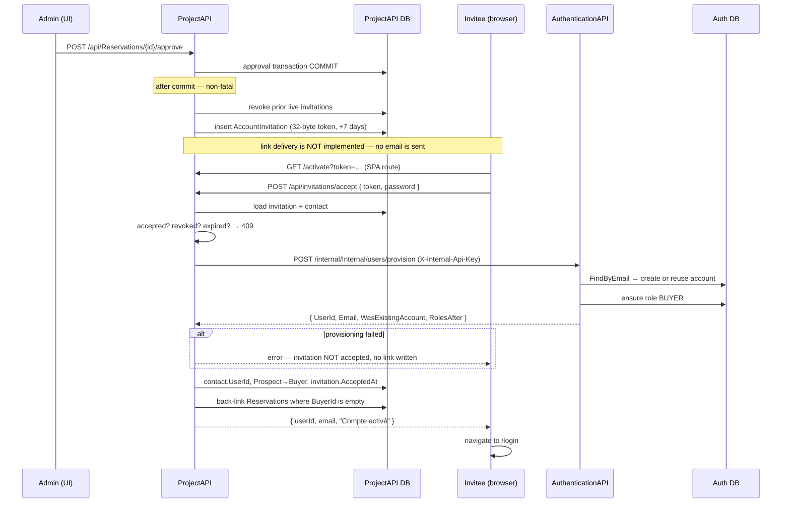

# Workflow — Buyer account activation by invitation

**Status: fully traced**, across both services. This is the only workflow in the
solution that crosses the ProjectAPI ↔ AuthenticationAPI boundary at runtime.

## Business purpose

A buyer can be recorded and approved without ever having a login — an agent
enters a walk-in on the reservation's own identity fields. Approval then issues a
single-use invitation so that person can set their own password and reach the
buyer portal. The system must never invent a password for them, and never create
a second CRM contact for someone it already knows.

Ownership is split deliberately: **ProjectAPI owns the invitation and the CRM
contact; AuthenticationAPI is the only service that ever calls
`UserManager.CreateAsync`.**

## Participants

| Layer | Component |
|---|---|
| Frontend | `features/auth/ActivateAccountPage.tsx` (route `/activate?token=…`) |
| Adapter | `api/http/invitationsApi.ts` |
| ProjectAPI | `ApproveReservationHandler`, `AccountInvitationService`, `InvitationsController`, `AcceptInvitationHandler`, `AuthenticationApiClient` |
| AuthenticationAPI | `InternalController`, `ProvisionInternalUserHandler` |
| Tables | `AccountInvitations`, `CrmContacts`, `Reservations` (ProjectAPI) · `AspNetUsers`, `AspNetRoles`, `AspNetUserRoles` (AuthenticationAPI) |

## Step-by-step trace

### 1 — Approval issues the token

Inside `ApproveReservationHandler`, **after** the approval transaction commits
(so a failure here never rolls back a real approval):

```
if (hasBuyerAccount)            → GrantBuyerRoleAsync(...)
else if (PrimaryContactId != null) → IssueInvitationAsync(...)
```

`IAccountInvitationService.IssueAsync(crmContactId)`:

1. Loads the `CrmContact`; **returns `null` when it has no email** — nothing to
   send an invitation to, and the caller logs and moves on.
2. Revokes every prior live invitation for that contact
   (`AcceptedAt == null && RevokedAt == null` → sets `RevokedAt = now`), so a
   contact never holds two usable tokens.
3. Inserts a new `AccountInvitation`:
   - `Token` = `Convert.ToHexString(RandomNumberGenerator.GetBytes(32))`
     — 32 cryptographically random bytes, hex-encoded;
   - `ExpiresAt = now + 7 days` (`Validity`);
   - `Email` copied from the contact.
4. Saves.

Both the role grant and the invitation are wrapped in `try/catch` and logged —
**never fatal**. The approval stands regardless.

> **No email is sent.** `ApproveReservationHandler` states this explicitly and no
> code contradicts it: `IEmailService` has no callers in ProjectAPI, and
> `Program.cs` registers SMTP settings only so the service can be resolved. The
> token is durable in the database; delivering the link is currently a manual or
> out-of-band step. **This is a gap, not a design choice to rely on.**

### 2 — The invitee opens the link

`ActivateAccountPage` reads `token` from the query string
(`searchParams.get("token")`). With no token it renders an error state rather
than calling the API. The user supplies a password and confirmation.

### 3 — Acceptance

`invitationsApi.accept(token, password)` → `POST /api/invitations/accept`.

`InvitationsController` is **`[AllowAnonymous]`** at class level — correctly, as
the invitee has no session yet; the token is the proof of authorisation.

`AcceptInvitationHandler`:

1. Empty token ⇒ 422 `VALIDATION_FAILED`.
2. Loads the `AccountInvitation` by token, including its `CrmContact`; absent ⇒
   404.
3. Fails closed on each terminal state with a distinct stable code, all **409**:
   - `AcceptedAt != null` ⇒ `INVITATION_ALREADY_ACCEPTED`
   - `RevokedAt != null` ⇒ `INVITATION_REVOKED`
   - `ExpiresAt <= UtcNow` ⇒ `INVITATION_EXPIRED`
4. Calls `IAuthenticationApiClient.ProvisionBuyerAsync(...)` — see step 4.
5. If the contact is already linked to a **different** `UserId` ⇒ 422 (a genuine
   data inconsistency, refused rather than overwritten).
6. Writes `contact.UserId`, promotes `LifecycleStatus` `Prospect → Buyer`, sets
   `UpdatedAt`.
7. Marks `invitation.AcceptedAt = UtcNow`.
8. **Back-links reservations**: every `Reservation` with
   `PrimaryContactId == contact.Id && string.IsNullOrEmpty(BuyerId)` gets
   `BuyerId = provisioned.UserId` — so files created before the account existed
   become visible in the buyer portal, which queries by `BuyerId`.
9. One `SaveChangesAsync`.

### 4 — Cross-service provisioning

`AuthenticationApiClient.ProvisionBuyerAsync` issues:

```
POST {InternalApi:AuthApiBaseUrl}/internal/Internal/users/provision
X-Internal-Api-Key: <configured key>
{ Email, FirstName, LastName, Password, RoleCode = "BUYER", PhoneNumber }
```

A non-success status is **logged and rethrown** as `InvalidOperationException` —
deliberately, so the invitation is *not* marked accepted and no `UserId` link is
written when provisioning fails.

AuthenticationAPI's `InternalController` is gated by
`[Authorize(AuthenticationSchemes = InternalApiKeyDefaults.AuthenticationScheme)]`
— a separate scheme from the JWT bearer scheme, opted into only here.

`ProvisionInternalUserHandler`:

1. `RoleCodes.Normalize(request.RoleCode)`.
2. `FindByEmailAsync` — **idempotent on existing accounts**: if one exists it is
   reused, the password is **not** touched, and only the role is added.
3. Otherwise creates a `User` with `Id = Guid.NewGuid().ToString()`,
   `UserName = Email`, `Discriminator = roleCode`, via
   `UserManager.CreateAsync(user, password)`; Identity failures become the app's
   `ValidationException` ⇒ 422.
4. Creates the role if missing, then `AddToRoleAsync` when not already held.
5. Returns `{ UserId, Email, WasExistingAccount, RolesAfter }`.

### 5 — After activation

The handler returns `{ userId, email, message }`. `ActivateAccountPage` shows a
success state and offers a link to `/login`. **It does not sign the user in** —
no token is issued by this flow; the user authenticates normally afterwards, at
which point `TokenProvider` emits the `BUYER` role and `landingPathFor` routes
them to `/my`.

## Full flow



## Design properties worth preserving

- **Single-use, single-live token.** Issuing revokes prior live invitations;
  acceptance sets `AcceptedAt`. Three distinct 409 codes tell the invitee which
  dead end they hit.
- **Provisioning failure is not partially committed.** The client rethrows, so
  the invitation stays usable and no contact link is written.
- **Existing accounts are reused, not duplicated**, and their password is never
  overwritten.
- **One contact ↔ one account**, enforced by the `contact.UserId != provisioned.UserId`
  refusal.
- **Reservations are retro-linked**, which is what makes previously account-less
  files appear in the buyer portal.

## Known weaknesses in this workflow

1. **The invitation is never delivered.** No email provider is wired into
   ProjectAPI; `IEmailService` has no callers there. The token exists only in the
   database, so activation currently requires someone to extract and send the
   link manually. This is the single blocking gap in the flow.
2. **A contact with no email is silently skipped.** `IssueAsync` returns `null`
   and the approval logs it — the buyer simply never gets an invitation and
   nothing surfaces in the UI.
3. **`POST /api/invitations/accept` is unauthenticated and unthrottled.** There
   is no rate limit or lockout in the traced path, so the 64-hex-character token
   space is the only protection. That space is large enough that brute force is
   impractical, but the absence of throttling is worth noting.
4. **Password policy lives entirely in AuthenticationAPI's Identity options.**
   `AcceptInvitationCommand` has no validator in ProjectAPI, so weak-password
   rejection surfaces as a 422 relayed from the other service.
5. **The internal API key is a shared static secret** sent as `X-Internal-Api-Key`
   on every call. Key material is configuration, not documented here.

## Related documents

- Backend: [Reservations.md](../backend/Reservations.md) (approval, step 1)
- Backend *(pending)*: `Invitations.md`, `Internal.md` (ProjectAPI),
  `Internal-Auth.md`, `UserController.md` (AuthenticationAPI)
- Workflows: [ReservationLifecycle.md](ReservationLifecycle.md)
- Frontend *(pending)*: `realestateFront/docs/frontend/Auth.md`

## Correction (2026-09-14)

Step 5 is out of date: `ActivateAccountPage` now **signs the buyer in** right
after a successful acceptance (`login(result.email, password)`, non-fatal on
failure) and the app routes them to the buyer portal; the success message is only
visible when that automatic sign-in fails.

## Validated

Legend: ✅ validated end to end (Playwright UI test against the running stack, state re-read from the API/DB) · ⚠️ fixed during validation (fix logged in `docs/fixes/`) then validated · ❌ not validated (reason given).
Suite: `realestateFront/tests/` — run on 2026-09-14 against Azure SQL `GPIA_Project` (S2).

| Step | Result | Evidence (test) |
|---|---|---|
| 1 — approving a walk-in reservation issues a 64-hex-char single-use token | ✅ | `workflow_account_activation` (token read from `AccountInvitations`; no e-mail is sent — gap unchanged) |
| 2-3 — the invitee opens `/activate?token=…` without a session and sets a password | ✅ | `workflow_account_activation` |
| 4 — cross-service provisioning: AuthenticationAPI account with BUYER | ✅ | `workflow_account_activation` (login with the new password returns BUYER) |
| 3.8 — reservations created before the account are back-linked | ✅ | `workflow_account_activation` (`GET Reservations/mine` and "Mes biens") |
| Token reuse refused (409 `INVITATION_ALREADY_ACCEPTED`) | ✅ | `workflow_account_activation` |
| 5 — after activation | ⚠️ doc corrected (automatic sign-in); "Mes biens" now shows project / building / floor | `workflow_account_activation` |
| Expired / revoked tokens | ❌ | not exercised (needs a token aged 7 days or a second approval on the same contact) |
