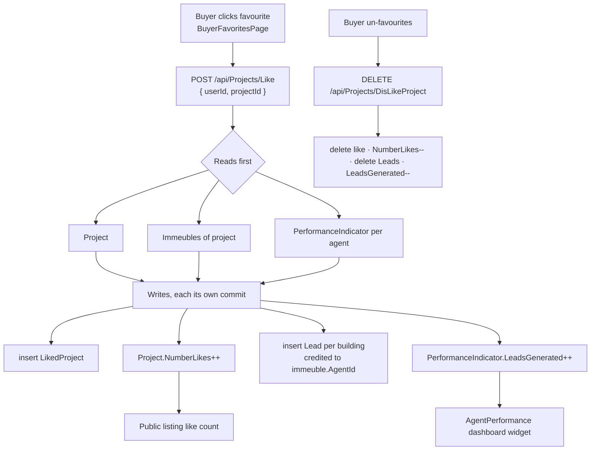

# Workflow — Favourite → lead → agent performance

**Status: fully traced** (`AddLikedProjectHandler`, `RemoveLikedProjectHandler`).

## Business purpose

When a signed-in visitor favourites a project, the system treats it as commercial
interest: it records the favourite, bumps the project's public like counter, and
creates a **lead** for every building in that project, crediting the building's
agent. Agent performance dashboards then count those leads. Un-favouriting is
meant to reverse all three effects.

## Participants

| Layer | Component |
|---|---|
| Frontend | `features/buyer/BuyerFavoritesPage.tsx`, `features/dashboard/AgentPerformance.tsx` |
| Adapter | `api/http/favoritesApi.ts` |
| Controller | `ProjectsController` → [Projects.md](../backend/Projects.md) |
| Tables | `LikedProjects`, `Projects` (`NumberLikes`), `Leads`, `PerformanceIndicators` |

## Step-by-step trace

### 1 — Favourite

`favoritesApi.add(userId, projectId)` → `POST /api/Projects/Like`.

**Authorization: none beyond class-level `[Authorize]`.** No role attribute, and
`userId` comes from the request body.

`AddLikedProjectHandler` — the order matters and is forced by
`BaseRepository` committing inside every write (see
[Projects.md § Repository semantics](../backend/Projects.md#repository-semantics)),
so all reads run first:

**Reads**
1. `Project` by id.
2. All `Immeuble` rows where `ProjectId == request.ProjectId`.
3. Distinct non-empty `AgentId` values across those buildings.
4. A `PerformanceIndicator` per agent, collected into a dictionary.

**Writes** (each its own commit — no transaction)
5. Insert `LikedProject { Id, UserId, ProjectId, LikedAt = DateTime.Now }`.
6. `project.NumberLikes++` → `Update`.
7. For **every building** in the project, insert a `Lead { ProjectId, UserId,
   AgentId = immeuble.AgentId, CreatedAt = DateTime.Now }`.
8. For each agent with an existing indicator: `IncrementLeadsGenerated()` →
   `Update`.

### 2 — Read favourites

`favoritesApi.list(userId)` → `GET /api/Projects/LikedProjects?UserId=…&PageSize=100`.

`GetLikedProjectsHandler` returns an empty page when the user id matches no
`AspNetUsers` row, otherwise joins `LikedProjects → Project` and enriches each
row with the owning user's `UserName`, `FirstName` and `LastName` from
`_context.Users`.

### 3 — Un-favourite

`favoritesApi.remove(userId, projectId)` → `DELETE /api/Projects/DisLikeProject`.

`RemoveLikedProjectHandler`, same reads-before-writes shape:

**Reads** — the `LikedProject` (404 if absent), the `Project` (404 if absent),
the project's buildings, then per building the `Lead` rows matching
`(ProjectId, UserId, AgentId)`, and one `PerformanceIndicator` per distinct agent.

**Writes** — `Delete` the like; `NumberLikes = Math.Max(0, NumberLikes - 1)`;
delete every collected `Lead`; decrement `LeadsGenerated` where `> 0`. Then four
separate `SaveAsync()` calls, each a no-op because every write already committed.

### 4 — Consumption

`PerformanceIndicator.LeadsGenerated` is read by the admin dashboard's agent
performance widget. `Project.NumberLikes` is returned by `GET /api/Projects` and
rendered on public listings.

## Full flow

## Known weaknesses in this workflow

All four are documented in [Projects.md](../backend/Projects.md).

1. **No ownership check anywhere (P1).** `POST Like`, `DELETE DisLikeProject`,
   `GET LikedProjects` and `PUT LikedProject` carry no role attribute and take
   `UserId` from the request. No handler compares it to `ICurrentUser.UserId`.
   Any authenticated account can therefore favourite on another user's behalf —
   manufacturing leads and inflating an agent's performance figures — and
   `GET LikedProjects?UserId=<someone-else>` discloses that user's favourites
   **together with their `UserName`, `FirstName` and `LastName`**.

2. **Favouriting is not idempotent (P6).** `AddLikedProjectHandler` never checks
   for an existing `LikedProject`. Liking twice inserts two rows, increments
   `NumberLikes` twice, and duplicates both the `Lead` rows and the
   `LeadsGenerated` increments. `RemoveLikedProjectHandler` deletes only
   `.FirstOrDefault()`, so the counters **cannot be fully walked back** — the
   reversal in step 3 is incomplete by construction.

3. **No transaction on either side.** Because every repository write commits
   individually, a failure mid-sequence leaves e.g. the like recorded but the
   counter un-incremented, or some leads created and others not. There is no
   rollback and no compensation.

4. **A new agent's first lead can be lost.** The increment only runs for agents
   that already have a `PerformanceIndicator` row; `AddLikedProjectHandler`
   collects indicators into `indicatorsByAgent` only when `found.FirstOrDefault()`
   is non-null, so an agent with no indicator row yet gets no row created and no
   credit. (Contrast `CreateAppointmentHandler`, which *does* create one — but
   initialises it to `0` without incrementing, so its first appointment is also
   uncounted.)

5. **Local timestamps.** `LikedAt` and `Lead.CreatedAt` use `DateTime.Now`, not
   `DateTime.UtcNow`.

## Related documents

- Backend: [Projects.md](../backend/Projects.md) ·
  [Immeuble.md](../backend/Immeuble.md) (`Immeuble.AgentId` is the credited agent)
- Backend *(pending)*: `Leads.md`, `AdminDashboard.md`
- Frontend *(pending)*: `realestateFront/docs/frontend/Buyer.md`,
  `.../Dashboard.md`

## Corrections (2026-09-14)

- **Weakness 1 fixed:** `GET LikedProjects/mine` added; for a caller without an
  internal role, `GET LikedProjects`, `POST Like` and `DELETE DisLikeProject` are
  pinned to the token's user (`docs/fixes/Security.md`).
- **Weakness 2 fixed:** favouriting is idempotent — a second like returns the
  existing row with no counter or lead side effect; an unknown project is 404
  (`docs/fixes/Favourites.md`).
- **Weakness 5 fixed:** `LikedAt` / `Lead.CreatedAt` use UTC.
- The public "Favori" button was covered by the facts band and could not be
  clicked; its failures were silent (`realestateFront/docs/fixes/PublicSite.md`).
- Weaknesses 3 (no transaction) and 4 (agent without an indicator row) remain.

## Validated

Legend: ✅ validated end to end (Playwright UI test against the running stack, state re-read from the API/DB) · ⚠️ fixed during validation (fix logged in `docs/fixes/`) then validated · ❌ not validated (reason given).
Suite: `realestateFront/tests/` — run on 2026-09-14 against Azure SQL `GPIA_Project` (S2).

| Step | Result | Evidence (test) |
|---|---|---|
| 1 — favourite from the public project page: like row, `NumberLikes` +1, one lead per building | ⚠️ fixed (button covered, silent failure) | `workflow_favourite_to_lead` |
| Idempotent second like | ⚠️ fixed | `workflow_favourite_to_lead` |
| 2 — read own favourites ("Favoris" page), another buyer cannot read or create them | ⚠️ fixed | `workflow_favourite_to_lead`, `buyer_pages_call_only_mine_endpoints` |
| 3 — un-favourite walks back like, counter and leads | ✅ | `workflow_favourite_to_lead` |
| 4 — consumption (agent performance `LeadsGenerated`) | ❌ | building fixtures carry no `AgentId`, so no indicator is incremented in the suite |
