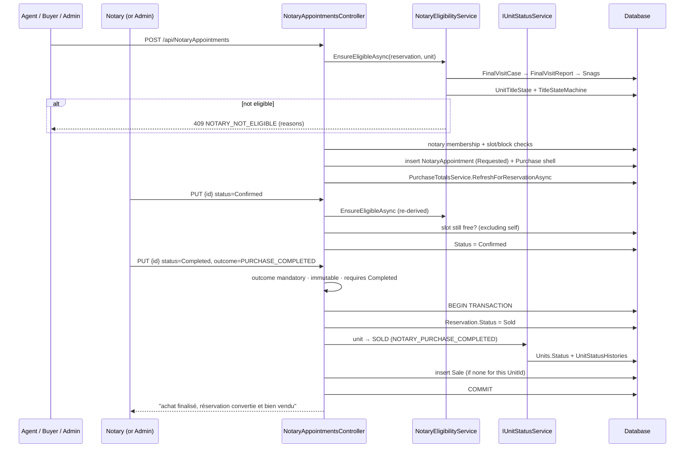

# Workflow — Notarial conversion (approved reservation → sold unit → sale record)

**Status: fully traced.** Confirmed by reading
`UpdateNotaryAppointmentHandler` lines 300–357. This is the **only** code path in
the solution that sets `ReservationStatus.Sold`.

## Business purpose

An approved reservation becomes a completed purchase only when a notary records
that the deed was actually signed. Recording `PURCHASE_COMPLETED` converts the
reservation, marks the unit sold and creates the sales record — in one
transaction, so the three can never disagree. Every other outcome closes the
meeting and leaves the file intact so it can be retried with a new appointment.

## Participants

| Layer | Component |
|---|---|
| Frontend | `features/notary/NotaryAppointmentsPage.tsx` |
| Adapter | `api/http/notaryApi.ts` |
| Controllers | `NotaryAppointmentsController` → [NotaryAppointments.md](../backend/NotaryAppointments.md) |
| Gate | `NotaryEligibilityService` (reads final-visit + title state) |
| Shared services | `ProjectScopeService`, `IUnitStatusService`, `PurchaseTotalsService` |
| Tables | `NotaryAppointments`, `NotaryAppointmentAssignmentHistories`, `Reservations`, `Units`, `UnitStatusHistories`, `Sales`, `Purchases`, `NotaryBlocks`, `ProjectMemberships` |

## Preconditions

The reservation must be `APPROVED` — `ReservationStateMachine` permits only
`Approved → Sold`. The unit is `RESERVED` at this point (set by
[ReservationLifecycle.md](ReservationLifecycle.md) step 3).

## Step-by-step trace

### 1 — Request the appointment

`notaryApi.createAppointment(data)` → `POST /api/NotaryAppointments`.
Roles: admins, `SALES_AGENT`, `BUYER` — **`NOTARY` is deliberately excluded**
(`RoleGroups.NotaryAppointmentRequesters`), so a notary cannot raise a meeting
for themselves.

`CreateNotaryAppointmentHandler`:

1. `EnsureReservationAccessAsync` + `EnsureBuyerOwnsReservationAsync`.
2. **Eligibility gate** — `NotaryEligibilityService.EnsureEligibleAsync`:
   - loads the `FinalVisitCase` for the reservation with its `Appointments`;
   - takes the newest non-`Superseded` `FinalVisitReport` across them;
   - loads that report's `Snag` rows;
   - `NotaryEligibilityCalculator.Calculate(case, report, snags)`;
   - loads `UnitTitleState` (defaulting to `TitleStatus.NotAvailable`) and checks
     `TitleStateMachine.AllowsNotaryAppointment(...)`;
   - either check failing ⇒ **`NOTARY_NOT_ELIGIBLE`** with accumulated reasons.
3. If a notary is named: `EnsureEligibleNotaryAsync` — the notary must hold an
   active `ProjectMembership` with `RoleCode == NOTARY` on the project reached by
   `unit.ProjectId → Immeuble.Id → Immeuble.ProjectId`; then
   `EnsureSlotAvailableAsync` — no other blocking `NotaryAppointment` within
   ±1 minute and no `NotaryBlock` covering the instant.
4. Inserts the appointment with `Status = "Requested"`, snapshotting buyer
   identity and `PropertyPrice` from the reservation.
5. Inserts a `NotaryAppointmentAssignmentHistory` row when a notary was named.
6. Increments the reservation agent's `PerformanceIndicator.LeadsGenerated`.
7. Creates a `Purchase` shell (`PaidAmount = 0`) **only when a buyer account
   exists**, then inside a transaction saves and calls
   `PurchaseTotalsService.RefreshForReservationAsync` to reconcile from the
   payment ledger.

### 2 — Confirm

`notaryApi.updateAppointment(id, { status: "Confirmed" })` → `PUT /api/NotaryAppointments/{id}`.
Roles: `AdminsNotary` only.

`UpdateNotaryAppointmentHandler` re-runs **the same eligibility gate** — a file
eligible at request time may not be by confirmation (a new snag, a disputed
report) — and re-checks slot availability excluding the row itself.

A `NOTARY` caller must own the appointment (`NotaireId == ICurrentUser.UserId`).

### 3 — Record the outcome

`PUT /api/NotaryAppointments/{id}` with `status: "Completed"` **and**
`outcome: "PURCHASE_COMPLETED"`.

Guards, in the order the code applies them:

1. `AppointmentStateMachine.CanTransition(current → Completed)` — a same-state
   update is allowed; anything else must be a legal edge.
2. `completing == true` with an empty `Outcome` ⇒ **422** ("un rendez-vous
   notarial ne peut être marqué réalisé sans résultat").
3. `NotaryOutcomeCodes.Parse(outcome)`.
4. Outcome may only be recorded when status is already `Completed` ⇒ else **409**.
5. A *different* outcome already recorded ⇒ **409** (outcomes are immutable; the
   same outcome again is accepted).

### 4 — The conversion

Inside `BeginTransactionAsync`, and only when
`outcome == NotaryAppointmentOutcome.PurchaseCompleted`:

```
if (reservation.Status != ReservationStatus.Sold)     // idempotency guard
{
    ReservationStateMachine.EnsureCanTransition(status, Sold);
    reservation.Status = ReservationStatus.Sold;

    _unitStatus.TransitionAsync(unit → SOLD,
        cause: NOTARY_PURCHASE_COMPLETED,
        reservationId, actorUserId);

    if (no Sale exists WHERE UnitId == reservation.UnitId)
        insert Sale { BuyerId, buyer identity snapshot, UnitId,
                      SaleDate = UtcNow,
                      TotalPrice = FinalPrice ?? TotalPropertyPrice,
                      IsUnderConstruction }
}
```

Then `SaveAsync` + `CommitAsync`. Reservation, unit, unit-status history and the
sale row all commit together or not at all.

**State after:** reservation `CONVERTED` (`Sold`), unit `SOLD`, one `Sale` row,
`UnitStatusHistories` carrying cause `NOTARY_PURCHASE_COMPLETED`.

### 5 — Every other outcome

`INCOMPLETE_FILE`, `BUYER_ABSENT`, `POSTPONED`, `NOT_COMPLETED_OTHER` are
recorded on the appointment (`Outcome`, `OutcomeRecordedAt`, `OutcomeRecordedBy`,
`OutcomeNote`) and change **nothing** on the reservation or unit. A retry is a
new appointment.

## Full flow



## Reassignment side-path

Naming `NewNotaireId` requires `ReassignmentReason` (422 otherwise), then:

- **Not yet confirmed** — the row is mutated in place, history appended.
- **Already confirmed** — the row is frozen as `Superseded` and a **new**
  `NotaryAppointment` is inserted with `PreviousAppointmentId`,
  `Status = "Requested"`, pending the buyer's acceptance. The response carries
  the **new** id.

> ⚠️ That branch returns early with its own `SaveAsync()` **before** the
> transaction is opened, so any status/outcome/fee changes made earlier in the
> same request commit untransacted.

## Known weaknesses in this workflow

Documented in full in [NotaryAppointments.md](../backend/NotaryAppointments.md).

1. **The `Sale` dedupe key is `UnitId`, not the reservation.** A unit sold,
   administratively cancelled back to `AVAILABLE`, then resold to a different
   buyer produces **no second `Sale` row**. The `Sale` also stores no
   `ReservationId`, so the two cannot be correlated afterwards.
2. `GET /api/NotaryAppointments/{id}` throws a bare `Exception` for a missing id
   ⇒ **500**, making the controller's 404 branch unreachable.
3. ±1-minute conflict window; no appointment duration is modelled at all.
4. No separation-of-duties check — an admin may both request and complete the
   same appointment, unlike reservations' `SELF_APPROVAL_FORBIDDEN`.
5. Fees (`TaxFees`, `TahfidFees`) remain writable after conversion.
6. `notaryApi.updateAppointment` types the response as a full appointment DTO,
   but the handler returns `{ Success, AppointmentId, Status, Message }` — so on
   a confirmed-appointment reassignment the UI never learns the replacement id.

## Related documents

- Backend: [NotaryAppointments.md](../backend/NotaryAppointments.md) ·
  [Reservations.md](../backend/Reservations.md) ·
  [Immeuble.md](../backend/Immeuble.md)
- Backend *(pending)*: `FinalVisits.md`, `Construction.md` (title state),
  `Sales.md`, `Payments.md`
- Workflows: [ReservationLifecycle.md](ReservationLifecycle.md)
- Frontend *(pending)*: `realestateFront/docs/frontend/Notary.md`

## Validated

Legend: ✅ validated end to end (Playwright UI test against the running stack, state re-read from the API/DB) · ⚠️ fixed during validation (fix logged in `docs/fixes/`) then validated · ❌ not validated (reason given).
Suite: `realestateFront/tests/` — run on 2026-09-14 against Azure SQL `GPIA_Project` (S2).

| Step | Result | Evidence (test) |
|---|---|---|
| Preconditions: final visit validated, title available | ✅ | `visit_satisfactory_makes_file_eligible_for_notary`, `sale_button_hidden_unless_final_visit_validated` |
| 1 — request (agent, admin, buyer), cascade Projet → … → Dossier | ⚠️ fixed (cascade from reservations, buyer request form) | `appointment_cascade_filters_project_building_floor_unit_reservation`, `buyer_appointment_request_created_with_status_requested`, `buyer_can_create_notary_appointment_request` |
| 2 — confirm by agent / admin / notary | ⚠️ fixed (agent allowed to confirm/cancel only) | `appointment_confirmable_by_agent_admin_or_notary` |
| 3 — outcome; note required for failed / cancelled / postponed; buyer cannot complete | ⚠️ fixed | `note_required_for_failed_cancelled_or_postponed_result`, `buyer_cannot_set_purchase_completed`, `api_rejects_role_violation` |
| 4 — PURCHASE_COMPLETED: reservation CONVERTED, unit SOLD, existing draft sale confirmed or a sale created | ⚠️ fixed (draft confirmed in place, PendingNotary sync) | `existing_draft_sale_becomes_confirmed_on_purchase_completed`, `sale_auto_created_as_confirmed_when_none_exists`, `reservation_becomes_converted_on_purchase_completed`, `unit_becomes_sold_on_purchase_completed` |
| Atomicity (fault injected on the sale insert) | ✅ | `auto_sale_creation_is_transactional`, `api_atomic_on_purchase_completed` |
| Skipping confirmation refused | ✅ | `api_enforces_state_machine_transitions` |
| Appointment detail shows project / building / floor / unit | ⚠️ fixed | `notary_appointment_detail_shows_project_building_floor_unit` |
| Buyer reads only their own appointments | ⚠️ fixed (`GET NotaryAppointments/mine`) | `buyer_pages_call_only_mine_endpoints` |
| Weakness 1 (Sale keyed on UnitId, no ReservationId) | ⚠️ fixed | `Sale.ReservationId` + `only_one_active_sale_per_reservation`, `only_one_active_sale_per_unit` |
| Reassignment of an already-confirmed appointment | ❌ | not exercised by the UI suite (no screen offers reassignment) |
