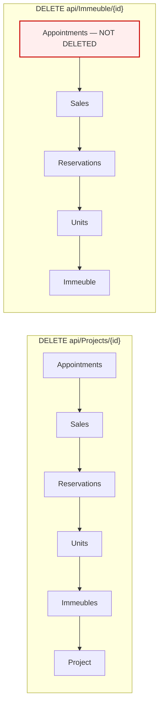

# Workflow — Project and building deletion cascade

**Status: fully traced** (`RemoveProjectHandler`, `DeleteImmeublesHandler`).

> This is the highest-blast-radius operation in the solution and the one whose
> implementation diverges most from what the rest of the codebase assumes.
> Nothing here is a recommendation to use it.

## Business purpose

Remove a project — or a single building — together with everything commercial
that hangs beneath it. Both handlers perform a **hard delete**: rows are removed,
not archived.

This directly contradicts the frontend's stated position. `ProjectsApi`
(`src/api/interfaces.ts:103`) documents the deliberate omission of a `remove()`:
*"les données métier ne sont jamais supprimées (§9, §6.3) — fin de vie d'un projet
= statut ARCHIVED, pas un DELETE"*, and `ImmeublesApi` repeats it at line 123.
**Neither delete endpoint has any frontend caller**, so the cascade is reachable
only via direct API access.

## Participants

| Layer | Component |
|---|---|
| Controllers | `ProjectsController` (`DELETE api/Projects/{projectId}`), `ImmeubleController` (`DELETE api/Immeuble/{id}`) |
| Handlers | `RemoveProjectHandler`, `DeleteImmeublesHandler` |
| Tables | `Projects`, `Immeubles`, `Units`, `Reservations`, `Sales`, `Appointments` |
| Auth | `RoleGroups.Admins` + `ProjectScopeService.EnsureProjectAccessAsync` |

## Project deletion — step-by-step

`DELETE /api/Projects/{projectId}` → `RemoveProjectHandler`:

1. Load the project. **Missing ⇒ `Success = false`**, which the controller maps
   to **400**, not 404.
2. `EnsureProjectAccessAsync(projectId)` — a `PROJECT_ADMIN` cannot delete
   outside their perimeter. A `BusinessRuleException` here is deliberately
   rethrown so it reaches `ApiExceptionFilter` as a 403.
3. `_immeubleRepository.GetAllAsync()` → filter to this project **in memory**.
4. `_unitRepository.GetAllAsync()` → filter to those buildings **in memory**.
5. Delete every `Appointment` where `ProjectId == request.ProjectId`
   (a direct project FK), then `SaveAsync`.
6. Delete every `Sale` whose `UnitId` is in the project, then `SaveAsync`.
7. Delete every `Reservation` whose `UnitId` is in the project, then `SaveAsync`.
8. Delete the `Unit` rows, then `SaveAsync`.
9. Delete the `Immeuble` rows, then `SaveAsync`.
10. `DeleteAsync(project.Id)`, then `SaveAsync`.
11. Return a `DeletedEntities` list naming every removed row.

## Building deletion — step-by-step

`DELETE /api/Immeuble/{id}` → `DeleteImmeublesHandler`: the same shape, scoped to
one building — load with dependencies, perimeter check on
`immeuble.ProjectId`, then **sales → reservations → units → immeuble**.

## The two cascades are not equivalent



`DeleteImmeublesHandler` **injects `IAppointmentRepository`, assigns it to a
field, and never calls it** — its numbered comment sequence jumps from "1." to
"3.". Deleting a building therefore leaves every appointment on that building's
project intact, while deleting the whole project removes them. Since
`Appointment.ProjectId` is a project-level FK rather than a unit-level one, it is
genuinely ambiguous whether building deletion *should* remove them — but the
injected-and-unused dependency shows the omission is accidental, not a decision.

## Neither cascade is transactional

`BaseRepository.Delete(T)` calls the **synchronous** `_dbContext.SaveChanges()`
internally, and `DeleteAsync` calls `SaveAsync`. Every delete in the loops above
is therefore its own committed transaction. There is no
`BeginTransactionAsync` anywhere in either handler.

Consequence: a failure at step 8 leaves appointments, sales and reservations
permanently deleted while the units, buildings and project remain — an
unrecoverable partial state with no compensation path. The `DeletedEntities`
list in the response is the only record of what was removed.

## Error handling leaks internals

`RemoveProjectHandler`'s `catch (Exception ex)` returns:

```
Success = false,
Message = $"Error deleting project ID '{id}': {ex.Message}",
Details = [ $"Exception Type: {ex.GetType().Name}", …, $"Full Error: {ex.ToString()}" ]
```

`ex.ToString()` is the **full stack trace**, returned to the client as a 400.
This bypasses `ApiExceptionFilter.HandleGlobalException`, whose entire purpose is
*"never leak stack traces, SQL or sensitive data to the client"*.
`DeleteImmeublesHandler`'s equivalent catch includes `ex.Message` and the
exception type name but **not** the stack trace — so the two differ here too.

## Data the cascade does not clean up

Traced by comparing the deleted set against tables that reference them:

| Orphaned by the cascade | Referencing column |
|---|---|
| `UnitStatusHistories` | `UnitId`, `ReservationId` — configured `DeleteBehavior.NoAction` ("never cascade-delete an audit trail") |
| `ReservationDocuments` | cascade from `Reservations` at the DB level, so these *are* removed |
| `ReservationBuyers` | cascade from `Reservations`, removed |
| `Purchases` | `ReservationId` — no delete in either handler |
| `PaymentSchedules` / `PaymentInstallments` | hang off reservations — **Unverified**, not yet traced |
| `NotaryAppointments` | `ReservationId` — no delete in either handler |
| `FinalVisitCases` | `ReservationId` — no delete in either handler |
| `LikedProjects`, `Leads` | `ProjectId` — no delete in either handler |
| `ProjectMemberships`, `ProjectAssignments` | `ProjectId` — no delete in either handler |
| `Floors` | `ImmeubleId` — **not deleted by either handler** |

Whether these fail at the database level on FK constraints, or are left as
orphans, depends on each relationship's configured `DeleteBehavior`. Only the
`UnitStatusHistories` (`NoAction`), `ReservationDocuments` (`Cascade`) and
`ReservationBuyers` (`Cascade`) behaviours have been read directly; the rest are
**Unverified**.

## Known weaknesses

1. **No transaction** — partial, unrecoverable deletion on any mid-sequence
   failure.
2. **Full stack trace returned to the client** on the project path.
3. **Missing appointment deletion** on the building path, with the dependency
   injected but unused.
4. **`Floors` are never deleted**, though units reference them.
5. **Missing project reported as 400, not 404.**
6. **`GetAllAsync()` on five tables** with in-memory filtering — the whole
   `Units`, `Sales`, `Reservations` and `Appointments` tables are materialised to
   delete one project's worth of rows.
7. **Contradicts the documented domain rule.** Both frontend API interfaces state
   that business data is never deleted and that end-of-life is `ARCHIVED` status.
   `ProjectStatusCodes` includes `ARCHIVED`, and `UpdateProjectHandler` can set
   it — so the archival path exists and is the one actually used by the UI.

## Related documents

- Backend: [Projects.md](../backend/Projects.md) ·
  [Immeuble.md](../backend/Immeuble.md) ·
  [Reservations.md](../backend/Reservations.md) ·
  [Appointments.md](../backend/Appointments.md)
- Backend *(pending)*: `Sales.md`, `Payments.md`, `FinalVisits.md`

## Superseded (2026-09-14)

The behaviour traced above no longer exists. Both handlers were rewritten
(`docs/fixes/Projects.md`):

- **Refusal first.** A project (or building) with reservations, sales,
  deliveries, commercial appointments or buyer feedback is refused with **409
  `RESOURCE_IN_USE`** — business history is never deleted (the building handler
  used to delete sales and reservations). A finalised project is **409
  `PROJECT_READ_ONLY`**.
- **One transaction.** The configuration graph (units and their histories /
  title states / tracking, floors, building features / plans / tracking / type
  links / assignments, buildings, construction milestones and updates, videos,
  invitation assignments, leads, likes, assignment config, project assignments,
  features, type links, amenities, document rules, memberships, project) is
  deleted with set-based SQL inside one transaction: no partial state.
- **No table scans.** Existence checks are SQL queries instead of loading every
  building, unit, reservation, sale and appointment into memory.
- **Errors** go through `ApiExceptionFilter` (no stack trace to the client).
- Before the rewrite, *every* real project failed with 409 on its configuration
  rows (memberships, milestones, document rules…).

## Validated

Legend: ✅ validated end to end (Playwright UI test against the running stack, state re-read from the API/DB) · ⚠️ fixed during validation (fix logged in `docs/fixes/`) then validated · ❌ not validated (reason given).
Suite: `realestateFront/tests/` — run on 2026-09-14 against Azure SQL `GPIA_Project` (S2).

| Step | Result | Evidence (test) |
|---|---|---|
| Delete a project without history from the UI: project, buildings and units gone | ⚠️ fixed (was always 409) | `workflow_project_deletion_cascade` |
| A project with a reservation is refused (UI alert + API 409) and kept whole | ⚠️ fixed | `workflow_project_deletion_cascade` |
| A building with a reservation is refused; an empty building is deleted | ⚠️ fixed (was deleting sales and reservations) | `workflow_project_deletion_cascade` |
| Perimeter: out-of-scope project admin refused | ✅ | backend enforcement tests `RemoveProject_ProjectAdmin_WithNoMembership_IsDenied_AndProjectSurvives`, `DeleteImmeuble_*` (205/205 passing) |
| Finalised project refused | ✅ | `finalise_makes_project_read_only` (guard) |
