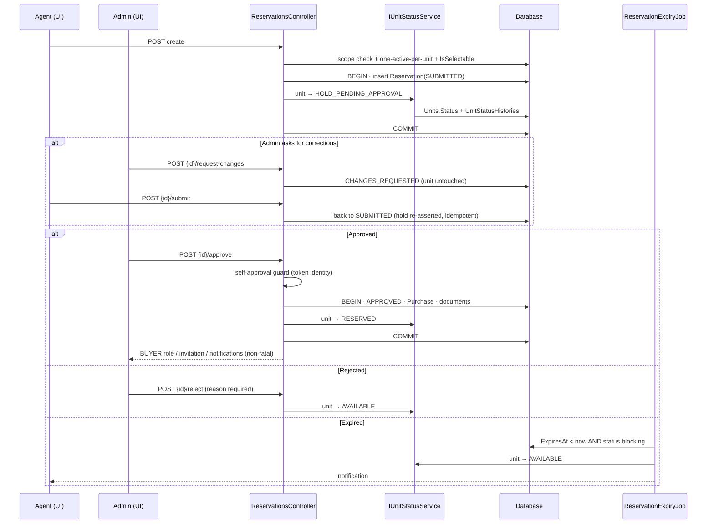

# Workflow — Reservation lifecycle (submit → decide → hold or release)

**Status: fully traced.** Every step below was followed through executable
statements. Nothing here is inferred from comments or naming.

## Business purpose

A sales agent records a buyer's intent to reserve a specific unit. The unit is
held off the market while a project administrator decides. Approval promotes the
hold to a firm reservation, grants the buyer portal access, and starts the
notarial track. Rejection, cancellation or expiry releases the unit back to the
catalogue. The rule the whole workflow protects is **one active reservation per
unit** — enforced both in application code and by a filtered unique index.

## Participants

| Layer | Component |
|---|---|
| Frontend | `features/reservations/ReservationsPage.tsx`, `ReservationDocumentsPanel.tsx` |
| Adapter | `api/http/reservationsApi.ts` |
| Controller | `ReservationsController` → [Reservations.md](../backend/Reservations.md) |
| Shared services | `ProjectScopeService`, `IUnitStatusService`, `IContactResolver`, `INotificationService`, `IAccountInvitationService` |
| Background | `ReservationExpiryJob` |
| Tables | `Reservations`, `ReservationBuyers`, `ReservationDocuments`, `Units`, `UnitStatusHistories`, `CrmContacts`, `Purchases`, `Notifications`, `AccountInvitations` |

## Step-by-step trace

### 1 — Agent submits a reservation

**Frontend** `reservationsApi.create(data)` → `POST /api/Reservations/create`
(roles: `GLOBAL_ADMIN`, `PROJECT_ADMIN`, `SALES_AGENT`).

**Handler** `CreateReservationHandler`:

1. Loads the unit; 404 if absent.
2. Resolves `unit.ProjectId → Immeuble.ProjectId` and calls
   `ProjectScopeService.EnsureProjectAccessAsync` — an agent cannot reserve in a
   project they hold no `ProjectMembership` on.
3. Rejects if any reservation on that unit is already `Pending`,
   `ChangesRequested`, `Approved` or `Sold` ⇒ **409 `UNIT_NOT_AVAILABLE`**.
4. Rejects unless `UnitStateMachine.IsSelectable(unit.Status)` — i.e. the unit is
   `AVAILABLE`.
5. Validates `AgentId` against `UserManager`.
6. `IContactResolver.ResolveAsync` returns or creates the one `CrmContact` for
   this person; each co-buyer is resolved the same way into `ReservationBuyers`.
7. Freezes pricing: `CatalogPrice = unit.LatestPrice ?? TotalPropertyPrice`,
   `FinalPrice = CatalogPrice − Discount`.
8. Sets `ExpiresAt = UtcNow + 72h` (hardcoded `DefaultHoldDuration`).
9. **Transaction**: insert `Reservation` (status `Pending`) **and**
   `IUnitStatusService.TransitionAsync(unit → HOLD_PENDING_APPROVAL, cause
   RESERVATION_SUBMITTED)`, which also appends a `UnitStatusHistories` row.
   Commit.

**State after:** reservation `SUBMITTED`, unit `HOLD_PENDING_APPROVAL`.

**UI next:** the adapter returns `{...data, id}` — the request echoed back, not
server state. `status`, `expiresAt` and `finalPrice` are absent until the list is
re-fetched.

### 2a — Administrator requests changes

`reservationsApi.requestChanges(id, reason)` → `POST /api/Reservations/{id}/request-changes`
(roles: admins only).

`RequestChangesHandler` checks the perimeter, requires a non-empty `Reason`
(inline, 422), runs `ReservationStateMachine.EnsureCanTransition(→ ChangesRequested)`,
writes the reason into `AdminNote`. **The unit is not touched** — it stays held.

**State after:** reservation `CHANGES_REQUESTED`, unit still
`HOLD_PENDING_APPROVAL`.

### 2b — Agent resubmits

`reservationsApi.submit(id, agentNote)` → `POST /api/Reservations/{id}/submit`
(admins + agent).

`ResubmitReservationHandler` re-checks the one-active-reservation rule **only if
the current status is `Draft`** (a draft never blocked the unit, so the unit may
have been taken meanwhile), then transitions back to `Pending` and calls
`TransitionIfNeededAsync` — idempotent, so re-asserting an existing hold writes
no history row.

> ⚠️ `request.AgentNote` is written into the **same** `AdminNote` column that
> step 2a used, so resubmitting destroys the reason the file was sent back for.

### 3 — Administrator approves

`reservationsApi.approve(id, note)` → `POST /api/Reservations/{id}/approve`
(admins only). The frontend always sends `documents: []`.

`ApproveReservationHandler`, in order:

1. `EnsureReservationAccessAsync` (perimeter).
2. **Separation of duties**: if `ICurrentUser.UserId == reservation.AgentId` ⇒
   **403 `SELF_APPROVAL_FORBIDDEN`**. Uses the token identity, never the body's
   `AdminUserId`.
3. `EnsureCanTransition(→ Approved)`.
4. Promotes the `CrmContact` from `Prospect` to `Buyer` if applicable.
5. Sets `ValidatedAt`, `ValidatedBy = caller id`, `AdminNote`.
6. **Transaction**: unit → `RESERVED` (cause `RESERVATION_APPROVED`); insert a
   `Purchase` row **only if** `reservation.BuyerId` is set; save the reservation;
   insert any `ReservationDocuments`; commit.
7. **After commit — all non-fatal, caught and logged:**
   - has an account → `AddToRoleAsync(BUYER)`, idempotent;
   - has no account but has a contact → `IAccountInvitationService.IssueAsync`
     (continues as [AccountActivation.md](AccountActivation.md));
   - `INotificationService.NotifyAsync` to the buyer (if account) and the agent.

**State after:** reservation `APPROVED`, unit `RESERVED`, buyer holds the `BUYER`
role or a pending invitation.

### 4 — Terminal paths that release the unit

| Trigger | Endpoint / job | Reservation | Unit | Cause code |
|---|---|---|---|---|
| Admin rejects | `POST {id}/reject` (reason **required**) | `REJECTED` | `AVAILABLE` | `RESERVATION_REJECTED` |
| Admin cancels an approved file | `PUT {id}/cancel` | `CANCELLED` | `AVAILABLE` | `RESERVATION_CANCELLED` |
| Deadline passes | `ReservationExpiryJob` | `EXPIRED` | `AVAILABLE` | `RESERVATION_EXPIRED` |

`ReservationExpiryJob` runs every 5 minutes after a 30-second startup delay,
selecting `ExpiresAt < now` where status is `Pending` or `ChangesRequested`. It
goes through the state machine, releases each unit, saves once, then notifies the
owning agent. A reservation with `ExpiresAt = null` never expires.

### 5 — Continues elsewhere

An `APPROVED` reservation's only remaining forward transition is `CONVERTED`,
which this module never performs. See
[NotaryConversion.md](NotaryConversion.md).

## Full flow

## Concurrency

The application-level availability check in steps 1 and 2b is a read-then-write
and cannot survive two simultaneous submits. The real backstop is the filtered
unique index `IX_Reservations_ActivePerUnit` with filter
`[Status] IN (0, 1, 4, 6)` — verified identical to
`ReservationStateMachine.UnitBlockingStatuses`. A lost race raises SQL 2601/2627,
which `ApiExceptionFilter` matches **by index name** and converts to
**409 `UNIT_NOT_AVAILABLE`**. The index name is therefore part of the API
contract.

`Reservation.RowVersion` additionally gives optimistic concurrency: two admins
acting at once produce `DbUpdateConcurrencyException` ⇒
**409 `RESOURCE_VERSION_CONFLICT`**.

## Known weaknesses in this workflow

Each is documented in full in [Reservations.md](../backend/Reservations.md).

1. `POST create` has **no validator**, so a malformed body reaches the handler.
2. `ValidatedBy` is trustworthy on approve (token) but **client-supplied on
   reject** — the frontend sends it from `localStorage`.
3. Resubmitting overwrites the admin's correction reason (same `AdminNote` column).
4. Cancellation records no reason and no actor; its `UnitStatusHistories` row is
   the only unattributable one in the workflow.
5. `ExpiresAt` is never extended, and `CHANGES_REQUESTED` is expirable — a file
   can expire while the agent is correcting it.
6. Idempotency is implemented (`IIdempotentRequest` + `IdempotencyBehaviour`) but
   **never exercised**: the frontend sends no `Idempotency-Key` header.

## Related documents

- Backend: [Reservations.md](../backend/Reservations.md) ·
  [Immeuble.md](../backend/Immeuble.md) (unit + status history) ·
  [Projects.md](../backend/Projects.md) (perimeter)
- Workflows: [NotaryConversion.md](NotaryConversion.md) ·
  [AccountActivation.md](AccountActivation.md)
- Frontend: `realestateFront/docs/frontend/Reservations.md` *(pending)*

## Validated

Legend: ✅ validated end to end (Playwright UI test against the running stack, state re-read from the API/DB) · ⚠️ fixed during validation (fix logged in `docs/fixes/`) then validated · ❌ not validated (reason given).
Suite: `realestateFront/tests/` — run on 2026-09-14 against Azure SQL `GPIA_Project` (S2).

| Step | Result | Evidence (test) |
|---|---|---|
| Agent creates a reservation, SUR_PLAN projects only | ✅ | `reservation_creation_allowed_only_for_sur_plan_project`, `sur_plan_allows_reservation_creation`, `en_livraison_blocks_new_reservation` |
| Cascade Projet → Immeuble → Étage → Type → Unité, only available units | ⚠️ fixed (cascade, available units, filters) | `reservation_cascade_filters_project_building_floor_type_unit`, `reservation_unit_list_shows_only_available_units` |
| Documents at creation / in detail / persisted / no 403 | ⚠️ fixed (upload policy, 404s, required types) | `documents_can_be_uploaded_during_creation`, `uploaded_documents_visible_in_detail_view`, `documents_can_be_added_and_deleted_in_detail_view`, `document_upload_does_not_return_403`, `documents_persist_server_side_after_reload` |
| Draft without documents; submission / approval blocked without required documents; per-project rules | ⚠️ fixed (approval checklist check) | `draft_reservation_accepts_missing_documents`, `submission_blocked_without_required_documents`, `approval_blocked_without_required_documents`, `required_documents_are_configurable_per_project` |
| 1 — submit (unit → HOLD) · 3 — admin approves (unit → RESERVED) | ✅ | `agent_can_create_and_manage_reservation`, `project_admin_can_approve_reservation` |
| Self-approval refused | ✅ | `forbidden_actions_hidden_or_disabled_by_role_and_status` (agent) |
| Editable before approval, read-only after | ✅ | `reservation_editable_before_approved`, `reservation_read_only_after_approved` |
| Project / building / floor / unit shown | ⚠️ fixed (unit context) | `reservation_detail_shows_project_building_floor_unit`, `buyer_file_shows_project_building_floor_unit` |
| Perimeter and state machine at the API | ✅ | `api_rejects_out_of_scope_project_access`, `api_enforces_state_machine_transitions`, `api_rejects_status_violation` |
| List performance (all reservations loaded per page) | ⚠️ fixed (SQL paging) | full regression, `docs/fixes/Performance.md` |
| 2a/2b — request changes, correction in the UI, resubmit | ✅ | `reservation_editable_before_approved` |
| 4 — expiry by `ReservationExpiryJob` | ❌ | time-based background job (30 s start delay, 5 min interval, expiry dates in days); not driven by the UI suite |
